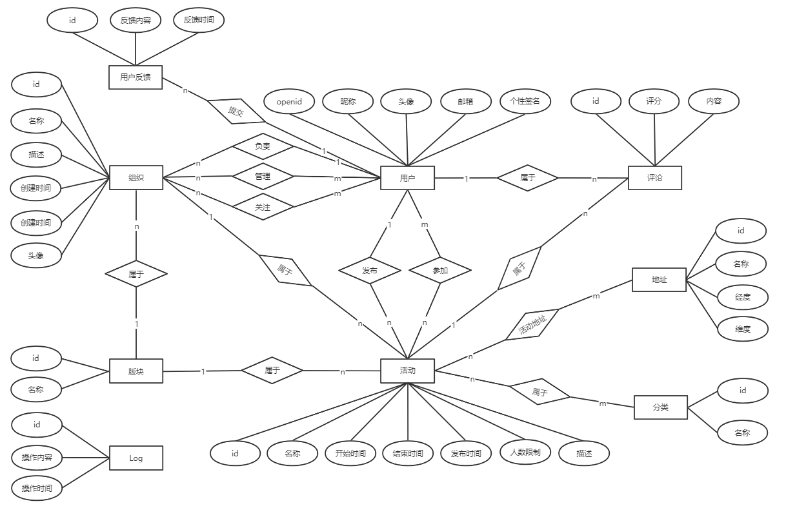

# **数据库基本表定义**

## 概述

* 实体
  * 一般性的）用户、活动、组织、版块、评论

  * （请求性质的）报名活动申请、管理员申请、组织创建申请，…………TODO

* 关系

  * TODO：这里可以画个图（E-R图？）
  * 用户和加入的活动：多对多
  * ~~用户和管理的活动：多对多（个人活动直接对应，其他活动通过组织对应）~~
  * 用户和关注的组织：多对多
  * 组织管理员和管理的组织：多对多
  * 组织负责人和管理的组织：一对多
  * 用户和评论：一对多
  * 活动和组织：多对一
  * 活动和版块：多对一（在部分版块中直接对应，其他版块中通过组织对应）
  * 活动和评论：一对多
  * 评论和被回复的评论：多对一
  * 组织和版块：多对一
  * TODO：申请相关的关系


## 实体

### 1.用户 WXUser <u>（继承User类）？？？</u>

| 属性名     | 英文   | 数据类型   | 初始化方式         | 可修改 | 待讨论的问题 | 备注                   |
| :--------- | ------ | ---------- | ------------------ | ------ | ------------ | ---------------------- |
| openid     |        | 字符串     | 从微信接口服务获得 |        |              | primary key            |
| 名称       | name   | 字符串     | 微信授权登录       | √      |              |                        |
| 个性签名   | sign   | 字符串     | 用户设置           | √      |              |                        |
| 邮箱       | email  | 字符串     | 用户设置           |        |              | 北航邮箱，需验证       |
| 头像       | avatar | 字符串     | 微信授权登录       | √      |              |                        |
| 负责的组织 |        |            |                    |        |              | 一对多，见Organization |
| 发布的活动 |        |            |                    |        |              | 一对多，见Activity     |
| 参加的活动 |        |            |                    |        |              | 多对多，见Activity     |
| 管理的组织 |        |            |                    |        |              | 多对多，见Organization |
| 关注的组织 |        |            |                    |        |              | 多对多，见Organization |
| ~~密码~~   |        | ~~字符串~~ | ~~用户设置~~       | ~~√~~  |              | ~~加密~~               |
| ~~学号~~   |        | ~~字符串~~ | ~~实名认证~~       |        |              |                        |
| ~~学院~~   |        | ~~id~~     | ~~实名认证~~       |        |              | ~~对应学院编号~~       |
| ~~姓名~~   |        | ~~字符串~~ | ~~实名认证~~       |        |              |                        |


### 2.活动 Activity

| 属性名                 | 英文        | 数据类型    | 初始化方式   | 可修改 | 待讨论的问题                           | 备注                                                         |
| :--------------------- | ----------- | ----------- | ------------ | ------ | -------------------------------------- | ------------------------------------------------------------ |
| id                     |             | id          | 自动生成     |        |                                        | primary key                                                  |
| 名称                   | name        | 字符串      | 用户设置     | √      |                                        |                                                              |
| 开始时间               | begin_time  | 时间        | 用户设置     | √      |                                        |                                                              |
| 结束时间               | end_time    | 时间        | 用户设置     | √      |                                        |                                                              |
| 发布时间               | pub_time    | 时间        | 自动生成     |        |                                        |                                                              |
| 人数限制               | contain     | 整数        | 用户设置     | √      |                                        |                                                              |
| 描述                   | description | 字符串      | 用户设置     | √      |                                        |                                                              |
| 报名需要审核？         | review      | boolean     | 用户设置     |        |                                        | False：无需审核；True：需要审核                              |
| 分类                   | type        | id          | 用户设置     | √      |                                        | foreign key                                                  |
| 所属组织               | org         | id          | 前端获取     |        |                                        | foreigin key；为空,为空表示个人活动                          |
| 发起者                 | owner       | id          | 前端获取     |        |                                        | foreign key                                                  |
| 活动地点               | location    |             |              |        |                                        | foreign key                                                  |
| 报名人员               | person      | id          |              |        |                                        | 多对多                                                       |
| <u>所属版块</u>        | block       | id          | 自动生成     |        | **有必要吗？**组织为空自动分入个人版块 | 固定活动和个人活动时为直接所属版块；组织活动时为所属组织的所属板块 |
| <u>是个人/组织活动</u> | is_personal | boolean     | 用户设置     |        | **有必要吗？**可以靠所属版块判断       | 固定活动时本项无意义                                         |
| ~~是固定活动~~         |             | ~~boolean~~ | ~~自动生成~~ |        |                                        |                                                              |

组织活动只能在管理的组织界面下发起，个人活动可以在我的活动发起。


### 3.分类 Category

| 属性名       | 英文 | 数据类型 | 初始化方式 | 可修改 | 待讨论的问题 | 备注               |
| :----------- | ---- | -------- | ---------- | ------ | ------------ | ------------------ |
| id           |      | id       | 自动生成   |        |              | primary key        |
| 名称         | name | 字符串   | 用户设置   | √      |              |                    |
| 分类下的活动 |      |          |            |        |              | 一对多，见Activity |

('SPORT', '体育'), ('COURSE', '讲座'), ('VOLUNTEER', '志愿'), ('COMP', '竞赛'), ('SOCIAL', ' 社交'), ('SHOW', '演出'),**需要补充**


### 4.地址 Address

| 属性名 | 英文      | 数据类型     | 初始化方式 | 可修改 | 待讨论的问题                 | 备注               |
| :----- | --------- | ------------ | ---------- | ------ | ---------------------------- | ------------------ |
| id     |           | id           | 自动生成   |        |                              | primary key        |
| 名称   | name      | 字符串       | 用户设置   | √      |                              | unique             |
| 经度   | longitude | 十进制浮点数 | 用户设置   | √      | 数据类型需要和小程序地图统一 |                    |
| 维度   | latitude  | 十进制浮点数 | 用户设置   | √      |                              |                    |
| 活动   |           |              |            |        |                              | 一对多，见Activity |


### 5.组织 Organization

| 属性名       | 英文        | 数据类型    | 初始化方式   | 可修改 | 待讨论的问题 | 备注               |
| :----------- | ----------- | ----------- | ------------ | ------ | ------------ | ------------------ |
| id           | id          | id          | 自动生成     |        |              | primary key        |
| 名称         | name        | 字符串      | 用户设置     | √      |              |                    |
| 描述         | description | 字符串      | 用户设置     | √      |              |                    |
| 创建时间     | create_time | 日期        | 自动生成     |        |              |                    |
| 头像         | avatar      | 图片        | 用户设置     | √      |              |                    |
| 负责人       | owner       | id          | 用户设置     | √      |              | foreign key        |
| 所属版块     | block       | id          | 用户设置     | √      |              | foreign key        |
| 管理员       | manager     | id          |              |        |              | 多对多             |
| 关注者       | follower    | id          |              |        |              | 多对多             |
| 组织下活动   |             |             |              |        |              | 一对多，见Activity |
| ~~点赞数~~   |             | ~~integer~~ | ~~自动生成~~ | ~~√~~  | ~~必要性？~~ |                    |
| ~~活动数量~~ |             | ~~integer~~ | ~~自动生成~~ | ~~√~~  |              |                    |


### 6.评价 Comment

| 属性名         | 英文     | 数据类型    | 初始化方式   | 可修改 | 待讨论的问题 | 备注        |
| :------------- | -------- | ----------- | ------------ | ------ | ------------ | ----------- |
| id             | id       | id          | 自动生成     |        |              | primary key |
| 内容           | content  | 字符串      | 用户设置     |        |              |             |
| 发布时间       | pub_time | 时间        | 自动生成     |        |              |             |
| 评分           | score    | 整数        | 用户设置     |        |              |             |
| 所属活动       | act      | id          | 自动生成     |        |              | foreign key |
| 所属用户       | user     | id          | 自动生成     |        |              | foreign key |
| ~~点赞数~~     |          | ~~integer~~ | ~~自动生成~~ | ~~√~~  | ~~必要性？~~ |             |
| ~~回复的评论~~ |          | ~~id~~      | ~~用户设置~~ |        | ~~必要性？~~ |             |
| ~~是否置顶~~   |          | ~~boolean~~ | ~~自动生成~~ | ~~√~~  | ~~必要性？~~ |             |
|                |          |             |              |        |              |             |


### 7.版块 Block

~~不需要吧？直接从活动、组织查~~  需要，当版块下没有活动、组织时，无法查询到该板块。同时，若做成选项无法对版块进行增加，必须修改源代码。

| 属性名       | 英文 | 数据类型    | 初始化方式   | 可修改 | 待讨论的问题 | 备注                   |
| :----------- | ---- | ----------- | ------------ | ------ | ------------ | ---------------------- |
| id           | id   | id          | 自动生成     |        |              | primary key            |
| 名称         | name | 字符串      | 用户输入     | √      |              |                        |
| 版块下组织   |      |             |              |        |              | 一对多，见Organization |
| ~~组织数量~~ |      | ~~integer~~ | ~~自动生成~~ | ~~√~~  |              | 可以用数据库查询得到   |
| ~~活动数量~~ |      | ~~integer~~ | ~~自动生成~~ | ~~√~~  |              | 可以用数据库查询得到   |

```
('CLUB', '社团'),
('LECTURE', '博雅'),
('VOLUNTEER', '志愿'),
('UNION', '学生会'),
('PERSONAL', '个人')
```


### 8.超级管理员 SuperAdmin（继承User类）

| 属性名 | 英文 | 数据类型 | 初始化方式 | 可修改 | 待讨论的问题 | 备注         |
| :----- | ---- | -------- | ---------- | ------ | ------------ | ------------ |
| id     | id   | id       | 自动生成   |        |              | primary key  |
| 名称   | name | name     | 自动生成   | √      |              |              |
| 用户名 |      | 字符串   | 自动生成   |        |              | User类中继承 |
| 密码   |      | 字符串   | 自动生成   | √      |              | User类中继承 |


### 9.log文件 Log

| 属性名   | 英文     | 数据类型 | 初始化方式 | 可修改 | 待讨论的问题 | 备注               |
| :------- | -------- | -------- | ---------- | ------ | ------------ | ------------------ |
| id       | id       | id       | 自动生成   |        |              | primary key        |
| 操作内容 | content  | 字符串   | ？？       |        |              | 包括哪些？从哪来？ |
| 操作时间 | pub_time | 时间     | 自动生成   |        |              |                    |


### 10.用户反馈 UserFeedback

| 属性名   | 英文     | 数据类型 | 初始化方式 | 可修改 | 待讨论的问题 | 备注        |
| :------- | -------- | -------- | ---------- | ------ | ------------ | ----------- |
| id       | id       | id       | 自动生成   |        |              | primary key |
| 用户名   | user     | id       | 自动生成   |        |              | foreign key |
| 反馈内容 | content  | 字符串   | 用户设置   |        |              |             |
| 反馈时间 | pub_time | 时间     | 自动生成   |        |              |             |


### 11.管理员申请 ManagerApply（？不确定 TODO）

| 属性名   | 英文     | 数据类型 | 初始化方式 | 可修改 | 待讨论的问题 | 备注        |
| :------- | -------- | -------- | ---------- | ------ | ------------ | ----------- |
| id       | id       | id       | 自动生成   |        |              | primary key |
| 组织     | org      | id       | 前端获取   |        |              | foreign key |
| 申请用户 | user     | id       | 前端获取   |        |              | foreign key |
| 理由     | content  | 字符串   | 用户设置   |        |              |             |
| 申请时间 | pub_time | 时间     | 自动生成   |        |              |             |

TODO：组织创建申请、~~活动报名申请~~，……（对照着需求文档）


### 12.组织申请 OrgApply

| 属性名   | 英文        | 数据类型  | 初始化方式 | 可修改 | 待讨论的问题 | 备注                                  |
| :------- | ----------- | --------- | ---------- | ------ | ------------ | ------------------------------------- |
| id       | id          | id        | 自动生成   |        |              | primary key                           |
| 名称     | name        | 字符串    | 用户设置   |        |              |                                       |
| 申请描述 | description | 字符串    | 用户设置   |        |              |                                       |
| 申请时间 | pub_time    | 时间      | 自动生成   |        |              |                                       |
| 申请人   | user        | id        | 前端获取   |        |              | foreign key                           |
| 所属版块 | block       | id        | 用户设置   |        |              | foreign key                           |
| 审批状态 | status      | small int | 自动设置   | √      |              | 0：未审批；1：审批通过；2：审批不通过 |


### 13.加入活动申请 JoinActApply

| 属性名   | 英文 | 数据类型 | 初始化方式 | 可修改 | 待讨论的问题 | 备注                                      |
| :------- | ---- | -------- | ---------- | ------ | ------------ | ----------------------------------------- |
| id       | id   | id       | 自动生成   |        |              | primary key                               |
| 申请活动 | act  | id       | 用户设置   |        |              | foreign key；需要检查是否为需要申请的活动 |
| 申请人   | user | id       | 用户设置   |        |              | foreign key                               |


### 14.通知Notification

| 属性名   | 英文    | 数据类型 | 初始化方式           | 可修改 | 待讨论的问题 | 备注                           |
| :------- | ------- | -------- | -------------------- | ------ | ------------ | ------------------------------ |
| 通知id   | id      | id       | 自动生成             |        |              | primary key                    |
| 通知类型 | type    | id       | 后端根据实际情况设置 |        |              | 通知类型与对应关系见下面的附表 |
| 通知内容 | content | string   | 后端根据实际情况设置 |        |              |                                |
| 活动     | act     | id       | 后端根据实际情况设置 |        |              | type=1,4,5需要填写此字段       |
| 组织     | org     | id       | 后端根据实际情况设置 |        |              | type=6,7,8需要填写此字段       |


**通知类型表**

| 通知类型                         | type_id | 前端点击跳转         | 备注               |
| -------------------------------- | ------- | -------------------- | ------------------ |
| 参与活动内容变更通知             | 1       | 活动详情             |                    |
| 参与活动被取消通知               | 2       | 无                   |                    |
| 被管理员移除出活动通知           | 3       | 无                   |                    |
| 新博雅通知                       | 4       | 活动详情             |                    |
| 创建的活动被评论通知             | 5       | 活动详情             |                    |
| 创建组织请求的审批结果通知       | 6       | 组织详情（act-list） | 通过；未通过及原因 |
| 被转让为组织负责人通知           | 7       | 组织详情             |                    |
| 被设置为组织管理员通知           | 8       | 组织详情             |                    |
| 被移除组织管理员身份通知         | 9       | 无                   |                    |
| 创建的活动下的评论被重新编辑通知 | 10      | 活动详情             |                    |


### 15.发送通知SendNotification

| 属性名     | 英文         | 数据类型 | 初始化方式           | 可修改 | 待讨论的问题 | 备注        |
| :--------- | ------------ | -------- | -------------------- | ------ | ------------ | ----------- |
| 通知id     | id           | id       | 后端根据实际情况设置 |        |              | foreign key |
| 被通知用户 | user         | id       | 后端根据实际情况设置 |        |              | foreign key |
| 已读       | already_read | bool     | false                |        |              |             |


## E-R图



