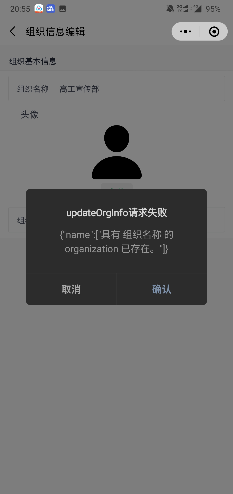

# 内部Bug清单

本文档仅面向团队内部，用于记录测试遇到的bug和修复进度

## Web

### Bug

- [ ] 

### 体验项

- [ ] 

## 小程序

### Bug

- [ ] 用户反馈界面下错误显示“组织基本信息”
- [ ] 创建组织后提示显示不完整。
- [ ] 

### 体验项

- [ ] 首页“推荐”、“地图”的点击范围较小
- [ ] 组织信息编辑报错提醒简陋
- [ ] 组织成员管理界面，组织名建议用不同样式标出
- [ ] 

## 后端

### Bug

- [ ] 

### 体验项

- [ ] 

