# ARS-FR-2 互测报告

## 版本历史

| 版本 | 作者                                         | 更新日期 | 更新说明 |
| ---- | -------------------------------------------- | -------- | -------- |
| 0.1  | 乐洋，史鑫杰，开聚实，王肇凯，王佳瑞，李永毅 | 2021.6.2 | 完成互测 |

## 目录

[TOC]

## 1 引言

### 1.1 标识

标题：《ARS-FR-2互测报告》。

### 1.2 文档概述

本文档为ARS-FR-2组互测报告，用于测试互测对象ARS-FR-1组小程序端、Web端的测试情况并记录测试结果。

### 1.3 项目概述

#### 1.3.1 被测软件概述

a) 被测软件名称为“航go-北航大学生活动发布与社交平台”。

b) 被测软件的功能主要包括：活动发布、宣传通知、日程提醒、活动报名、推荐活动等。

c) 被测软件为网页（管理端）及小程序（用户端），分别在主流浏览器上、ios或安卓的微信客户端上运行。

## 2 测试资源

### 2.1 测试环境

| 软件环境                         | 硬件环境           |
| -------------------------------- | ------------------ |
| Safari 14.0.3; Mac OS 11.2.3     | MacBook Pro 2020   |
| Chrome 90.0.4430.212 ;Windows 10 | LENOVO ideapad 300 |
| 微信7.0.21; Android 11           | Xiaomi 10          |
| 微信8.0.6; iOS 14.4.2            | iPhone 12          |
| 微信8.0.6; Android 10            | Honor v30 pro      |

### 2.2 测试工具

无

## 3 测试总结

### 3.1 测试时间

2021年5月29日至2021年6月3日。

### 3.2 测试人员

乐洋、史鑫杰、开聚实、王肇凯、李永毅、王佳瑞。

### 3.3 小程序端测试结果

#### 3.3.1 活动名称、描述、标签长度上限（Sev=2）

活动名称、描述、标签均无长度上限，且超过一定范围只提示发布失败；字数较多时影响前端界面显示

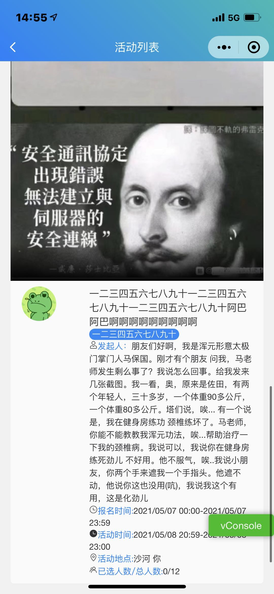

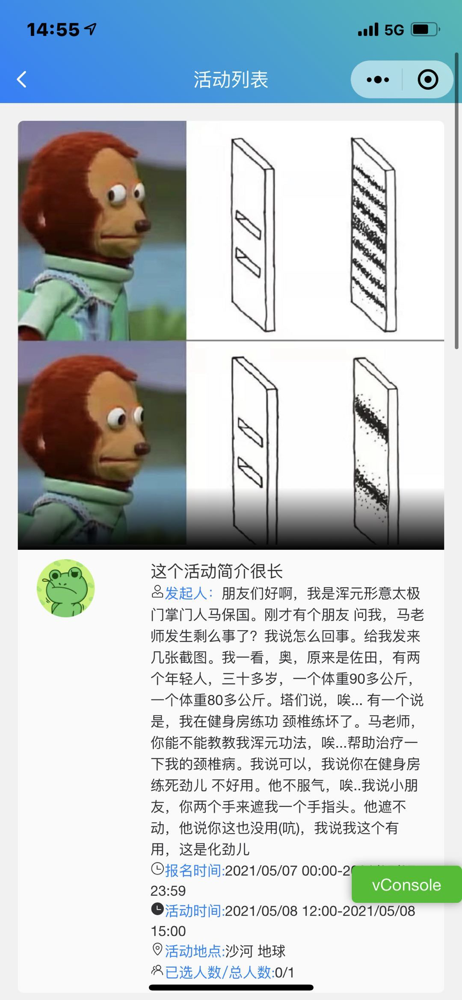

#### 3.3.2 日期第一行显示错误（Sev=2）

日程页面点击第一行的日期，日期会显示错误

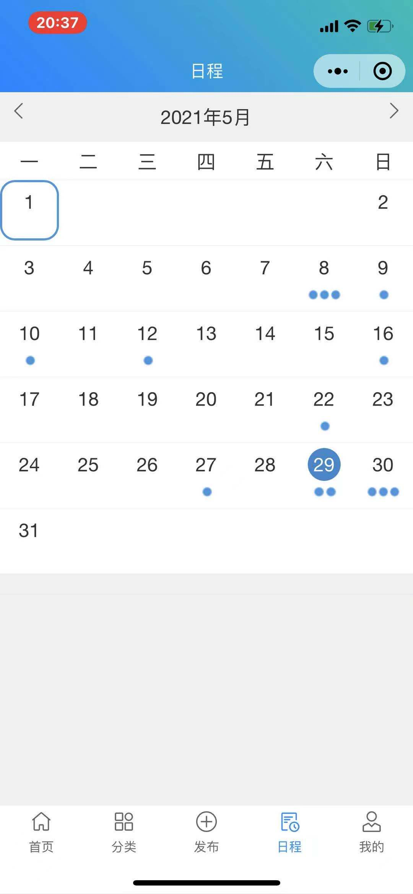

#### 3.3.3 用户昵称和学号长度上限（Sev=2）

输入框未限制字数，约200字的昵称仍能提交（再长会点击按钮无响应，猜测是前端或后端报错），学号长度同理；会导致“我的”页面和评论区等处页面严重失调

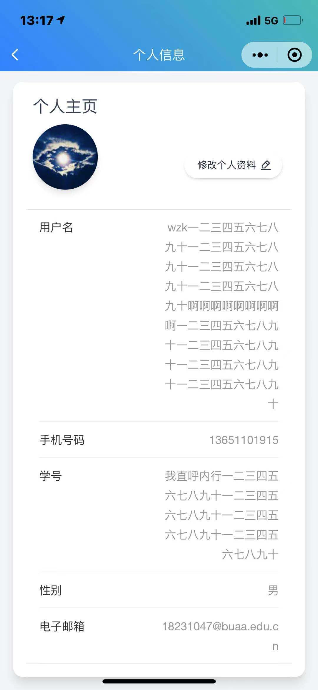

#### 3.3.4 bot按钮点击无反应（Sev=3）

首页右上角的bot按钮点击后无响应

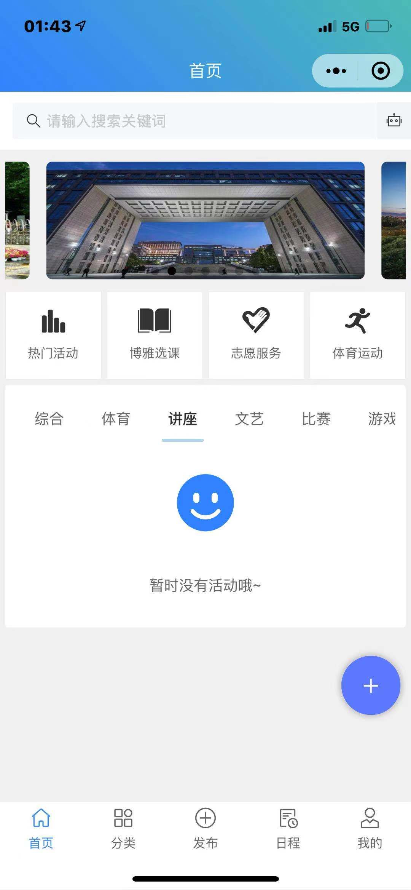

#### 3.3.5 活动人数上限（Sev=3）

人数输入框没有限制最大范围，输入错误时只显示了一个空的大括号

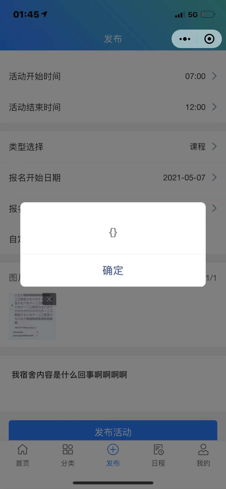

#### 3.3.6 认证界面输入格式与长度上限（Sev=3）

学号及手机号没有限制输入格式和字数，且输入错误格式时仅提示认证失败

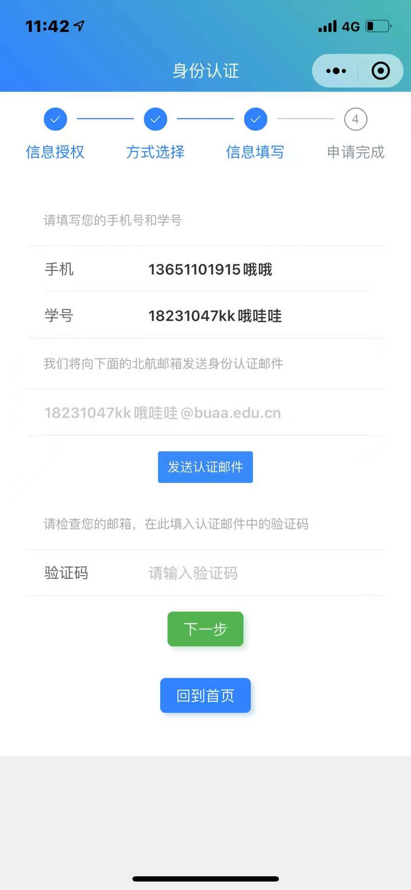

#### 3.3.7 选择地址按钮文本未清空（Sev=1）

成功发完一个活动后，提交地址按钮的文本仍然为此前选择的地址而非初始值“请选择xx类别地址”，后续发布活动均强制变为运动类活动。

#### 3.3.8 个人信息性别显示未知（Sev=3）

点击其他用户信息，有用户显示性别为未知

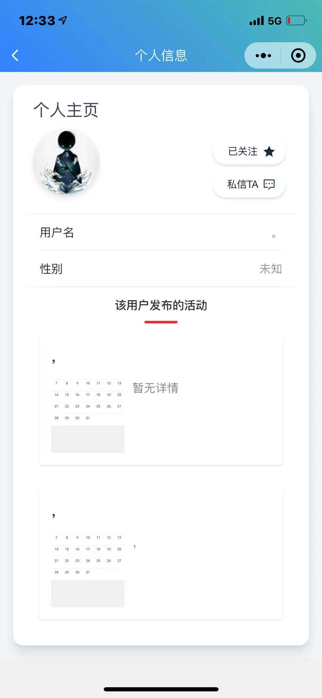

#### 3.3.9 消息列表显示“NaN天前“（Sev=3）

在某用户里点击私信但不发信息，回到我的—消息列表会显示该用户为“NaN天前”

#### 3.3.10 博雅人数显示为null（Sev=2）

博雅活动列表页人数为null

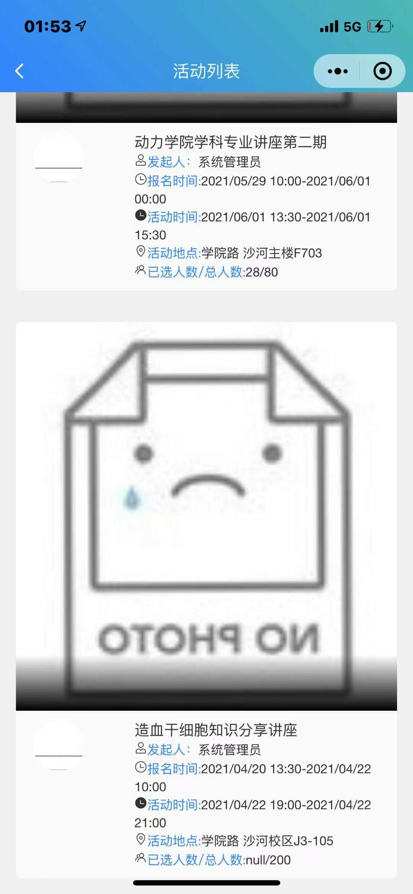

#### 3.3.11 查看消息后未读提示红点不消失（Sev=2）

点开消息查看被回复内容后，返回我的消息页面红色提示没有消失

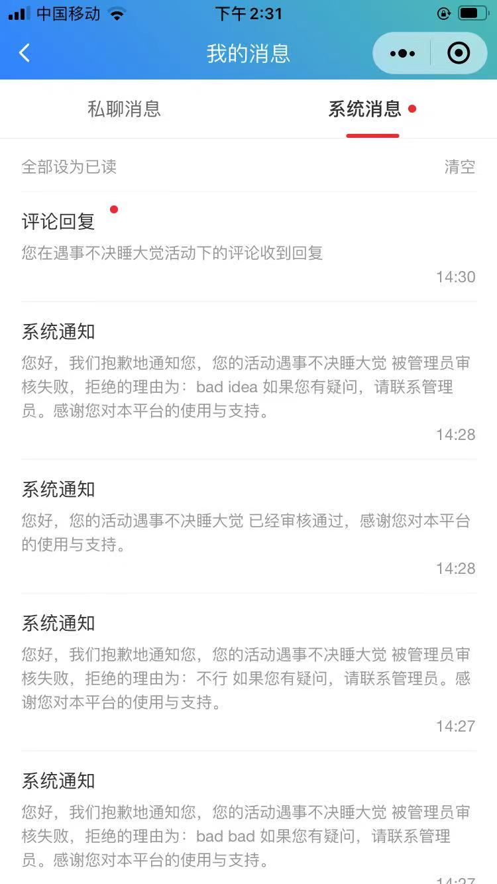

#### 3.3.12 活动发布失败不提示原因（Sev=2）

发布活动失败

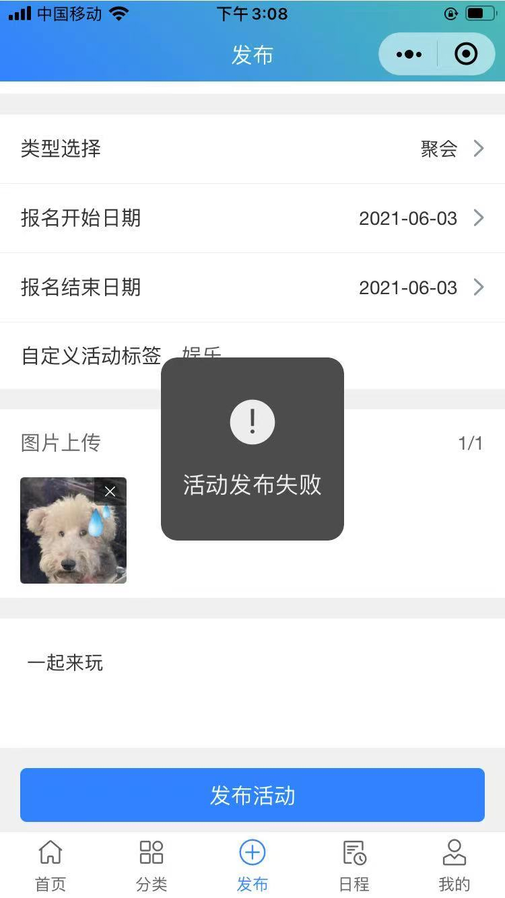

#### 3.3.13 发布活动选择时间为灰色（Sev=3）

用户使用手册未说明发布活动时间限制，但活动发布时间选择有限制

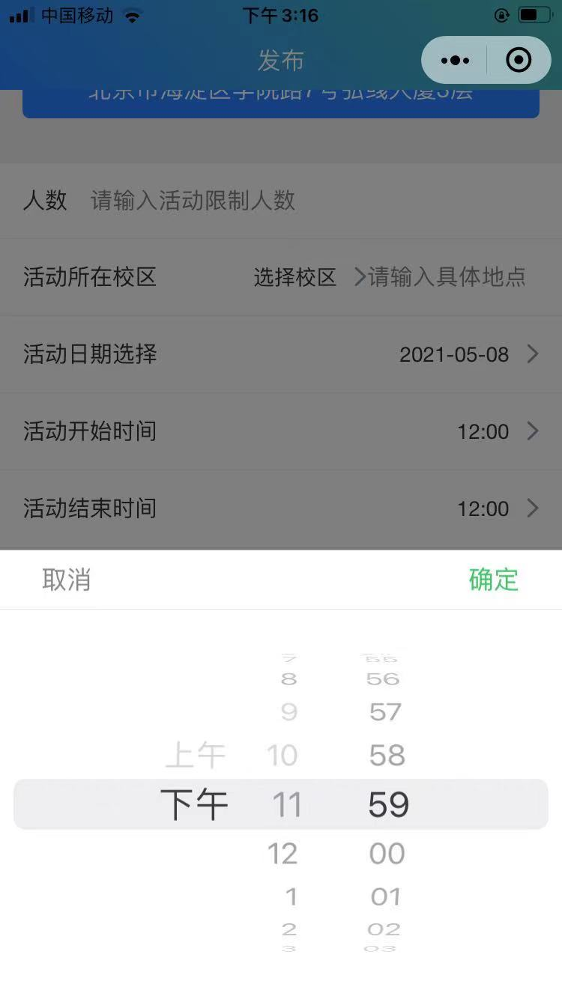

#### 3.3.14 刚进入小程序时首页中综合栏目下无活动（Sev=2）

刚进入小程序时首页中综合栏目下无活动，切到其他页面再转回来时也没有，而转到体育或讲座栏目下再转回来时会有活动

#### 3.3.15 日程表显示错误（Sev=3）

2021年11月（事实上2022年8月也是）多了一行空白周

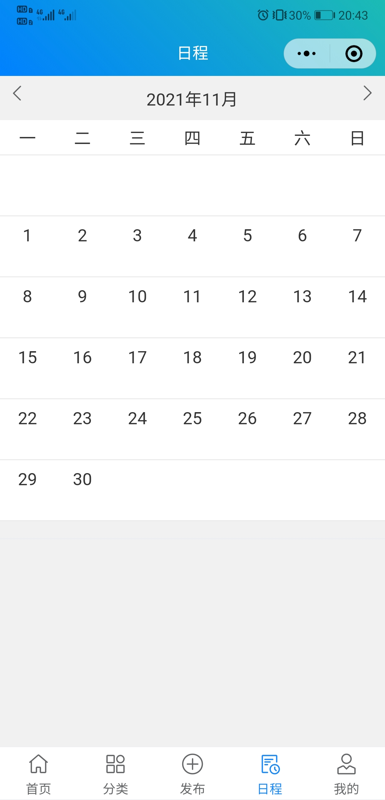

#### 3.3.16 私聊消息问题（Sev=3）

在与任何进入用户对象的私信界面后，即使不发送消息，该用户对象也会出现在私聊消息界面中

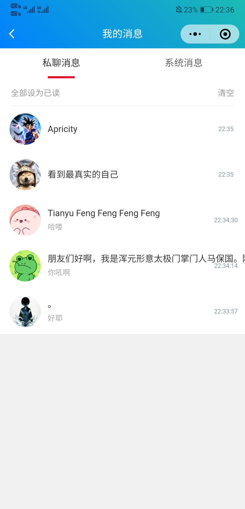

#### 3.3.17 未登录下活动发布错误（Sev=2）

未登录状态下发布活动仅提示“网络错误”，并未提示正确原因。

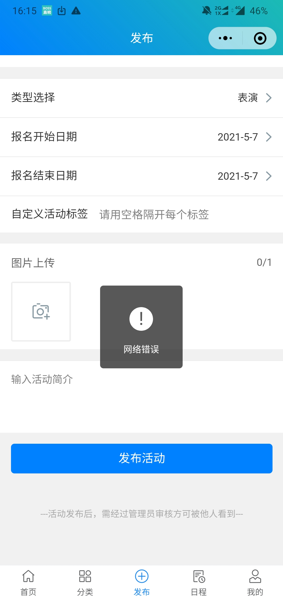

#### 3.3.18 身份认证界面返回异常（Sev=3）

在身份认证界面左滑返回后，会跳转回“我的”界面，但此后立即跳转到“身份认证”界面。

#### 3.3.19 偶尔出现活动修改失败（Sev=3）

偶尔出现无论修改任何内容（均为合法输入），点击“修改活动”按钮后无反应或提示“活动修改失败”。

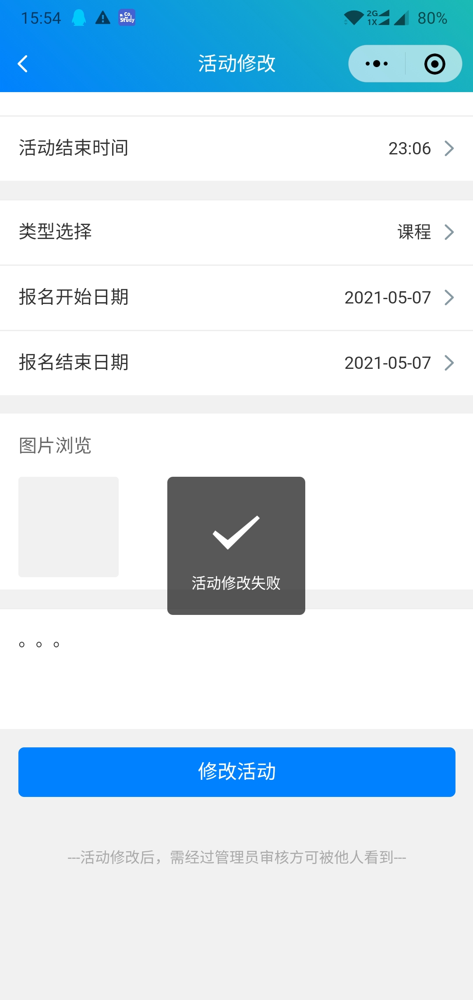

#### 3.3.20 活动类型无法修改（Sev=1）

活动修改类型后点击“修改活动”，显示“活动修改成功”，但活动类型自动变回修改前内容，且在web端待审核活动中，活动类别也为修改前的内容。

#### 3.3.21 地图聚焦功能无效（Sev=1）

用户手册中运动部分描述“点击活动序号，地图聚焦到该活动”的功能在小程序上无法使用。

#### 3.3.22 连续发布活动后活动简介出错（Sev=2）

在活动发布成功后，继续发布活动，若未填写活动简介，则系统自动将上一个发布活动的活动简介作为本活动的活动简介。

#### 3.3.23 活动图片过长在首页显示异常（Sev=3）

 活动图片过长会超出本活动单元格范围，影响页面其他部分显示。

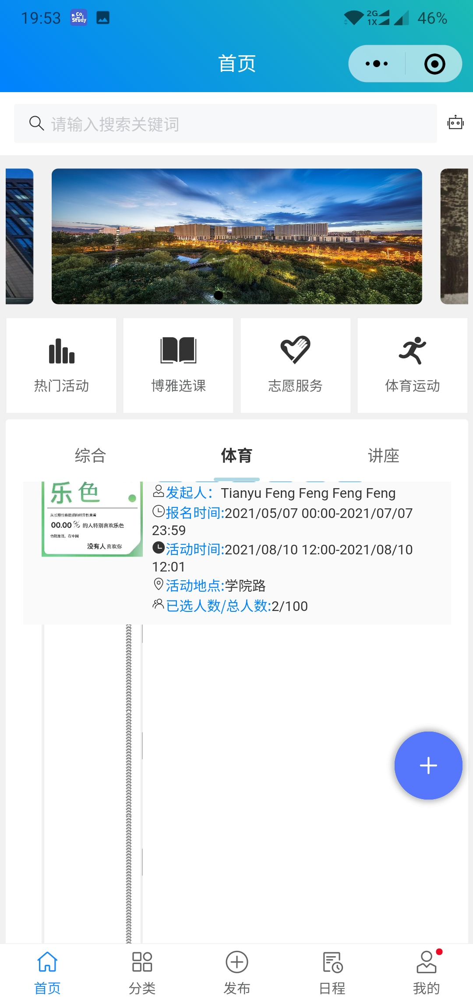

#### 3.3.24 活动人数错误引发的异常活动发布（Sev=1）

活动人数超过上限后，点击“发布活动”，返回错误信息，但实际上创建了一个没有人数、开始和结束时间、活动描述的错误活动，且在web端能够看见，并且能够通过审核，此后在小程序端可以查看本错误活动。

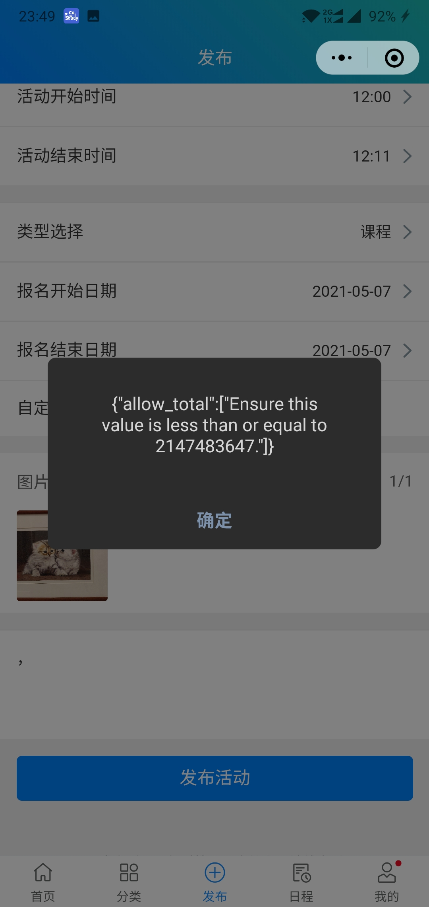

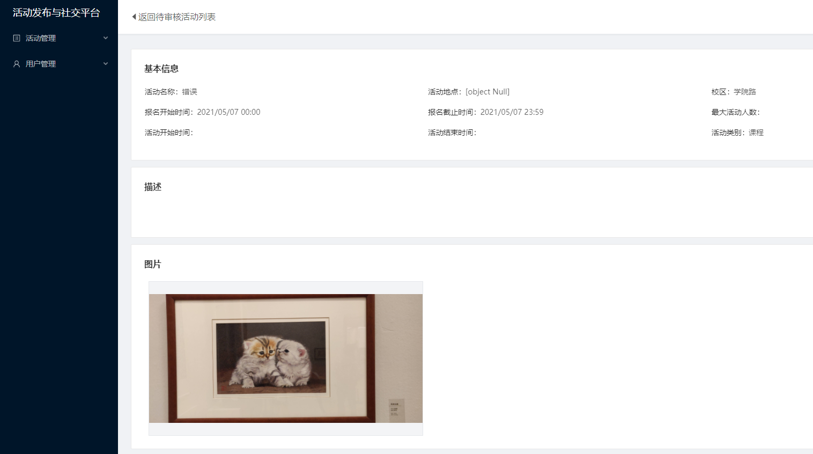

#### 3.3.25 搜索后“历史搜索”没有记录（Sev=1）

输入搜索关键词进行搜索后，“历史搜索”栏没有搜索过的关键词

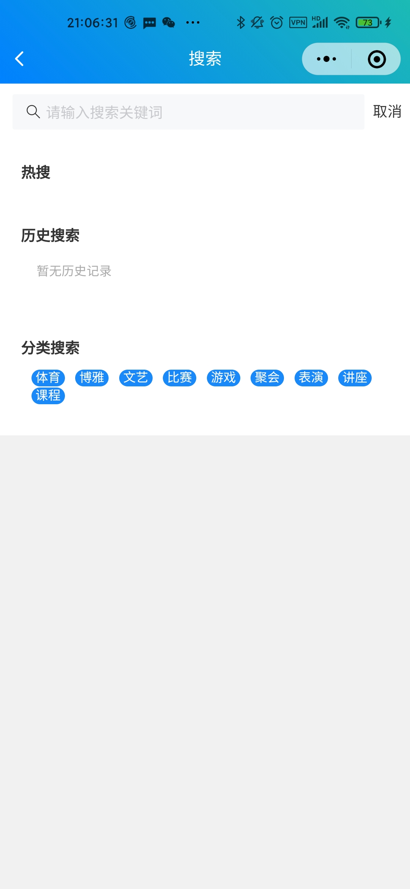

#### 3.3.26 未登录时点击加入活动无反应（Sev=2）

在活动详情页点击“加入活动”，没有任何反应或提示

#### 3.3.27 未登录时评论活动无反应（Sev=2）

在活动详情页点击“Comment”，没有任何反应或提示

#### 3.3.28 未登录状态下分类页面为空（Sev=2）

未登录状态下，点击“分类”，页面为空且没有提示

#### 3.3.29 未登录状态下发送私信，提示“网络异常”（Sev=2）

未登录状态下，在私聊页面，点击“发送”按钮，提示“网络异常，无法发送”

#### 3.3.30 未登录状态下个人信息不显示（Sev=2）

未登录状态下，在个人信息页面，头像、用户名为空，性别为女，关注按钮无法点击

#### 3.3.31 未登录状态下发布活动，提示“活动发布失败”（Sev=2）

未登录状态下，在发布页面，填写部分字段后，点击“发布活动”，提示“活动发布失败”，未提示失败原因

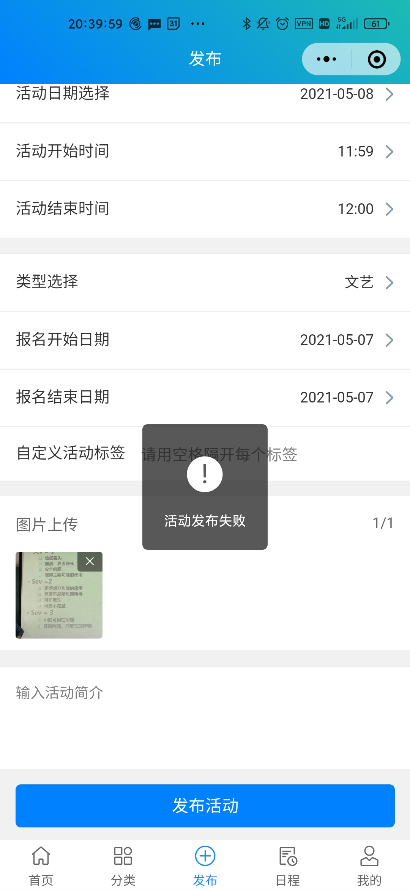

#### 3.3.32 活动无地点时会显示[Object Null]（Sev=3）

在活动详情页，活动无地点时，活动的地点字段会显示为[Object Null]

#### 3.3.33 活动开始时间等于结束时间时提示“活动开始时间不能晚于活动结束时间”（Sev=3）

在发布页面，选择的活动开始时间与结束时间相等时，提示“活动开始时间不能晚于活动结束时间”

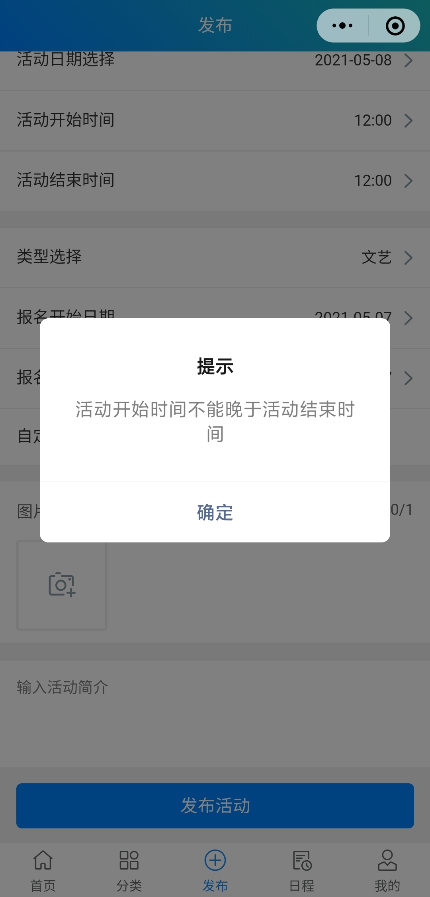

#### 3.3.34 未登录时点击“清空历史记录”提示“该用户不存在”（Sev=3）

未登录状态下，在搜索页面点击“清空历史记录”，提示“该用户不存在”

#### 3.3.35 热搜榜有的条目没有标题(Sev=3)

热搜榜有的条目没有标题，但点击之后其实能跳转到相应的活动。

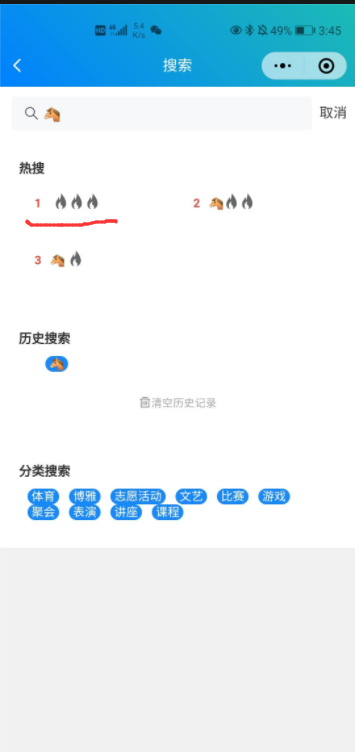

#### 3.3.36 通过首页的“志愿服务”进入活动列表显示不全（Sev=2）

通过分类的“志愿活动”进入活动列表能看到活动（见下图1），但是通过通过首页的“志愿服务”进入活动列表显示不全（见下图2）

#### 3.3.37 评论为空（Sev=2）

在活动详情界面的comment处，不输入评论内容也可以提交发布

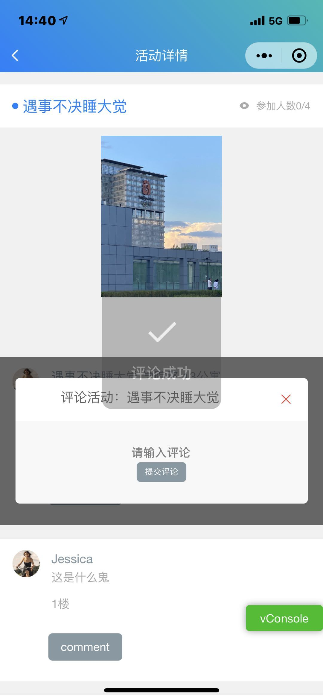

#### 3.3.38消息列表中可以看到未审核的活动（Sev=2）

订阅提醒“您订阅的类别xx有新的活动xxxx”，点击后发现活动正在审核中还未发布

### 3.4 Web端测试结果

#### 3.4.1 活动驳回理由长度上限（Sev=2）

活动审核驳回理由未限制字数，且会完整地返回至前端造成界面异常

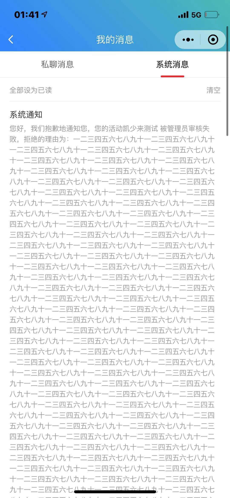

#### 3.4.2 所有用户显示用户不完整（Sev=1）

已认证的id=11 用户未出现在所有用户列表中

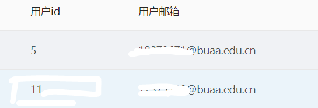

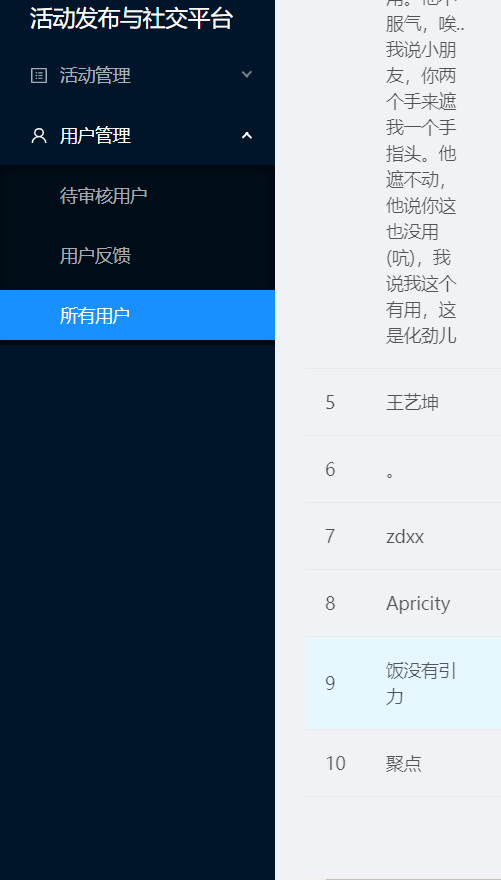

#### 3.4.3 所有用户反馈显示不完整（Sev=1）

用户反馈最多只能显示10条，更多的用户反馈无法在管理端正确显示。

#### 3.4.4 对同一活动先驳回后通过与先通过后驳回的结果均为活动通过（Sev=1）

在活动审核页，对于同一活动，先选择驳回，后选择通过，则活动被通过；先选择通过，后选择驳回，活动依然通过。既没有阻止后发生的操作，也没有让后发生的操作覆盖先发生的操作。

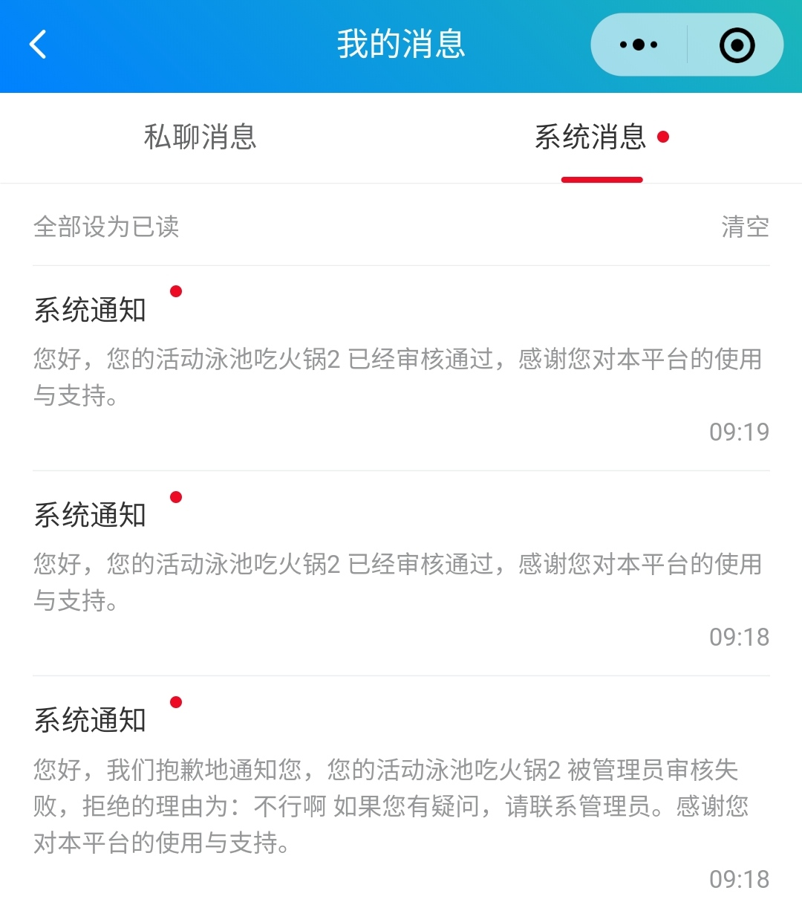

#### 3.4.5 无法点开已通过活动界面（Sev=3）

当数据库中没有任何已通过活动，已通过活动界面无法点开。

### 3.5 后端接口测试结果

#### 3.5.1 activity接口安全性问题（Sev=1）

在无身份认证的情况下，通过接口能够随意查看和删除活动。

#### 3.5.2 activity_types接口安全性问题（Sev=1）

在无身份认证的情况下，通过接口能够随意查看、增加、修改、删除活动类型。

#### 3.5.3 tags接口安全性问题（Sev=1）

在无身份认证的情况下，通过接口能够随意查看、增加、修改、删除活动标签。

#### 3.5.4 feedbacks接口安全漏洞问题（Sev=1）

feedbacks接口返回用户所有个人信息，包括：openid，统一认证密码等重要信息，具有重大安全隐患。

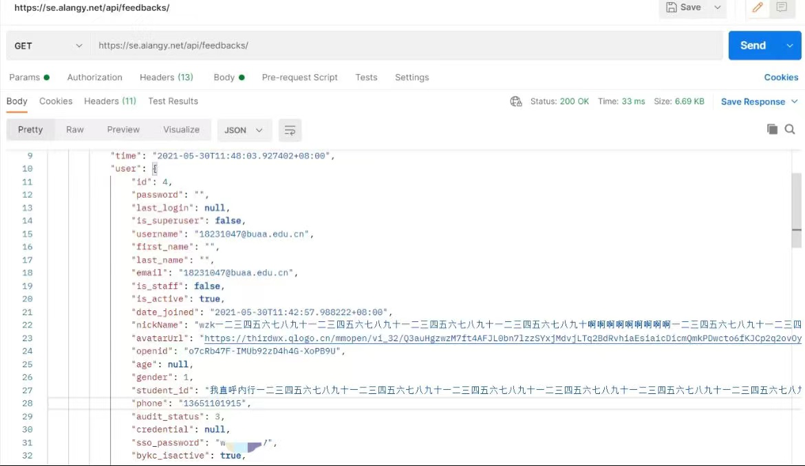

