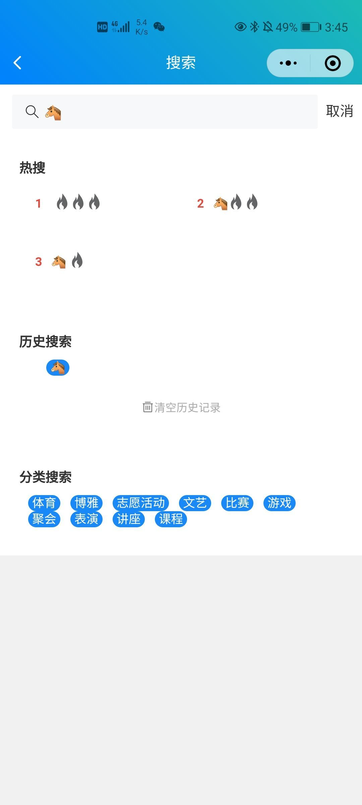
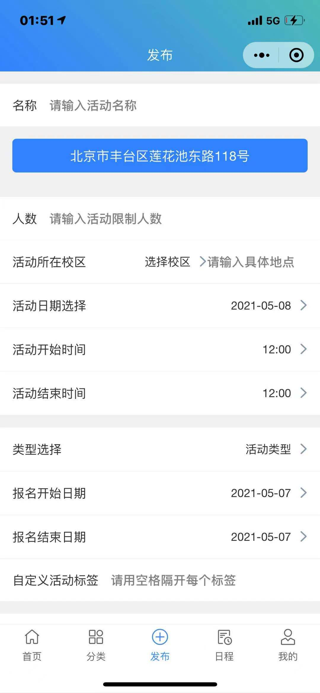

# ARS-FR-2 互测报告

## 版本历史

| 版本 | 作者 | 更新日期 | 更新说明 |
| ---- | ---- | -------- | -------- |
|      |      |          |          |
|      |      |          |          |

## 目录

[TOC]

## 1 引言

### 1.1 标识

标题：《ARS-FR-2互测报告》。

### 1.2 文档概述

本文档为ARS-FR-2组互测报告，用于测试互测对象ARS-FR-1组小程序端、Web端的测试情况并记录测试结果。

### 1.3 项目概述

#### 1.3.1 被测软件概述

a) 被测软件名称为“航go-北航大学生活动发布与社交平台”。

b) 被测软件的功能主要包括：活动发布、宣传通知、日程提醒、活动报名、推荐活动等。

c) 被测软件为网页（管理端）及小程序（用户端），分别在主流浏览器上、ios或安卓的微信客户端上运行。

## 2 测试资源

### 2.1 测试环境

| 软件环境                         | 硬件环境           |
| -------------------------------- | ------------------ |
| Safari 14.0.3; Mac OS 11.2.3     | MacBook Pro 2020   |
| Chrome 90.0.4430.212 ;Windows 10 | LENOVO ideapad 300 |
| 微信7.0.21; Android 11           | Xiaomi 10          |
| 微信8.0.6; iOS 14.4.2            | iPhone 12          |

### 2.2 测试工具

无

## 3 测试总结

### 3.1 测试时间

2021年5月29日至2021年6月3日。

### 3.2 测试人员

乐洋、史鑫杰、开聚实、王肇凯、李永毅、王佳瑞。

### 3.3 小程序端测试结果

#### 3.3.1 上传证件仍需要邮箱确认（Sev=1）

注册认证界面选择上传证件时仍然会显示发送邮件按钮和输入框，且无法提交

#### 3.3.2 日期第一行显示错误（Sev=2）

日程页面点击第一行的日期，日期会显示错误

#### 3.3.3 用户昵称和学号长度上限（Sev=2）

输入框未限制字数，约200字的昵称仍能提交（再长会点击按钮无响应，猜测是前端或后端报错），学号长度同理；会导致“我的”页面和评论区等处页面严重失调

#### 3.3.4 bot按钮点击无反应（Sev=3）

首页右上角的bot按钮点击后无响应

#### 3.3.5 活动人数上限（Sev=3）

人数输入框没有限制最大范围，输入错误时只显示了一个空的大括号

#### 3.3.6 认证界面输入格式与长度上限（Sev=3）

学号及手机号没有限制输入格式和字数，且输入错误格式时仅提示认证失败

#### 3.3.7 选择地址按钮文本未清空（Sev=3）

成功发完一个活动后，提交地址按钮的文本仍然为此前选择的地址而非初始值“请选择xx类别地址”

#### 3.3.8 个人信息性别显示未知（Sev=3）

点击其他用户信息，有用户显示性别为未知

#### 3.3.9 消息列表显示“NaN天前“（Sev=3）

在某用户里点击私信但不发信息，回到我的—消息列表会显示该用户为“NaN天前”

#### 3.3.10 博雅人数显示为null（Sev=2）

博雅活动列表页人数为null

#### 3.3.11 查看消息后未读提示红点不消失（Sev=2）

点开消息查看被回复内容后，返回我的消息页面红色提示没有消失

#### 3.3.12 活动发布失败不提示原因（Sev=2）

发布活动失败

#### 3.3.13 发布活动选择时间为灰色（Sev=3）

用户使用手册未说明发布活动时间限制，但活动发布时间选择有限制

### 3.4 Web端测试结果

#### 3.4.1 活动驳回理由长度上限（Sev=2）

活动审核驳回理由未限制字数，且会完整地返回至前端造成界面异常

#### 3.4.2 所有用户显示用户不完整（Sev=1）

已认证的id=11 用户未出现在所有用户列表中

