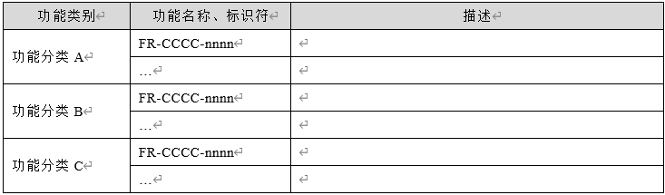

# 『一苇以航』 概要设计报告

## 版本历史

| 版本 | 作者 | 更新日期 | 更新说明 |
| ---- | ---- | -------- | -------- |
|      |      |          |          |

## 目录

[TOC]

## 1 文档介绍

### 1.1 文档目的

### 1.2 文档范围

### 1.3 读者对象

### 1.4 参考文献

**提示：**列出本文档的所有参考文献（可以是非正式出版物），格式如下：

[编号] 作者，文献名称，出版单位（或归属单位），日期

| 编号 | 作者 | 文档名称 | 单位 | 日期 |
| ---- | ---- | -------- | ---- | ---- |
|      |      |          |      |      |
|      |      |          |      |      |
|      |      |          |      |      |

例如：

[SPP-PROC-PP]SEPG，需求开发规范，机构名称，日期

### 1.5 术语与缩写解释

| 缩写、术语 | 解释 |
| ---------- | ---- |
|            |      |
|            |      |
|            |      |

## 2 设计要点

**提示：**描述文档组织结构，列举影响模块设计的关键点，包括：

*1.*    *本设计报告的范围。*

*2.*    *关键业务功能。引用《需求规格书》中对应功能的描述，并说明如何实现。*

*3.*    *技术实现难点。通常来源于非功能性需求，如：性能、数据规模、可靠性等。*

*4.*  *影响设计的其他考虑，如：外购产品、扩展性、参数化、可维护性、数据规模、性能等。*

## 3 功能分组1 实现设计

**提示：**本章内容应包括对“需求规格书”中功能的实现说明。实现方法应与设计要点中的约定保持一致。此处可增加表格方式展示实现的功能列表。

*如：*

### 3.1 功能A1（编号）实现

**提示：”功能A1”**是对“需求规格书”中对应功能编号和名称的引用。描述下列内容：

*1.*    前提条件。应在原有功能的“输入/前提条件”基础上加以细化，约定对前提条件的检查方法。

*2.*    功能实现步骤。应在原有功能的“操作序列”基础上加以细化。

*3.*    后继结果。应在原有功能的“输出/后继结果”基础上加以细化。

*4.*    定义在上述内容中出现的数据及接口。包括：数据库、数据接口、通讯接口，至少要定义名称。

*5.*    如需引用其他文档定义的数据及接口(**如外部接口)**，应明确写出其名称、接口编号或对应文档章节号。

#### 3.1.1 实现简述及约定

**提示：**

描述该功能实现的设计思路和设计约定。

#### 3.1.2 功能实现流程

**提示：**绘制流程图(**必要)**、时序图(**可选)**、状态图（可选）等展示功能实现设计的细节。图形均建议采用VISO绘制。

当流程中有多个子系统、多个对象时，采用跨职能流程图绘制。

如需描述该子系统与其他子系统的一般性交互关系，可绘制简要时序图。

如存在较复杂的状态控制，可绘制状态图。

对于图中关键步骤，应辅以文字说明。

#### 3.2.3 用户界面设计

**提示：**介绍本功能用户界面的关键输入、输出项目。每个界面应具有界面编号，界面构成可采用下表进行描述：

| **NO** | **类型** | **信息内容**   | **信息表现**     | **说明**                                   |
| ------ | -------- | -------------- | ---------------- | ------------------------------------------ |
| 1      | 必选     | 对话框名称     | 字符提示         | 遵循字符要求  显示在窗体菜单栏上           |
| 2      | 可选     | 系统自检项状态 | 字符或者图片提示 | 遵循字符、图片提示要求  显示自检项通过情况 |

输  出：1）自检通过，迁移到登录界面（LCWS_E01_001）； 

补充说明： 

#### 3.1.4 相关接口

**提示：**列举本功能实现涉及到的接口，通常对于接口详细定义和说明，会提供单独的接口文档加以描述，本节中可以采用列表方式来进行引用，并适当说明其用法。

| 序号 | 类型 | 接口编号/名称 | 来源/文档编号 | 说明 |
| ---- | ---- | ------------- | ------------- | ---- |
| 1.   | 内部 |               |               |      |
| 2.   | 外部 |               |               |      |
| 3.   | UI   |               |               |      |

#### 3.1.5 出错处理设计

**提示：**说明功能执行过程中可能的异常、错误情况，并说明异常处理方法。

#### 3.1.6 出错信息

**提示：**用一览表的方式说明每种可能的出错或故障情况出现时，系统输出信息的形式、含意及处理方法。

| 序号 | 错误编码 | 错误信息 | 说明/处理办法 |
| ---- | -------- | -------- | ------------- |
| 1.   |          |          |               |

## 4 功能分组2 实现设计

## 5 接口设计

**提示：**说明本功能实现涉及到的接口，通常对于接口详细定义和说明，会提供单独的接口文档加以描述，本节中可以采用列表方式来进行引用，并适当说明其用法。如需定义新接口，则在本节中定义。

本节内容可选。

| 序号 | 类型 | 接口编号/名称 | 来源/文档编号 | 说明 |
| ---- | ---- | ------------- | ------------- | ---- |
| 1.   | 内部 |               |               |      |
| 2.   | 外部 |               |               |      |
| 3.   | UI   |               |               |      |

### 5.1 接口1（接口编号）定义

**提示：**描述接口方式、用途。定义接口格式。可采用与数据结构定义中的表格形式，或者给出顺序图。

| 序号 | 字段     | 长度 | 类型 | 说明 |
| ---- | -------- | ---- | ---- | ---- |
| 1    | 字段名称 |      | BCD  |      |
| 2    |          |      | HEX  |      |

## 6 数据结构设计

**提示：**说明本文档涉及的数据结构(数据库表)。

| 序号 | 类型     | 数据编号/名称 | 来源/文档编号 | 说明 |
| ---- | -------- | ------------- | ------------- | ---- |
| 1.   | 数据结构 |               |               |      |
| 2.   | 数据库表 |               |               |      |

### 6.1 数据结构1

| 序号 | 类型     | 数据编号/名称 | 来源/文档编号 | 说明 |
| ---- | -------- | ------------- | ------------- | ---- |
| 1.   | 数据结构 |               |               |      |
| 2.   | 数据库表 |               |               |      |