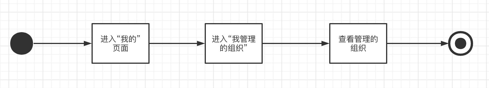
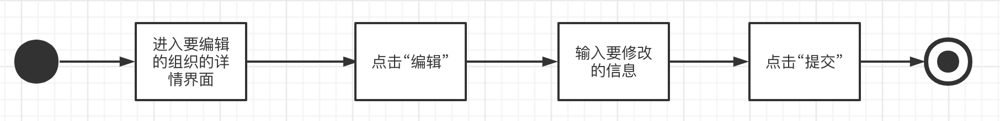
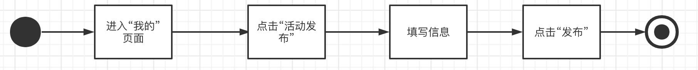
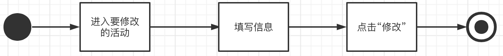
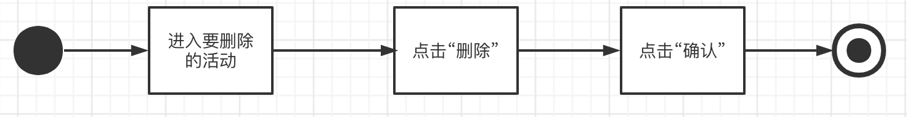
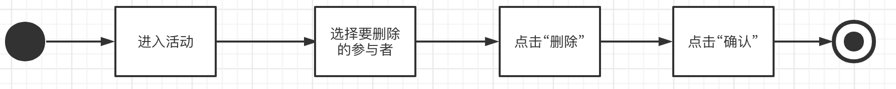
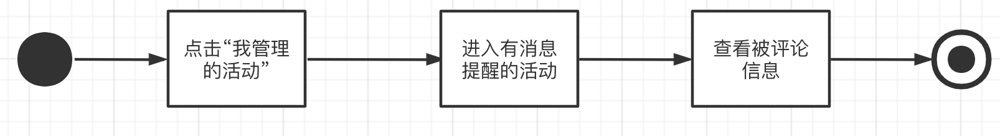
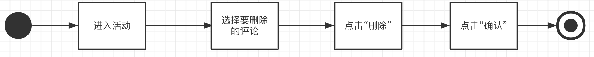

# TODO

提交时需要做的事：

* 导出成word
* 整理表格
* 删去目录，用word直接生成目录
* 调整字体格式等
* 删去本节

如何写3~4部分：

* 流程图：processon，组件从UML类图中选
* 简述/流程文字：从需求文档抄
  * 注意根据我们实际页面内容进行调整，不要直接复制
* 界面：参考实际页面内容
* 功能编号：3456分别对应ABCD，即A01-A24，B01-B09，C01-C03，D01-D12
* 实现简述及约定：需求文档里的“约定与约束”也要写在概要的“实现简述及约定”里， 不过如果是输入相关的约束（比如不能输入空字符串），就直接写在“ 出错处理设计”里
* 接口：从后端接口说明抄
  * 接口名称：直接写中文
  * 部分微信官方的（例如登录等）要写“外部”
* 出错处理设计、出错信息：从后端接口说明抄
  * 错误编码：写1234...就行，要改以后改
  * “用户id不存在”之类的出错可以不考虑


# 『一苇以航』 概要设计报告

## 版本历史

| 版本 | 作者 | 更新日期 | 更新说明 |
| ---- | ---- | -------- | -------- |
|      |      |          |          |

## 目录

[TOC]

## 1 文档介绍

### 1.1 文档目的

本文档给出“大学生活动发布与社交平台”产品“一苇以航”的整体概述，对于产品的各项功能进行系统描述，明确该产品的定位，用作之后系统测试的基础，同时也作为完成后验收确认的依据。

### 1.2 文档范围

该文档介绍活动发布系统的微信小程序，后端以及Web端的功能及其实现方式，错误处理等。

### 1.3 读者对象

本文档面向用户、开发人员、产品人员和验收方。

### 1.4 参考文献

| 编号          | 作者           | 文档名称                   | 单位                                                         | 日期       |
| ------------- | -------------- | -------------------------- | ------------------------------------------------------------ | ---------- |
| GB/T9235-2008 | 冯慧、王宝艾等 | 计算机软件需求规格说明规范 | 中华人民共和国国家质量监督检验检疫总局、中国国家标准化管理委员会 | 2008-04-11 |

### 1.5 术语与缩写解释

| 缩写、术语                          | 解释                                                         |
| ----------------------------------- | ------------------------------------------------------------ |
| 版块(Forum)                         | 活动的顶层分类，例如博雅、社团活动、志愿等，由超级管理员设定，无法随意添加或修改 |
| 组织(Organization, ORG)             | 从属于版块，由用户创建、经过审核后发布，创建者自动成为组织管理员 |
| 活动(Activity, ACT)                 | 从属于组织（社团、学生会等版块下）或版块（博雅、演出等官方版块，以及*个人版块*），由组织/个人发布 |
| 固定活动(Official Activity, OA)     | 具有（一定的）官方性质的活动，例如博雅、演出等，由超级管理员通过爬虫等渠道获取并更新至活动列表，不归特定组织所有 |
| 非固定活动(Unofficial Activity, UA) | 包括*组织活动*（由组织管理员代表组织发布）及*个人活动*（由个人发布），例如社团活动、约球约自习等 |


## 2 设计要点

**提示：**描述文档组织结构，列举影响模块设计的关键点，包括：

*1.*    *本设计报告的范围。*

*2.*    *关键业务功能。引用《需求规格书》中对应功能的描述，并说明如何实现。*

*3.*    *技术实现难点。通常来源于非功能性需求，如：性能、数据规模、可靠性等。*

*4.*  *影响设计的其他考虑，如：外购产品、扩展性、参数化、可维护性、数据规模、性能等。*


## 3 功能分组1 实现设计    普通用户


| 功能类别       | 功能类别、标识符   | 描述                                                         |
| -------------- | ------------------ | ------------------------------------------------------------ |
| 用户账户相关   | 用户注册 A01       | 首次使用此小程序时，微信用户通过微信的授权认证成为此小程序的用户 |
|                | 用户登录 A02       | 注册后，用户直接通过微信的小程序页面进入此微信小程序         |
|                | 编辑用户信息 A03   | 修改用户的信息                                               |
|                | 查看用户id A04     | 查看用户本人的id                                             |
|                | 身份验证 A05       | 验证用户是否是北航师生                                       |
| 组织管理相关   | 申请创建组织 A06   | 普通用户可申请注册新组织，并成为组织负责人                   |
|                | 申请组织管理员 A07 | 用户申请成为指定组织管理员                                   |
| 组织关注相关   | 关注组织 A08       | 用户所关注的组织发布的活动信息将展示于“关注”页面             |
|                | 取消关注组织 A09   | 不再展示被取消关注的组织的活动信息                           |
|                | 查看关注信息 A10   | 看已关注的组织或板块的发布信息                               |
| 活动参与相关   | 报名活动 A11       | 用户报名参加处于报名状态且未招满的活动                       |
|                | 退出活动 A12       | 退出已报名未进行的活动                                       |
|                | 评价活动 A13       | 在活动结束后对参与的活动进行打分和评论                       |
|                | 删除评论 A14       | 删除在活动页面已发表活动评论                                 |
|                | 查看活动地图 A15   | 通过地图形式查看已报名活动的相关信息                         |
|                | 查看活动日历 A16   | 通过日历形式查看已报名活动的相关信息                         |
| 个人活动相关   | 发布个人活动 A17   | 用户可在个人板块发布不可报名的非固定活动                     |
|                | 编辑个人活动 A18   | 修改个人发布的活动信息                                       |
|                | 删除个人活动 A19   | 删除发布的个人活动                                           |
| 分享功能相关   | 分享活动/组织 A20  | 对活动/组织进行分享                                          |
| 搜索功能相关   | 搜索活动/组织 A21  | 对活动/组织进行搜索                                          |
| 个性化推荐相关 | 个性化推荐 A22     | 个性化推荐可能想要关注的活动和想参与的组织                   |
| 通知信息相关   | 查看通知 A23       | 查看接收到的通知信息                                         |
| 用户反馈相关   | 提交用户反馈 A24   | 将使用反馈发送给小程序开发者                                 |


### 3.1  A01 
#### 3.1.1 实现简述及约定  

#### 3.1.2 功能实现流程


#### 3.1.3 用户界面设计

| **NO** | **类型** | **信息内容** | **信息表现** | **说明** |
| ------ | -------- | ------------ | ------------ | -------- |
|        |          |              |              |          |

输出：

#### 3.1.4 相关接口

| 序号 | 类型 | 接口编号/名称 | 来源/文档编号 | 说明 |
| ---- | ---- | ------------- | ------------- | ---- |
|      |      |               |               |      |

#### 3.1.5 出错处理设计


#### 3.1.6 出错信息

| 序号 | 错误编码 | 错误信息 | 说明/处理办法 |
| ---- | -------- | -------- | ------------- |
| 1    |          |          |               |


### 3.2  A02 
#### 3.2.1 实现简述及约定  

#### 3.2.2 功能实现流程


#### 3.2.3 用户界面设计

| **NO** | **类型** | **信息内容** | **信息表现** | **说明** |
| ------ | -------- | ------------ | ------------ | -------- |
|        |          |              |              |          |

输出：

#### 3.2.4 相关接口

| 序号 | 类型 | 接口编号/名称 | 来源/文档编号 | 说明 |
| ---- | ---- | ------------- | ------------- | ---- |
|      |      |               |               |      |

#### 3.2.5 出错处理设计


#### 3.2.6 出错信息

| 序号 | 错误编码 | 错误信息 | 说明/处理办法 |
| ---- | -------- | -------- | ------------- |
| 1    |          |          |               |


### 3.3  A03 
#### 3.3.1 实现简述及约定  

#### 3.3.2 功能实现流程


#### 3.3.3 用户界面设计

| **NO** | **类型** | **信息内容** | **信息表现** | **说明** |
| ------ | -------- | ------------ | ------------ | -------- |
|        |          |              |              |          |

输出：

#### 3.3.4 相关接口

| 序号 | 类型 | 接口编号/名称 | 来源/文档编号 | 说明 |
| ---- | ---- | ------------- | ------------- | ---- |
|      |      |               |               |      |

#### 3.3.5 出错处理设计


#### 3.3.6 出错信息

| 序号 | 错误编码 | 错误信息 | 说明/处理办法 |
| ---- | -------- | -------- | ------------- |
| 1    |          |          |               |


### 3.4  A04 
#### 3.4.1 实现简述及约定  

#### 3.4.2 功能实现流程


#### 3.4.3 用户界面设计

| **NO** | **类型** | **信息内容** | **信息表现** | **说明** |
| ------ | -------- | ------------ | ------------ | -------- |
|        |          |              |              |          |

输出：

#### 3.4.4 相关接口

| 序号 | 类型 | 接口编号/名称 | 来源/文档编号 | 说明 |
| ---- | ---- | ------------- | ------------- | ---- |
|      |      |               |               |      |

#### 3.4.5 出错处理设计


#### 3.4.6 出错信息

| 序号 | 错误编码 | 错误信息 | 说明/处理办法 |
| ---- | -------- | -------- | ------------- |
| 1    |          |          |               |


### 3.5  A05 
#### 3.5.1 实现简述及约定  

#### 3.5.2 功能实现流程


#### 3.5.3 用户界面设计

| **NO** | **类型** | **信息内容** | **信息表现** | **说明** |
| ------ | -------- | ------------ | ------------ | -------- |
|        |          |              |              |          |

输出：

#### 3.5.4 相关接口

| 序号 | 类型 | 接口编号/名称 | 来源/文档编号 | 说明 |
| ---- | ---- | ------------- | ------------- | ---- |
|      |      |               |               |      |

#### 3.5.5 出错处理设计


#### 3.5.6 出错信息

| 序号 | 错误编码 | 错误信息 | 说明/处理办法 |
| ---- | -------- | -------- | ------------- |
| 1    |          |          |               |


### 3.6  A06 
#### 3.6.1 实现简述及约定  

#### 3.6.2 功能实现流程


#### 3.6.3 用户界面设计

| **NO** | **类型** | **信息内容** | **信息表现** | **说明** |
| ------ | -------- | ------------ | ------------ | -------- |
|        |          |              |              |          |

输出：

#### 3.6.4 相关接口

| 序号 | 类型 | 接口编号/名称 | 来源/文档编号 | 说明 |
| ---- | ---- | ------------- | ------------- | ---- |
|      |      |               |               |      |

#### 3.6.5 出错处理设计


#### 3.6.6 出错信息

| 序号 | 错误编码 | 错误信息 | 说明/处理办法 |
| ---- | -------- | -------- | ------------- |
| 1    |          |          |               |


### 3.7  A07 
#### 3.7.1 实现简述及约定  

#### 3.7.2 功能实现流程


#### 3.7.3 用户界面设计

| **NO** | **类型** | **信息内容** | **信息表现** | **说明** |
| ------ | -------- | ------------ | ------------ | -------- |
|        |          |              |              |          |

输出：

#### 3.7.4 相关接口

| 序号 | 类型 | 接口编号/名称 | 来源/文档编号 | 说明 |
| ---- | ---- | ------------- | ------------- | ---- |
|      |      |               |               |      |

#### 3.7.5 出错处理设计


#### 3.7.6 出错信息

| 序号 | 错误编码 | 错误信息 | 说明/处理办法 |
| ---- | -------- | -------- | ------------- |
| 1    |          |          |               |


### 3.8  A08 
#### 3.8.1 实现简述及约定  

#### 3.8.2 功能实现流程


#### 3.8.3 用户界面设计

| **NO** | **类型** | **信息内容** | **信息表现** | **说明** |
| ------ | -------- | ------------ | ------------ | -------- |
|        |          |              |              |          |

输出：

#### 3.8.4 相关接口

| 序号 | 类型 | 接口编号/名称 | 来源/文档编号 | 说明 |
| ---- | ---- | ------------- | ------------- | ---- |
|      |      |               |               |      |

#### 3.8.5 出错处理设计


#### 3.8.6 出错信息

| 序号 | 错误编码 | 错误信息 | 说明/处理办法 |
| ---- | -------- | -------- | ------------- |
| 1    |          |          |               |


### 3.9  A09 
#### 3.9.1 实现简述及约定  

#### 3.9.2 功能实现流程


#### 3.9.3 用户界面设计

| **NO** | **类型** | **信息内容** | **信息表现** | **说明** |
| ------ | -------- | ------------ | ------------ | -------- |
|        |          |              |              |          |

输出：

#### 3.9.4 相关接口

| 序号 | 类型 | 接口编号/名称 | 来源/文档编号 | 说明 |
| ---- | ---- | ------------- | ------------- | ---- |
|      |      |               |               |      |

#### 3.9.5 出错处理设计


#### 3.9.6 出错信息

| 序号 | 错误编码 | 错误信息 | 说明/处理办法 |
| ---- | -------- | -------- | ------------- |
| 1    |          |          |               |


### 3.10  A10 
#### 3.10.1 实现简述及约定  

#### 3.10.2 功能实现流程


#### 3.10.3 用户界面设计

| **NO** | **类型** | **信息内容** | **信息表现** | **说明** |
| ------ | -------- | ------------ | ------------ | -------- |
|        |          |              |              |          |

输出：

#### 3.10.4 相关接口

| 序号 | 类型 | 接口编号/名称 | 来源/文档编号 | 说明 |
| ---- | ---- | ------------- | ------------- | ---- |
|      |      |               |               |      |

#### 3.10.5 出错处理设计


#### 3.10.6 出错信息

| 序号 | 错误编码 | 错误信息 | 说明/处理办法 |
| ---- | -------- | -------- | ------------- |
| 1    |          |          |               |


### 3.11  A11 
#### 3.11.1 实现简述及约定  

#### 3.11.2 功能实现流程


#### 3.11.3 用户界面设计

| **NO** | **类型** | **信息内容** | **信息表现** | **说明** |
| ------ | -------- | ------------ | ------------ | -------- |
|        |          |              |              |          |

输出：

#### 3.11.4 相关接口

| 序号 | 类型 | 接口编号/名称 | 来源/文档编号 | 说明 |
| ---- | ---- | ------------- | ------------- | ---- |
|      |      |               |               |      |

#### 3.11.5 出错处理设计


#### 3.11.6 出错信息

| 序号 | 错误编码 | 错误信息 | 说明/处理办法 |
| ---- | -------- | -------- | ------------- |
| 1    |          |          |               |


### 3.12  A12 
#### 3.12.1 实现简述及约定  

#### 3.12.2 功能实现流程


#### 3.12.3 用户界面设计

| **NO** | **类型** | **信息内容** | **信息表现** | **说明** |
| ------ | -------- | ------------ | ------------ | -------- |
|        |          |              |              |          |

输出：

#### 3.12.4 相关接口

| 序号 | 类型 | 接口编号/名称 | 来源/文档编号 | 说明 |
| ---- | ---- | ------------- | ------------- | ---- |
|      |      |               |               |      |

#### 3.12.5 出错处理设计


#### 3.12.6 出错信息

| 序号 | 错误编码 | 错误信息 | 说明/处理办法 |
| ---- | -------- | -------- | ------------- |
| 1    |          |          |               |


### 3.13  A13 
#### 3.13.1 实现简述及约定  

#### 3.13.2 功能实现流程


#### 3.13.3 用户界面设计

| **NO** | **类型** | **信息内容** | **信息表现** | **说明** |
| ------ | -------- | ------------ | ------------ | -------- |
|        |          |              |              |          |

输出：

#### 3.13.4 相关接口

| 序号 | 类型 | 接口编号/名称 | 来源/文档编号 | 说明 |
| ---- | ---- | ------------- | ------------- | ---- |
|      |      |               |               |      |

#### 3.13.5 出错处理设计


#### 3.13.6 出错信息

| 序号 | 错误编码 | 错误信息 | 说明/处理办法 |
| ---- | -------- | -------- | ------------- |
| 1    |          |          |               |


### 3.14  A14 
#### 3.14.1 实现简述及约定  

#### 3.14.2 功能实现流程


#### 3.14.3 用户界面设计

| **NO** | **类型** | **信息内容** | **信息表现** | **说明** |
| ------ | -------- | ------------ | ------------ | -------- |
|        |          |              |              |          |

输出：

#### 3.14.4 相关接口

| 序号 | 类型 | 接口编号/名称 | 来源/文档编号 | 说明 |
| ---- | ---- | ------------- | ------------- | ---- |
|      |      |               |               |      |

#### 3.14.5 出错处理设计


#### 3.14.6 出错信息

| 序号 | 错误编码 | 错误信息 | 说明/处理办法 |
| ---- | -------- | -------- | ------------- |
| 1    |          |          |               |


### 3.15  A15 
#### 3.15.1 实现简述及约定  

#### 3.15.2 功能实现流程


#### 3.15.3 用户界面设计

| **NO** | **类型** | **信息内容** | **信息表现** | **说明** |
| ------ | -------- | ------------ | ------------ | -------- |
|        |          |              |              |          |

输出：

#### 3.15.4 相关接口

| 序号 | 类型 | 接口编号/名称 | 来源/文档编号 | 说明 |
| ---- | ---- | ------------- | ------------- | ---- |
|      |      |               |               |      |

#### 3.15.5 出错处理设计


#### 3.15.6 出错信息

| 序号 | 错误编码 | 错误信息 | 说明/处理办法 |
| ---- | -------- | -------- | ------------- |
| 1    |          |          |               |


### 3.16  A16 
#### 3.16.1 实现简述及约定  

#### 3.16.2 功能实现流程


#### 3.16.3 用户界面设计

| **NO** | **类型** | **信息内容** | **信息表现** | **说明** |
| ------ | -------- | ------------ | ------------ | -------- |
|        |          |              |              |          |

输出：

#### 3.16.4 相关接口

| 序号 | 类型 | 接口编号/名称 | 来源/文档编号 | 说明 |
| ---- | ---- | ------------- | ------------- | ---- |
|      |      |               |               |      |

#### 3.16.5 出错处理设计


#### 3.16.6 出错信息

| 序号 | 错误编码 | 错误信息 | 说明/处理办法 |
| ---- | -------- | -------- | ------------- |
| 1    |          |          |               |


### 3.17  A17 
#### 3.17.1 实现简述及约定  

#### 3.17.2 功能实现流程


#### 3.17.3 用户界面设计

| **NO** | **类型** | **信息内容** | **信息表现** | **说明** |
| ------ | -------- | ------------ | ------------ | -------- |
|        |          |              |              |          |

输出：

#### 3.17.4 相关接口

| 序号 | 类型 | 接口编号/名称 | 来源/文档编号 | 说明 |
| ---- | ---- | ------------- | ------------- | ---- |
|      |      |               |               |      |

#### 3.17.5 出错处理设计


#### 3.17.6 出错信息

| 序号 | 错误编码 | 错误信息 | 说明/处理办法 |
| ---- | -------- | -------- | ------------- |
| 1    |          |          |               |


### 3.18  A18 
#### 3.18.1 实现简述及约定  

#### 3.18.2 功能实现流程


#### 3.18.3 用户界面设计

| **NO** | **类型** | **信息内容** | **信息表现** | **说明** |
| ------ | -------- | ------------ | ------------ | -------- |
|        |          |              |              |          |

输出：

#### 3.18.4 相关接口

| 序号 | 类型 | 接口编号/名称 | 来源/文档编号 | 说明 |
| ---- | ---- | ------------- | ------------- | ---- |
|      |      |               |               |      |

#### 3.18.5 出错处理设计


#### 3.18.6 出错信息

| 序号 | 错误编码 | 错误信息 | 说明/处理办法 |
| ---- | -------- | -------- | ------------- |
| 1    |          |          |               |


### 3.19  A19 
#### 3.19.1 实现简述及约定  

#### 3.19.2 功能实现流程


#### 3.19.3 用户界面设计

| **NO** | **类型** | **信息内容** | **信息表现** | **说明** |
| ------ | -------- | ------------ | ------------ | -------- |
|        |          |              |              |          |

输出：

#### 3.19.4 相关接口

| 序号 | 类型 | 接口编号/名称 | 来源/文档编号 | 说明 |
| ---- | ---- | ------------- | ------------- | ---- |
|      |      |               |               |      |

#### 3.19.5 出错处理设计


#### 3.19.6 出错信息

| 序号 | 错误编码 | 错误信息 | 说明/处理办法 |
| ---- | -------- | -------- | ------------- |
| 1    |          |          |               |


### 3.20  A20 
#### 3.20.1 实现简述及约定  

#### 3.20.2 功能实现流程


#### 3.20.3 用户界面设计

| **NO** | **类型** | **信息内容** | **信息表现** | **说明** |
| ------ | -------- | ------------ | ------------ | -------- |
|        |          |              |              |          |

输出：

#### 3.20.4 相关接口

| 序号 | 类型 | 接口编号/名称 | 来源/文档编号 | 说明 |
| ---- | ---- | ------------- | ------------- | ---- |
|      |      |               |               |      |

#### 3.20.5 出错处理设计


#### 3.20.6 出错信息

| 序号 | 错误编码 | 错误信息 | 说明/处理办法 |
| ---- | -------- | -------- | ------------- |
| 1    |          |          |               |


### 3.21  A21 
#### 3.21.1 实现简述及约定  

#### 3.21.2 功能实现流程


#### 3.21.3 用户界面设计

| **NO** | **类型** | **信息内容** | **信息表现** | **说明** |
| ------ | -------- | ------------ | ------------ | -------- |
|        |          |              |              |          |

输出：

#### 3.21.4 相关接口

| 序号 | 类型 | 接口编号/名称 | 来源/文档编号 | 说明 |
| ---- | ---- | ------------- | ------------- | ---- |
|      |      |               |               |      |

#### 3.21.5 出错处理设计


#### 3.21.6 出错信息

| 序号 | 错误编码 | 错误信息 | 说明/处理办法 |
| ---- | -------- | -------- | ------------- |
| 1    |          |          |               |


### 3.22  A22 
#### 3.22.1 实现简述及约定  

#### 3.22.2 功能实现流程


#### 3.22.3 用户界面设计

| **NO** | **类型** | **信息内容** | **信息表现** | **说明** |
| ------ | -------- | ------------ | ------------ | -------- |
|        |          |              |              |          |

输出：

#### 3.22.4 相关接口

| 序号 | 类型 | 接口编号/名称 | 来源/文档编号 | 说明 |
| ---- | ---- | ------------- | ------------- | ---- |
|      |      |               |               |      |

#### 3.22.5 出错处理设计


#### 3.22.6 出错信息

| 序号 | 错误编码 | 错误信息 | 说明/处理办法 |
| ---- | -------- | -------- | ------------- |
| 1    |          |          |               |


### 3.23  A23 
#### 3.23.1 实现简述及约定  

#### 3.23.2 功能实现流程


#### 3.23.3 用户界面设计

| **NO** | **类型** | **信息内容** | **信息表现** | **说明** |
| ------ | -------- | ------------ | ------------ | -------- |
|        |          |              |              |          |

输出：

#### 3.23.4 相关接口

| 序号 | 类型 | 接口编号/名称 | 来源/文档编号 | 说明 |
| ---- | ---- | ------------- | ------------- | ---- |
|      |      |               |               |      |

#### 3.23.5 出错处理设计


#### 3.23.6 出错信息

| 序号 | 错误编码 | 错误信息 | 说明/处理办法 |
| ---- | -------- | -------- | ------------- |
| 1    |          |          |               |


### 3.24  A24 
#### 3.24.1 实现简述及约定  

#### 3.24.2 功能实现流程


#### 3.24.3 用户界面设计

| **NO** | **类型** | **信息内容** | **信息表现** | **说明** |
| ------ | -------- | ------------ | ------------ | -------- |
|        |          |              |              |          |

输出：

#### 3.24.4 相关接口

| 序号 | 类型 | 接口编号/名称 | 来源/文档编号 | 说明 |
| ---- | ---- | ------------- | ------------- | ---- |
|      |      |               |               |      |

#### 3.24.5 出错处理设计


#### 3.24.6 出错信息

| 序号 | 错误编码 | 错误信息 | 说明/处理办法 |
| ---- | -------- | -------- | ------------- |
| 1    |          |          |               |


## 4 组织管理员功能设计

| 功能类别     | 功能类别、标识符   | 描述                                             |
| ------------ | ------------------ | ------------------------------------------------ |
| 组织管理相关 | 查看管理的组织 B01 | 查看被此用户管理的所有组织的列表。               |
|              | 编辑组织信息 B02   | 删除、增加、修改所管理组织的信息。               |
| 活动信息相关 | 发布组织活动 B03   | 申请发布所管理组织的非固定活动。                 |
|              | 编辑活动信息 B04   | 删除、增加、修改所管理组织发布的活动信息。       |
|              | 删除组织活动 B05   | 删除发布的组织活动。                             |
| 活动报名相关 | 移除活动参与者 B06 | 将已经加入活动的用户从活动名单中移出。           |
|              | 审核活动报名 B07   | 批准或拒绝用户加入活动的申请。                   |
| 活动评论相关 | 活动被评论通知 B08 | 自己管理的活动被评论后，收到活动被评论提醒通知。 |
|              | 删除活动的评论 B09 | 删除活动参与者在其管理的组织的活动下面的评论。   |


### 4.1 查看管理的组织 B01

#### 4.1.1 实现简述及约定

查看被此用户管理的所有组织的列表。


#### 4.1.2 功能实现流程



点击进入“我的”界面，点击进入“我管理的组织”界面，即可以查看所有管理的组织。


#### 4.1.3 用户界面设计

| **NO** | **类型** | **信息内容** | **信息表现** | **说明**                 |
| ------ | -------- | ------------ | ------------ | ------------------------ |
| 1      | 必选     | 组织列表     | 列表         | 显示每个管理的组织的名称 |

输出：无


#### 4.1.4 相关接口

| 序号 | 类型 | 接口编号/名称              | 来源/文档编号 | 说明                           |
| ---- | ---- | -------------------------- | ------------- | ------------------------------ |
| 1    | 内部 | 获取指定用户管理的所有组织 | 本文档        | 获得指定id的用户管理的所有组织 |


#### 4.1.5 出错处理设计

无


#### 4.1.6 出错信息

无


### 4.2 编辑组织信息 B02

#### 4.2.1 实现简述及约定

组织管理员可以删除、增加、修改所管理组织的信息。


#### 4.2.2 功能实现流程



进入将要修改信息的组织，在信息栏中选择“编辑”进入基本信息界面，编辑将要修改的信息，点击提交按钮。


#### 4.2.3 用户界面设计

| **NO** | **类型** | **信息内容** | **信息表现** | **说明**         |
| ------ | -------- | ------------ | ------------ | ---------------- |
| 1      | 必选     | 组织名称     | 输入框       | 输入要修改的名称 |
| 2      | 必选     | 组织描述     | 输入框       | 输入要修改的描述 |
| 3      | 必选     | 提交按钮     | 按钮         | 点击后完成提交   |

输出：提交后会更新组织的信息。


#### 4.2.4 相关接口

| 序号 | 类型 | 接口编号/名称    | 来源/文档编号 | 说明                 |
| ---- | ---- | ---------------- | ------------- | -------------------- |
| 1    | 内部 | 获取指定组织信息 | 本文档        | 获取指定id的组织信息 |
| 2    | 内部 | 修改指定组织信息 | 本文档        | 修改指定id的组织信息 |


#### 4.2.5 出错处理设计

输入组织名称为空：弹窗提示“名称不能为空”

修改后的组织名name与已有组织名重复：弹窗提示“名称已存在”


#### 4.2.6 出错信息

| 序号 | 错误编码 | 错误信息                                 | 说明/处理办法 |
| ---- | -------- | ---------------------------------------- | ------------- |
| 1    | 1        | "name字段不能为空。"                     | 用户重新输入  |
| 2    | 2        | "具有 组织名称 的 organization 已存在。" | 用户重新输入  |


### 4.3 发布组织活动 B03

#### 4.3.1 实现简述及约定

申请发布所管理组织的非固定活动。


#### 4.3.2 功能实现流程



点击进入“我的”界面，点击进入“活动发布”界面填写所属板块、所属组织、活动详情设置，点击“发布”按钮。


#### 4.3.3 用户界面设计

| **NO** | **类型** | **信息内容**  | **信息表现** | **说明**              |
| ------ | -------- | ------------- | ------------ | --------------------- |
| 1      | 必选     | 活动名称      | 输入框       | 输入活动名称          |
| 2      | 可选     | 活动描述      | 输入框       | 输入活动描述          |
| 3      | 必选     | 活动起止时间  | 单选         | 选择活动起止时间      |
| 4      | 必选     | 活动类别      | 单选         | 选择活动类别          |
| 5      | 必选     | 活动人数      | 输入框       | 输入活动人数          |
| 6      | 必选     | 是否需要审核  | 单选         | 选择活动是否需要审核  |
| 7      | 必选     | 所属组织/版块 | 单选         | 选择活动所属组织/版块 |
| 8      | 必选     | 提交按钮      | 按钮         | 点击后完成提交        |

输出：提交后会发布活动到指定组织/版块。


#### 4.3.4 相关接口

| 序号 | 类型 | 接口编号/名称 | 来源/文档编号 | 说明         |
| ---- | ---- | ------------- | ------------- | ------------ |
| 1    | 内部 | 新建活动      | 本文档        | 新建一个活动 |


#### 4.3.5 出错处理设计

某个必填字段为空：弹窗提示“字段不能为空”

活动人数少于1或超过上限：弹窗提示“人数不合法”

开始/结束时间格式错误：弹窗提示“时间格式不匹配”


#### 4.3.6 出错信息

| 序号 | 错误编码 | 错误信息         | 说明/处理办法 |
| ---- | -------- | ---------------- | ------------- |
| 1    | 1        | “字段不能为空”   | 用户重新输入  |
| 2    | 2        | “人数不合法”     | 用户重新输入  |
| 3    | 3        | “时间格式不匹配” | 用户重新输入  |


### 4.4 编辑活动信息 B04

#### 4.4.1 实现简述及约定

删除、增加、修改所管理组织发布的活动信息。


#### 4.4.2 功能实现流程

 

进入要修改信息的活动，修改活动信息，点击“修改”按钮。


#### 4.4.3 用户界面设计

| **NO** | **类型** | **信息内容** | **信息表现** | **说明**             |
| ------ | -------- | ------------ | ------------ | -------------------- |
| 1      | 必选     | 活动名称     | 输入框       | 输入活动名称         |
| 2      | 可选     | 活动描述     | 输入框       | 输入活动描述         |
| 3      | 必选     | 活动起止时间 | 单选         | 选择活动起止时间     |
| 4      | 必选     | 活动类别     | 单选         | 选择活动类别         |
| 5      | 必选     | 活动人数     | 输入框       | 输入活动人数         |
| 6      | 必选     | 是否需要审核 | 单选         | 选择活动是否需要审核 |
| 7      | 必选     | 修改按钮     | 按钮         | 点击后完成修改       |

输出：提交后会更新活动信息。


#### 4.4.4 相关接口

| 序号 | 类型 | 接口编号/名称    | 来源/文档编号 | 说明                 |
| ---- | ---- | ---------------- | ------------- | -------------------- |
| 1    | 内部 | 获取指定活动信息 | 本文档        | 获取对应id的活动信息 |
| 2    | 内部 | 修改指定活动信息 | 本文档        | 修改对应id的活动信息 |


#### 4.4.5 出错处理设计

某个必填字段为空：弹窗提示“字段不能为空”

活动人数少于1或超过上限：弹窗提示“人数不合法”

开始/结束时间格式错误：弹窗提示“时间格式不匹配”


#### 4.4.6 出错信息

| 序号 | 错误编码 | 错误信息         | 说明/处理办法 |
| ---- | -------- | ---------------- | ------------- |
| 1    | 1        | “字段不能为空”   | 用户重新输入  |
| 2    | 2        | “人数不合法”     | 用户重新输入  |
| 3    | 3        | “时间格式不匹配” | 用户重新输入  |


### 4.5 删除组织活动 B05

#### 4.5.1 实现简述及约定

删除发布的组织活动。


#### 4.5.2 功能实现流程



进入要修改信息的活动，点击“删除”按钮，点击“确认”。


#### 4.5.3 用户界面设计

| **NO** | **类型** | **信息内容** | **信息表现** | **说明**           |
| ------ | -------- | ------------ | ------------ | ------------------ |
| 1      | 必选     | 删除按钮     | 按钮         | 点击后弹出确认窗口 |
| 2      | 必选     | 确认按钮     | 按钮         | 点击后删除活动     |

输出：提交后会删除活动。


#### 4.5.4 相关接口

| 序号 | 类型 | 接口编号/名称 | 来源/文档编号 | 说明             |
| ---- | ---- | ------------- | ------------- | ---------------- |
| 1    | 内部 | 删除指定活动  | 本文档        | 删除对应id的活动 |


#### 4.5.5 出错处理设计

无


#### 4.5.6 出错信息

无


### 4.6 移除活动参与者 B06

#### 4.6.1 实现简述及约定

将已经加入活动的用户从活动名单中移出。


#### 4.6.2 功能实现流程



进入活动，在活动参与者中选择要删除的人，点击“删除”按钮，点击“确认”。


#### 4.6.3 用户界面设计

| **NO** | **类型** | **信息内容** | **信息表现** | **说明**             |
| ------ | -------- | ------------ | ------------ | -------------------- |
| 1      | 必选     | 参与者列表   | 列表         | 显示活动的所有参与者 |
| 2      | 必选     | 删除按钮     | 按钮         | 点击后弹出确认窗口   |
| 3      | 可选     | 确认按钮     | 按钮         | 点击后删除参与者     |

输出：提交后会在指定活动中删除该参与者。


#### 4.6.4 相关接口

| 序号 | 类型 | 接口编号/名称 | 来源/文档编号 | 说明           |
| ---- | ---- | ------------- | ------------- | -------------- |
| 1    | 内部 | 退出活动      | 本文档        | 将用户移出活动 |


#### 4.6.5 出错处理设计

无


#### 4.6.6 出错信息

无


### 4.7 审核活动报名 B07

#### 4.7.1 实现简述及约定

批准或拒绝用户加入活动的申请。


#### 4.7.2 功能实现流程

 

进入活动，在未审核报名者中选择要处理的人，点击“批准”或“拒绝”。


#### 4.7.3 用户界面设计

| **NO** | **类型** | **信息内容** | **信息表现** | **说明**               |
| ------ | -------- | ------------ | ------------ | ---------------------- |
| 1      | 必选     | 待审核列表   | 列表         | 显示活动的待审核用户   |
| 2      | 可选     | 批准按钮     | 按钮         | 点击后批准用户加入活动 |
| 3      | 可选     | 拒绝按钮     | 单选         | 点击后拒绝用户加入活动 |

输出：提交后会将用户加入活动或拒绝加入活动。


#### 4.7.4 相关接口

| 序号 | 类型 | 接口编号/名称      | 来源/文档编号 | 说明                         |
| ---- | ---- | ------------------ | ------------- | ---------------------------- |
| 1    | 内部 | 获取待审核报名列表 | 本文档        | 获取指定活动的待审核报名列表 |
| 2    | 内部 | 修改报名审核状态   | 本文档        | 修改指定用户的报名审核状态   |


#### 4.7.5 出错处理设计

审核已被处理：弹窗提示“审核已被处理”


#### 4.7.6 出错信息

| 序号 | 错误编码 | 错误信息       | 说明/处理办法          |
| ---- | -------- | -------------- | ---------------------- |
| 1    | 1        | “审核已被处理” | 页面刷新，更新审核状态 |


### 4.8 活动被评论通知 B08

#### 4.8.1 实现简述及约定

自己管理的活动被评论后，收到活动被评论提醒通知。


#### 4.8.2 功能实现流程



点击”我管理的活动“，点击进入有提醒的活动，查看被评论信息。


#### 4.8.3 用户界面设计

| **NO** | **类型** | **信息内容** | **信息表现** | **说明**     |
| ------ | -------- | ------------ | ------------ | ------------ |
| 1      | 必选     | 消息通知     | 图标         | 显示通知数量 |

输出：无。


#### 4.8.4 相关接口

| 序号 | 类型 | 接口编号/名称 | 来源/文档编号 | 说明                   |
| ---- | ---- | ------------- | ------------- | ---------------------- |
| 1    | 内部 | 获取活动评论  | 本文档        | 获取指定活动的评论列表 |


#### 4.8.5 出错处理设计

无


#### 4.8.6 出错信息

无


### 4.9 删除活动的评论 B09

#### 4.9.1 实现简述及约定

删除活动参与者在其管理的组织的活动下面的评论。


#### 4.9.2 功能实现流程



进入活动，点击要删除的评论，点击“删除”按钮，点击“确认”。


#### 4.9.3 用户界面设计

| **NO** | **类型** | **信息内容** | **信息表现** | **说明**           |
| ------ | -------- | ------------ | ------------ | ------------------ |
| 1      | 必选     | 评论列表     | 列表         | 显示活动的全部评论 |
| 2      | 必选     | 删除按钮     | 按钮         | 点击后弹出确认窗口 |
| 3      | 必选     | 确认按钮     | 按钮         | 点击后删除评论     |

输出：提交后删除指定的评论。


#### 4.9.4 相关接口

| 序号 | 类型 | 接口编号/名称 | 来源/文档编号 | 说明                   |
| ---- | ---- | ------------- | ------------- | ---------------------- |
| 1    | 内部 | 获取活动评论  | 本文档        | 获取指定活动的评论列表 |
| 2    | 内部 | 删除活动评论  | 本文档        | 删除指定的评论         |


#### 4.9.5 出错处理设计

无


#### 4.9.6 出错信息

无


## 5 功能分组3 实现设计  组织负责人


## 6 功能分组4 实现设计  超级管理员


## 7 接口设计

**提示：**说明本功能实现涉及到的接口，通常对于接口详细定义和说明，会提供单独的接口文档加以描述，本节中可以采用列表方式来进行引用，并适当说明其用法。如需定义新接口，则在本节中定义。

本节内容可选。

| 序号 | 类型 | 接口编号/名称 | 来源/文档编号 | 说明 |
| ---- | ---- | ------------- | ------------- | ---- |
| 1.   | 内部 |               |               |      |
| 2.   | 外部 |               |               |      |
| 3.   | UI   |               |               |      |


### 7.1 接口1（接口编号）定义

**提示：**描述接口方式、用途。定义接口格式。可采用与数据结构定义中的表格形式，或者给出顺序图。

| 序号 | 字段     | 长度 | 类型 | 说明 |
| ---- | -------- | ---- | ---- | ---- |
| 1    | 字段名称 |      | BCD  |      |
| 2    |          |      | HEX  |      |


## 8 数据结构设计

**提示：**说明本文档涉及的数据结构(数据库表)。

### 8.1 微信用户 WXUser

| 序号 | 字段   | 含义              | 长度  | 类型       | 说明                                         |
| ---- | ------ | ----------------- | ----- | ---------- | -------------------------------------------- |
| 1    | openid | 微信小程序open id | 1-500 | CharField  | 微信小程序认证登录时，每位用户自动生成openid |
| 2    | name   | 用户昵称          | 1-30  | CharField  | 微信认证登录用户微信昵称                     |
| 3    | avatar | 用户头像url       | 1-500 | CharField  | 微信用户头像url地址                          |
| 4    | email  | 邮箱              | 1-100 | EmailField | 认证北航邮箱                                 |
| 5    | sign   | 签名              | 1-200 | CharField  | 个性签名                                     |

### 8.2 活动Activity

| 序号 | 字段        | 含义         | 长度  | 类型          | 说明                              |
| ---- | ----------- | ------------ | ----- | ------------- | --------------------------------- |
| 1    | name        | 活动名称     | 1-100 | CharField     |                                   |
| 2    | begin_time  | 活动开始时间 |       | DateTimeField |                                   |
| 3    | end_time    | 活动结束时间 |       | DateTimeField |                                   |
| 4    | pub_time    | 活动发布时间 |       | DateTimeField | 活动发布时自动生成                |
| 5    | contain     | 人数限制     |       | CharField     | 活动最大人数限制，默认为0         |
| 6    | description | 活动描述     | 1-500 | CharField     | 活动描述                          |
| 7    | review      | 是否需要审核 |       | BooleanField  | 默认为False                       |
| 8    | owner       | 活动发起人   |       | ForeignKey    | WXUser，发布活动的人自动成为owner |
| 9    | type        | 活动类型     |       | ForeignKey    | Category                          |
| 10   | org         | 活动所属组织 |       | ForeignKey    | Organization                      |
| 11   | location    | 活动地点     |       | ForeignKey    | Address                           |

### 8.3 用户参加活动表 JoinedAct

| 序号 | 字段   | 含义 | 长度 | 类型       | 说明     |
| ---- | ------ | ---- | ---- | ---------- | -------- |
| 1    | act    | 活动 |      | ForeignKey | Activity |
| 2    | person | 用户 |      | ForeignKey | WXUser   |

### 8.4 活动类别Category

| 序号 | 字段 | 含义     | 长度 | 类型      | 说明 |
| ---- | ---- | -------- | ---- | --------- | ---- |
| 1    | name | 类别名称 | 1-50 | CharField |      |

### 8.5 地址Address

| 序号 | 字段      | 含义     | 长度            | 类型         | 说明 |
| ---- | --------- | -------- | --------------- | ------------ | ---- |
| 1    | name      | 地址名称 | 1-50            | CharField    |      |
| 2    | longitude | 经度     | 10，小数点后6位 | DecimalField |      |
| 3    | latitude  | 纬度     | 10，小数点后6位 | DecimalField |      |

### 8.6 组织 Organization

| 序号 | 字段        | 含义         | 长度  | 类型          | 说明                 |
| ---- | ----------- | ------------ | ----- | ------------- | -------------------- |
| 1    | name        | 组织名称     | 1-50  | CharField     |                      |
| 2    | description | 组织描述     | 1-500 | CharField     |                      |
| 3    | create_time | 组织创建时间 |       | DateTimeField | 组织被创建时自动生成 |
| 4    | avatar      | 组织头像     |       | CharField     | 对应前端url地址      |
| 5    | owner       | 组织负责人   |       | ForeignKey    | WXUser               |
| 6    | block       | 所属板块     |       | ForeignKey    | Block                |

### 8.7 组织管理员OrgManager

| 序号 | 字段   | 含义 | 长度 | 类型       | 说明         |
| ---- | ------ | ---- | ---- | ---------- | ------------ |
| 1    | org    | 组织 |      | ForeignKey | Organization |
| 2    | person | 用户 |      | ForeignKey | WXUser       |

### 8.8 关注组织表FollowedOrg

| 序号 | 字段   | 含义 | 长度 | 类型       | 说明         |
| ---- | ------ | ---- | ---- | ---------- | ------------ |
| 1    | org    | 组织 |      | ForeignKey | Organization |
| 2    | person | 用户 |      | ForeignKey | WXUser       |

### 8.9 评价Comment

| 序号 | 字段     | 含义     | 长度  | 类型          | 说明               |
| ---- | -------- | -------- | ----- | ------------- | ------------------ |
| 1    | content  | 评价内容 | 1-500 | CharField     |                    |
| 2    | pub_time | 发布时间 |       | DateTimeField | 随评论发布自动生成 |
| 3    | score    | 评分     |       | IntegerField  |                    |
| 4    | act      | 活动     |       | ForeignKey    | Activity           |
| 5    | person   | 用户     |       | ForeignKey    | WXUser             |

### 8.10 组织模块 Block

| 序号 | 字段 | 含义     | 长度 | 类型      | 说明 |
| ---- | ---- | -------- | ---- | --------- | ---- |
| 1    | name | 类别名称 | 1-50 | CharField |      |

### 8.11 组织管理员申请 ManagerApplication

| 序号 | 字段     | 含义     | 长度  | 类型          | 说明               |
| ---- | -------- | -------- | ----- | ------------- | ------------------ |
| 1    | org      | 组织     |       | ForeignKey    | Organization       |
| 2    | user     | 用户     |       | ForeignKey    | WXUser             |
| 3    | content  | 申请理由 | 1-500 | CharField     |                    |
| 4    | pub_time | 申请时间 |       | DateTimeField | 随评论发布自动生成 |

### 8.12 组织申请OrgApplication

| 序号 | 字段        | 含义     | 长度  | 类型              | 说明                                                      |
| ---- | ----------- | -------- | ----- | ----------------- | --------------------------------------------------------- |
| 1    | name        | 组织名称 | 1-50  | CharField         |                                                           |
| 2    | description | 组织描述 | 1-500 | CharField         |                                                           |
| 3    | pub_time    | 申请时间 |       | DateTimeField     | 发出申请时自动生成                                        |
| 4    | status      | 申请状态 |       | SmallIntegerField | (0, '待审批'),     (1, '审批通过'),     (2, '审批未通过') |
| 5    | user        | 申请用户 |       | ForeignKey        | WXUser                                                    |
| 6    | block       | 所属板块 |       | ForeignKey        | Block                                                     |

### 8.13 加入活动申请表JoinActApplication

| 序号 | 字段 | 含义 | 长度 | 类型       | 说明     |
| ---- | ---- | ---- | ---- | ---------- | -------- |
| 1    | act  | 活动 |      | ForeignKey | Activity |
| 2    | user | 用户 |      | ForeignKey | WXUser   |

### 8.14 超级管理员 SuperUser

| 序号 | 字段     | 含义     | 长度  | 类型       | 说明            |
| ---- | -------- | -------- | ----- | ---------- | --------------- |
| 1    | name     | 昵称     |       | CharField  |                 |
| 2    | avatar   | 用户头像 | 1-500 | CharField  | 用户头像url地址 |
| 3    | email    | 邮箱     | 1-100 | EmailField | 邮箱            |
| 4    | password | 密码     |       | CharField  |                 |

### 8.15 管理日志Log

| 序号 | 字段     | 含义     | 长度  | 类型          | 说明     |
| ---- | -------- | -------- | ----- | ------------- | -------- |
| 1    | content  | 操作内容 | 1-500 | CharField     |          |
| 2    | pub_time | 操作时间 |       | DateTimeField | 自动生成 |

### 8.16 用户反馈UserFeedback

| 序号 | 字段     | 含义     | 长度  | 类型          | 说明     |
| ---- | -------- | -------- | ----- | ------------- | -------- |
| 1    | content  | 内容     | 1-500 | CharField     |          |
| 2    | pub_time | 发布时间 |       | DateTimeField | 自动生成 |
| 3    | user     | 用户     |       | ForeignKey    | WXUser   |

### 8.17 数据库关系图


```

```