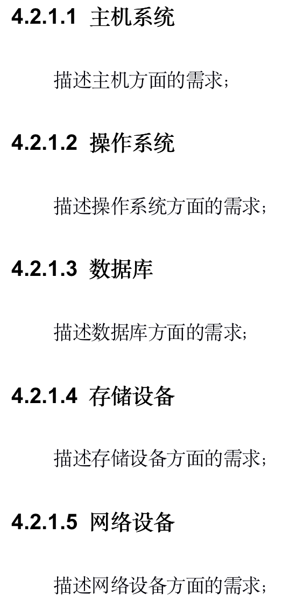

# 需求文档

## 版本历史

| 版本/状态 | 作者                           | 更新日期  | 更新说明                                         |
| --------- | ------------------------------ | --------- | ------------------------------------------------ |
| 0.1       | 王肇凯，开聚实，王佳瑞，李永毅 | 2021.3.24 | 完成前言部分、角色定义及普通用户功能部分         |
| 0.2       | 全体成员                       | 2021.3.25 | 完成项目概述、用户端功能需求及系统端功能需求部分 |

[TOC]

## 1 前言

### 1.1 编写目的

该需求规格说明书用于描述本项目的整体需求、设计和用途，以明确项目的基本功能。让项目开发人员明确各模块的任务需求以及实现细节，以便对开发进度进行整体把控、协调开展工作。

预期读者为项目团队全体成员和课程组监督人，用于项目开发的设计参考与进度参考。

### 1.2 范围

本文档主要阐述了项目的背景、目标、需求范围、用户特点、设计约束、功能性及非功能性需求。文档整体按照：文档介绍、概述、功能性需求、非功能性需求四个方面对阐述内容进行结构性组织。

“前言”章节对本文档的目的、范围、参考文档及文档中使用的术语和缩写进行了阐述；

“项目”章节对本项目进行了大体介绍，包括项目的用途、背景、适用的的用户群体、开发规范、包含及未包含的内容、各角色的职责；

“功能性需求”章节对本项目需要实现的功能给出了详细的阐述，包括功能性需求及对应功能的分类和各功能的简述、前提条件、主要流程及后继结果；

“非功能性需求”章节对本项目所需要实现的功能性需求进行了补充，包括但不限于用户界面需求、软硬件及运行环境需求、开发质量需求；

“外围系统和接口”章节对项目与其他系统的接口和关系进行了描述；

“数据字典”章节描述了系统的数据字典，主要包括有数据实体以及实体所包含的数据项；

“附件”中提供了原始需求等相关文件。

### 1.3 术语和缩略词

| 缩写、术语                          | 解释                                                         |
| ----------------------------------- | ------------------------------------------------------------ |
| 版块(Forum)                         | 活动的顶层分类，例如博雅、社团活动、志愿等，由超级管理员设定，无法随意添加或修改 |
| 组织(Organization, ORG)             | 从属于版块，由用户创建、经过审核后发布，创建者自动成为组织管理员 |
| 活动(Activity, ACT)                 | 从属于组织（社团、学生会等版块下）或版块（博雅、演出等官方版块，以及*个人版块*），由组织/个人发布 |
| 固定活动(Official Activity, OA)     | 具有（一定的）官方性质的活动，例如博雅、演出等，由超级管理员通过爬虫等渠道获取并更新至活动列表，不归特定组织所有 |
| 非固定活动(Unofficial Activity, UA) | 包括*组织活动*（由组织管理员代表组织发布）及*个人活动*（由个人发布），例如社团活动、约球约自习等 |

## 2 项目概述

### 2.1 项目背景

北航的博雅课程要求学生每学期参加一定数量的博雅讲座、志愿活动，此外学生也有参与社团/学生会活动、观看演出的需求。目前北航对于上述活动并没有一个统一的发布平台和入口，学生，老师及活动组织者需要通过不同的网站进行注册报名。并且这些网站也没有相关的日程提醒功能,也无法让活动参与者对组织者提供反馈。

具体来说，博雅需要通过校内博雅网站进行选课，但网站缺少预选提醒、开课提醒功能。志愿活动则没有统一的发布渠道，志愿北京上志愿团体多而杂，有效活动数量不足，信息不对称；蓝协等志愿团体活动有限，难以满足众人需求。上述两个渠道亦不具有提醒功能。

我们旨在改变这一现状，方便北航师生的课余生活。本项目由计算机学院软件工程课程组提出，*软工爹地* 团队（Daddies of SE）开发与部署，力图借助微信小程序，构建北航完整统一的活动发布、管理、社交平台。

* 项目名称：**//TODO**
* 开发团队：乐洋 史鑫杰 开聚实 王肇凯 王佳瑞 李永毅

### 2.2 项目目标

该系统为面向北航全校师生的活动发布、管理和社交平台，目的旨在方便全校的活动组织者和参与者，在活动发布、宣传通知、日程提醒和参与层面，给予一个统一的发布平台，并基于推荐算法为广大师生提供当前北航正在进行的、人气高的或用户感兴趣的活动。

对于活动的发布者（例如社团负责人、学生会干部等），可以更加方便地、向更广范围的师生发布活动；对于活动参与者，可以更便捷的查找感兴趣的活动，并在活动发布、开始时收到通知提醒，还可以根据推荐算法获得针对自己喜好的活动推荐。

### 2.3 需求范围

系统包括如下方面：

1. 活动相关，包括发布者对于活动进行发布、修改，参与者参与、退出、评论活动
2. 组织相关，包括组织的创建、修改、关注，组织负责人和管理员的设置
3. 后台管理系统，包括审核与管理用户、活动和组织
4. 活动推荐系统，根据用户的浏览记录、历史参与活动数据，采用AI模型进行智能活动推荐

### 2.4 总体框架

### 2.5 用户群体

#### 2.5.1 活动发布者

活动发布者主要为社团、学生会、志愿协会等学生团体的负责人，可以通过本平台进行活动的发布与宣传、审核活动报名、统计参与人数等。对于个人活动，每个用户均可以成为发布者。活动发布者预期的使用频度为每人（团体）每周一次。

#### 2.5.2 活动参与者

活动参与者主要为广大学生群体，在有参与博雅、志愿活动等需求时可以通过四种方式查询活动：浏览全部版块/组织/活动、通过关键词搜索组织/活动、查看已关注的版块/组织发布的活动、查看推荐算法推荐的组织/活动。参与者可以通过平台进行报名活动、评价活动、关注组织/版块。用户可以设置是否接受新活动发布、已关注活动更新/删除、已关注活动开始等多种通知提醒。活动参与者预期的使用频度为每人每日一次。

#### 2.5.3 管理人员

管理人员主要为平台的开发者和维护者，负责对用户、评论、活动、组织进行审核与管理，并负责固定活动的发布与更新。

### 2.6 设计约束

* 部署平台：微信小程序

* 代码管理：华为云

* 开发期限：5月7日前发布Alpha版，6月11日前发布稳定版

## 3 功能性需求

### 3.1 角色定义

|  角色名称  |             角色定位             |                             权限                             |
| :--------: | :------------------------------: | :----------------------------------------------------------: |
| 超级管理员 |        系统所有者与开发者        | 创建、维护版块与固定活动，审核与批准活动，管理组织管理员与普通用户，管理论坛信息等 |
| 组织负责人 |         组织管理员任命者         |  受到超级管理员审核，设置其他组织管理员，转让组织负责人职位  |
| 组织管理员 |    *组织活动*的发起人与负责人    | 发起并负责*组织活动*，受到组织负责人审核，审核与批准用户加入活动的申请 |
|  普通用户  | 活动的参与人、*个人活动*的发起人 | 参与各类固定与非固定活动，在*个人版块*发起活动，可申请成为组织管理员 |

<u><!--按照不同的使用对象，紧密围绕使用对象的工作范围、工作性质和工作内容，进行角色分类描述。--></u>

<u><!--对使用系统的人员进行角色分类，并进行详细的定义与说明。--></u>

### 3.2 功能性需求分类
<table>
   <tr>
      <td>功能执行者</td>
      <td>功能名称</td>
      <td>功能描述</td>
   </tr>
   <tr>
      <td rowspan="9">普通用户</td>
      <td>申请创建组织</td>
      <td>普通用户可申请注册新组织，并成为组织负责人</td>
   </tr>
   <tr>
      <td>申请组织管理员</td>
      <td>用户申请成为指定组织管理员</td>
   </tr>
   <tr>
      <td>关注组织</td>
      <td>用户所关注的组织发布的活动信息将展示于“关注”页面</td>
   </tr>
   <tr>
      <td>取消关注组织</td>
      <td>不再展示被取消关注的组织的活动信息</td>
   </tr>
   <tr>
      <td>报名参加活动</td>
      <td>用户报名参加报名状态且未招满的活动</td>
   </tr>
   <tr>
      <td>退出活动</td>
      <td>退出已报名未进行的活动</td>
   </tr>
   <tr>
      <td>评论活动</td>
      <td>在活动页面发表活动评论</td>
   </tr>
   <tr>
      <td>删除评论</td>
      <td>删除在活动页面已发表活动评论</td>
   </tr>
   <tr>
      <td>发布个人活动</td>
      <td>用户可在个人板块发布不可报名的非固定活动</td>
   </tr>
   <tr>
      <td rowspan="6">组织管理员</td>
      <td>编辑组织信息</td>
      <td>删除、增加、修改所管理组织的信息</td>
   </tr>
   <tr>
      <td>发布组织活动</td>
      <td>申请发布所管理组织的非固定活动</td>
   </tr>
   <tr>
      <td>编辑活动信息</td>
      <td>删除、增加、修改所管理组织发布的活动信息</td>
   </tr>
   <tr>
      <td>删除组织活动</td>
      <td>删除发布的组织活动</td>
   </tr>
   <tr>
      <td>审核活动报名</td>
      <td>批准或拒绝用户加入活动的申请</td>
   </tr>
   <tr>
      <td>移除活动参与者</td>
      <td>将已经加入活动的用户从活动名单中移出</td>
   </tr>
   <tr>
      <td rowspan="3">组织负责人</td>
      <td>转让负责人职位</td>
      <td>将组织负责人职位转让给其他用户，</td>
   </tr>
   <tr>
      <td>设置管理员</td>
      <td>授权其他用户成为所负责组织的管理员</td>
   </tr>
   <tr>
      <td>移除管理员</td>
      <td>取消对某用户成为所负责组织管理员的授权</td>
   </tr>
   <tr>
      <td rowspan="6">超级管理员</td>
      <td>编辑板块</td>
      <td>删除、增加、修改活动板块</td>
   </tr>
   <tr>
      <td>编辑固定活动</td>
      <td>删除、增加、修改固定活动信息</td>
   </tr>
   <tr>
      <td>审核活动</td>
      <td>批准或拒绝非固定活动发布的申请</td>
   </tr>
   <tr>
      <td>管理负责人</td>
      <td>批准或拒绝用户成为组织负责人的申请</td>
   </tr>
   <tr>
      <td>管理用户</td>
      <td>对用户所执行的功能进行直接操作</td>
   </tr>
   <tr>
      <td>管理评论</td>
      <td>删除、修改用户在活动页面发表的评论</td>
   </tr>
</table>

### 3.3 用户端功能描述

#### 3.3.1 普通用户

普通用户具有申请创建组织，申请组织管理员、关注组织、取消关注组织、报名参加活动、退出活动、评论活动、发布个人活动功能。

##### 3.3.1.1 申请创建组织

###### 3.3.1.1.1 简述

普通用户可以申请注册新组织，并申请成为组织负责人。

###### 3.3.1.1.2 操作流程

用户进入”分区“界面，选择”组织“页或者进入”我的“界面，点击右上角申请按钮，进入组织申请页面，填写信息，点击提交申请按钮。

###### 3.3.1.1.3 输入

| 输入     | 类别   |
| -------- | ------ |
| 组织名称 | 字符串 |
| 所属板块 | 选择   |
| 组织描述 | 字符串 |

###### 3.3.1.1.4 输出

| 反馈信号         | 类别   |
| ---------------- | ------ |
| 信息填写错误提示 | 字符串 |
| 申请提交成功提示 | 字符串 |

###### 3.3.1.1.5 约束与约定

申请组织名称不得与数据库中已有组织名称重复。

##### 3.3.1.2 申请组织管理员

###### 3.3.1.2.1 简述

用户可以申请特定组织管理员身份。

###### 3.3.1.2.2 操作流程

用户进入”分区“界面，选择”组织“页，点击进入特定组织页面，选择“成为管理员”按钮，展开申请框，输入申请信息，点击提交申请。

###### 3.3.1.2.3 输入

| 输入     | 类别   |
| -------- | ------ |
| 申请信息 | 字符串 |

###### 3.3.1.2.4 输出

| 反馈信号         | 类别   |
| ---------------- | ------ |
| 信息填写错误提示 | 字符串 |
| 申请提交成功提示 | 字符串 |

###### 3.3.1.2.5 约束与约定

该组织负责人、管理员不可重复申请成为组织管理员。

##### 3.3.1.3 关注组织

###### 3.3.1.3.1 简述

在”关注“页面展示用户已关注组织发布的消息。

###### 3.3.1.3.2 操作流程

用户进入”分区“界面，选择”组织“页，点击指定组织右边“关注”按钮，按钮状态变为“取消关注”

###### 3.3.1.3.3 输入

无

###### 3.3.1.3.4 输出

无

###### 3.3.1.3.5 约束与约定

无

##### 3.3.1.4 取消关注组织

###### 3.3.1.4.1 简述

对已关注的组织，可以取消关注。

###### 3.3.1.4.2 操作流程

用户进入”分区“界面，选择”组织“页，点击指定组织右边“取消关注”按钮，按钮状态变为“关注”。

###### 3.3.1.4.3 输入

无

###### 3.3.1.4.4 输出

无

###### 3.3.1.4.5 约束与约定

用户只能对已经关注的组织取消关注。

##### 3.3.1.5 报名参加活动

###### 3.3.1.5.1 简述

对报名进行中，名额未满的活动，可以报名参加。

###### 3.3.1.5.2 操作流程

用户进入”分区“界面，选择”组织“页，点击指定组织，展示组织发布的所有活动或“首页”界面，“推荐”页，点击活动公告more按钮展示活动列表，选择活动进入活动介绍页面，点击报名活动。

###### 3.3.1.5.3 输入

无

###### 3.3.1.5.4 输出

| 反馈信号     | 类别   |
| ------------ | ------ |
| 报名成功提示 | 字符串 |

###### 3.3.1.5.5 约束与约定

用户只能对报名进行中、人数未满的活动进行报名。不可重复报名活动。

##### 3.3.1.6 退出活动

###### 3.3.1.6.1 简述

可以选择退出已报名未进行的活动。

###### 3.3.1.6.2 操作流程

用户进入”日程“界面，选择”活动列表“页，在即将进行栏中找到待退出活动，点击退出按钮。

###### 3.3.1.6.3 输入

无

###### 3.3.1.6.4 输出

| 反馈信号     | 类别   |
| ------------ | ------ |
| 退出活动提示 | 字符串 |

###### 3.3.1.6.5 约束与约定

用户只能退出已报名，未开始的活动。

##### 3.3.1.7 评论活动

###### 3.3.1.7.1 简述

用户可在活动页面评论活动。

###### 3.3.1.7.2 操作流程

用户进入活动页面，进入下方对话框，输入评价内容，点击提交。

###### 3.3.1.7.3 输入

| 输入     | 类别   |
| -------- | ------ |
| 评价内容 | 字符串 |

###### 3.3.1.7.4 输出

无

###### 3.3.1.7.5 约束与约定

无

##### 3.3.1.8 删除评论

###### 3.3.1.8.1 简述

用户可删除在活动页面已发表的活动评论 。

###### 3.3.1.8.2 操作流程

。

###### 3.3.1.8.3 输入

###### 3.3.1.8.4 输出

无

###### 3.3.1.8.5 约束与约定

无

##### 3.3.1.9 发布个人活动

###### 3.3.1.9.1 简述

用户可在个人板块发布不可报名的非固定活动。

###### 3.3.1.9.2 操作流程

用户进入“我的”界面，点击活动发布按钮，进入活动发布页。

###### 3.3.1.9.3 输入

| 输入     | 类别   |
| -------- | ------ |
| 所属板块 | 选择   |
| 所属组织 | null   |
| 活动详情 | 字符串 |

###### 3.3.1.9.4 输出

| 反馈信号     | 类别   |
| ------------ | ------ |
| 发布成功提示 | 字符串 |

###### 3.3.1.9.5 约束与约定

非组织管理员不可选择组织发布活动。

#### 3.3.2 组织管理员

组织管理员具有发布组织活动、修改组织活动、删除组织活动功能。

##### 3.3.2.1 编辑组织信息
###### 3.3.2.1.1 功能描述

组织管理员可以删除、增加、修改所管理组织的信息。

###### 3.3.2.1.2 操作流程

1. 点击进入“我的”界面
2. 点击进入“我的组织”界面
3. 从组织列表中选择将要修改信息的组织，点击进入该组织的详情界面
4. 从顶部菜单栏选择“基本”进入基本信息界面
5. 编辑将要修改的信息
6. 点击保存按钮

###### 3.3.2.1.3 输入

| 输入     | 类别   |
| -------- | ------ |
| 组织名称 | 字符串 |
| 所属板块 | 选择   |
| 组织描述 | 字符串 |

###### 3.3.2.1.4 输出

| 反馈信号         | 类别   |
| ---------------- | ------ |
| 信息修改成功提示 | 字符串 |

###### 3.3.2.1.5 约束与约定

组织名称输入不能是空字符串。组织描述可以输入空字符串，代表删除组织描述信息。

##### 3.3.2.2 发布组织活动
###### 3.3.2.2.1 功能描述

申请发布所管理组织的非固定活动。

###### 3.3.2.2.2 操作流程

1. 点击进入“我的”界面
2. 点击进入“活动发布”界面
3. 填写所属板块、所属组织、活动详情设置
4. 点击“发布”按钮

###### 3.3.2.2.3 输入

| 输入     | 类别   |
| -------- | ------ |
| 所属板块 | 选择   |
| 所属组织 | 选择   |
| 活动详情 | 字符串 |

###### 3.3.2.2.4 输出

| 反馈信号     | 类别   |
| ------------ | ------ |
| 发布成功提示 | 字符串 |

###### 3.3.2.2.5 约束与约定

用户只能在自己是组织管理员的组织内发起活动。

##### 3.3.2.3 编辑活动信息
###### 3.3.2.3.1 功能描述

删除、增加、修改所管理组织发布的活动信息。

###### 3.3.2.3.2 操作流程

1. 点击进入“我的”界面
2. 点击进入“我管理的活动”界面
3. 在“未进行”的活动中查找需要修改信息的活动，点击“修改”按钮。
4. 修改活动信息，点击“发布”按钮。

###### 3.3.2.3.3 输入

| 输入     | 类别   |
| -------- | ------ |
| 所属板块 | 选择   |
| 所属组织 | 选择   |
| 活动详情 | 字符串 |

###### 3.3.2.3.4 输出

| 反馈信号         | 类别   |
| ---------------- | ------ |
| 信息修改成功提示 | 字符串 |

###### 3.3.2.3.5 约束与约定

无

##### 3.3.2.4 删除组织活动
###### 3.3.2.4.1 功能描述

删除发布的组织活动。

###### 3.3.2.4.2 操作流程

1. 点击进入“我的”界面
2. 点击进入“我管理的活动”界面
3. 在“未进行”的活动中查找需要修改信息的活动，点击“修改”按钮。
4. 在弹出的对话框中点击“确认”按钮。

###### 3.3.2.4.3 输入

无

###### 3.3.2.4.4 输出

| 反馈信号         | 类别   |
| ---------------- | ------ |
| 成功删除活动提示 | 字符串 |

###### 3.3.2.4.5 约束与约定

无

##### 3.3.2.5 移除活动参与者
###### 3.3.2.5.1 功能描述

将已经加入活动的用户从活动名单中移出。

###### 3.3.2.5.2 操作流程

**// TDOO: 尚未设计参加活动的用户列表界面**

###### 3.3.2.5.3 输入

| 输入          | 类别   |
| ------------- | ------ |
| 用户名/用户id | 字符串 |

###### 3.3.2.5.4 输出

| 反馈信号               | 类别   |
| ---------------------- | ------ |
| 成功移除活动参与者提示 | 字符串 |

###### 3.3.2.5.5 约束与约定

只能移除”未进行“的活动的参与者。

##### 3.3.2.6 审核活动报名
###### 3.3.2.6.1 功能描述

批准或拒绝用户加入活动的申请。

###### 3.3.2.6.2 操作流程

**//TODO:尚未设计通知界面**

###### 3.3.2.6.3 输入

无

###### 3.3.2.6.4 输出

无

###### 3.3.2.6.5 约束与约定

**//TODO:创建活动时，添加'可加入活动的用户'选项**

只有'可加入活动的用户'为“管理员审批”的活动才需要管理员审批。'可加入活动的用户'为“所有人可加入”的活动不需要管理员审批。

#### 3.3.3 组织负责人

组织负责人具有转让负责人职位、添加组织管理员、移除组织管理员功能。

##### 3.3.3.1 转让负责人职位
###### 3.3.3.1.1 功能描述

  将组织负责人职位转让给其他用户。

###### 3.3.3.1.2 操作流程

1. 点击进入“我的”界面
2. 点击进入“我的组织”界面
3. 从组织列表中选择将要转让负责人的组织，点击进入组织详情
4. 从顶部菜单栏选择“成员”进入成员界面
5. 点击“转让”按钮
6. 在弹出的信息框中点击“确认”按钮

###### 3.3.3.1.3 输入

无

###### 3.3.3.1.4 输出

| 反馈信号           | 类别   |
| ------------------ | ------ |
| 成功转让负责人提示 | 字符串 |

###### 3.3.3.1.5 约束与约定

获得转让成为组织负责人的前提是已经是该组织的组织管理员。

##### 3.3.3.2 设置组织管理员
###### 3.3.3.2.1 功能描述

授权其他用户成为所负责组织的管理员。

###### 3.3.3.2.2 操作流程

1. 点击进入“我的”界面
2. 点击进入“我的组织”界面
3. 从组织列表中选择目标组织
4. 从顶部菜单栏选择“成员”进入成员界面
5. 点击给”管理员“右侧的“添加”按钮
6. 输入要被添加为管理员的用户的id
7. 确认用户信息后点击确定

###### 3.3.3.2.3 输入

| 输入   | 类别   |
| ------ | ------ |
| 用户id | 字符串 |

###### 3.3.3.2.4 输出

无

###### 3.3.3.2.5 约束与约定

组织中只有”组织负责人“和”组织管理员“两种角色。因此要添加”组织管理员"时要从该软件所有的用户中搜索，为了保证搜索结果唯一，输入只能是id，不能是用户名。

##### 3.3.3.3 移除组织管理员
###### 3.3.3.3.1 功能描述

取消对某用户成为所负责组织管理员的授权。

###### 3.3.3.3.2 操作流程

**//TODO:添加移除管理员的界面。初步设想是直接在管理员列表的成员中添加”移除“按钮**

###### 3.3.3.3.3 输入

无

###### 3.3.3.3.4 输出

无

###### 3.3.3.3.5 约束与约定

无

### 3.4 管理端功能描述

本节所有功能均在web端管理员系统使用。

#### 3.4.1 管理员登录

##### 3.4.1.1 功能描述

超级管理员在登录页面输入其超级管理员账号和对应的密码后，进入管理页面。

##### 3.4.1.2 操作流程

超级管理员输入账号和密码，服务器端验证账号是否为超级管理员账号、密码是否为该账号的密码，若均匹配，则完成登录，界面自动跳转至管理页面；否则界面提示“用户名或密码有误”。

##### 3.4.1.3 输入

账号、密码。

##### 3.4.3.4 输出

登录结果。

##### 3.4.3.5 约束与约定

输入的账号必须为超级管理员账号，输入的密码必须为该账号对应的密码。

#### 3.4.2 删除用户

##### 3.4.2.1 功能描述

超级管理员在用户管理页面可以删除选定用户的账户。

##### 3.4.2.2 操作流程

超级管理员进入用户管理页面，选择需要删除账户的用户，对其进行删除，若该用户存在，则删除该用户并提示“删除成功”，否则提示“该用户不存在”。

##### 3.4.2.3 输入

被删除用户的id。

##### 3.4.2.4 输出

删除结果。

##### 3.4.2.5 约束与约定

被删除的用户在超级管理员对其删除时存在。

#### 3.4.3 审核组织创建
##### 3.4.3.1 功能描述

在待审核页面，超级管理员可以查看所有创建组织的申请，并选择同意或拒绝申请。

##### 3.4.3.2 操作流程

进入待审核页面，超级管理员选择要审核的申请，选择同意或拒绝该组织的创建申请，如果拒绝，可以填写拒绝原因，如果提交时该申请未被审核，则提示“审核完成”，否则提示“审核失败”。

##### 3.4.3.3 输入

申请编号、处理方式、处理意见。

##### 3.4.3.4 输出

审核是否成功。

##### 3.4.3.5 约束与约定

该申请在超级管理员提交审核结果时未被审核。

#### 3.4.4 修改组织信息
##### 3.4.4.1 功能描述

在组织管理页面，超级管理员可以选择目前存在的组织，修改其名称、简介、组织负责人等信息。

##### 3.4.4.2 操作流程

进入组织管理页面，超级管理员选择要修改信息的组织，修改其名称、简介、组织负责人等信息后提交，若提交时该组织仍存在，则提示“修改成功”，否则提示“该组织不存在”。

##### 3.4.4.3 输入

待修改的组织号、修改后的信息。

##### 3.4.4.4 输出

修改结果。

##### 3.4.4.5 约束与约定

提交时，待修改的组织必须存在。

#### 3.4.5 删除组织
##### 3.4.5.1 功能描述

在组织管理页面，超级管理员可以选择目前存在的组织，对其进行删除。

##### 3.4.5.2 操作流程

超级管理员选择要删除的组织并提交，如果提交时要删除的组织存在，则提示“删除成功”，否则提示“该组织不存在”。

##### 3.4.5.3 输入

待删除的组织号。

##### 3.4.5.4 输出
删除结果。

##### 3.4.5.5 约束与约定

提交时，待删除的组织必须存在。

#### 3.4.6 发布官方活动
##### 3.4.6.1 功能描述

在活动管理页面，超级管理员可以发布官方活动。

##### 3.4.6.2 操作流程

超级管理员选择活动所属的版块与组织，填写活动的时间、地点、简介等信息后发布活动。

##### 3.4.6.3 输入

活动所属组织号、活动时间、活动地点、活动简介。

##### 3.4.6.4 输出

无。

##### 3.4.6.5 约束与约定

无。

#### 3.4.7 修改活动信息
##### 3.4.7.1 功能描述

在活动管理页面，超级管理员可以修改已发布的活动的信息。

##### 3.4.7.2 操作流程

超级管理员选择要修改信息的活动，填写修改后活动的时间、地点、简介等信息后提交，若提交时活动仍存在，则提示“修改成功”，否则提示“活动不存在”。

##### 3.4.7.3 输入

待修改的活动号，修改后的时间、地点、简介等信息。

##### 3.4.7.4 输出

修改结果。

##### 3.4.7.5 约束与约定

提交修改时，活动必须存在。

#### 3.4.8 删除活动
##### 3.4.8.1 功能描述

在活动管理页面，超级管理员可以删除已经发布的活动。

##### 3.4.8.2 操作流程

超级管理员选择要删除的活动，进行删除，若提交时活动仍存在，则提示“删除成功”，否则提示“活动不存在”。

##### 3.4.8.3 输入

待删除的活动号。

##### 3.4.8.4 输出

删除结果。

##### 3.4.8.5 约束与约定

提交删除时，活动必须存在。

#### 3.4.9 修改回复
##### 3.4.9.1 功能描述

在回复管理页面，超级管理员可以对已发布的回复进行修改。

##### 3.4.9.2 操作流程

超级管理员选择要修改的回复，填写修改后的回复内容后提交，若提交时回复仍存在，则提示“修改成功”，否则提示“回复不存在”。

##### 3.4.9.3 输入

待修改的回复号，修改后的回复内容。

##### 3.4.9.4 输出

修改结果。

##### 3.4.9.5 约束与约定

提交修改时，待修改的回复必须存在。

#### 3.4.10 删除回复
##### 3.4.10.1 功能描述

在回复管理页面，超级管理员可以对已发布的回复进行删除。

##### 3.4.10.2 操作流程

超级管理员选择要删除的回复，进行删除，若删除时回复仍存在，则提示“删除成功”，否则提示“回复不存在”。

##### 3.4.10.3 输入

待修改的回复号。

##### 3.4.10.4 输出

修改结果。

##### 3.4.10.5 约束与约定

提交删除时，待删除的回复必须存在。

### 3.5 推荐算法功能描述

## 4 非功能性需求

### 4.1 软件需求

#### 4.1.1 界面需求

#### 4.1.2 性能需求

<u>//说明系统整体性能需求，包括并发处理能力以及单事务响应时间等指标，甚至更多性能要求指标，如：数据精度、时间特性、容错性、可扩展性以及系统有效性等等。</u>

#### 4.1.3 容量需求

<u>//说明系统整体容量，包括系统需要满足的用户规模以及对存储空间的要求等。</u>

#### 4.1.4 数据安全

##### 4.1.4.1 数据保护/保密

<u>//对需要保护或保密的敏感性、局限性等方面的数据进行需求描述</u>

##### 4.1.4.2 数据加密

<u>//描述关于在访问或传输过程中的数据加密方面的需求</u>

#### 4.1.5 数据备份/回复

<u>//对数据备份与数据恢复的需求进行描述。</u>

### 4.2 硬件需求

## 5 外围系统和接口

<u>//在本节中主要描述系统和哪些外围系统进行交互以及交互的接口说明。</u>

### 5.1 与其他系统的接口和关系

#### 5.1.1 概述

<u>//此处简要描述外围系统基本情况。可裁剪</u>

#### 5.1.2 接口描述

#### 5.1.2.1 与手机邮箱接口

<u>//此处描述接口的方式、接口数据内容，数据转换、数据安全、周期等信息。</u>

## 6 数据字典

<u>//在本章中主要描述系统的数据字典。主要包括有哪些实体以及实体所包含的数据项。</u> 

## 7 附件

### 7.1 原始需求要求

>**北航大学生活动发布与社交平台**
>
>**一、项目背景**
>
>目前北航的学术讲座、博雅课堂、社团活动和各个学生会组织的活动并没有
>
>一个统一的发布平台和入口，学生、老师及活动组织者需要通过不同的网站进行
>
>注册报名，并且这些网站也没有相关的日程提醒功能，也无法让活动参与者对组
>
>织者提供反馈，我们旨在改变这一现状，方便北航师生的课余生活。
>
>**二、项目目标**
>
>该系统为面向北航全校师生的活动发布、管理和社交平台，目的旨在方便全
>
>校的活动组织者和参与者，在活动发布、宣传通知、日程提醒和参与层面，给予
>
>一个统一的发布平台，并基于推荐算法为广大师生提供当前北航正在进行的、人
>
>气高的或用户感兴趣的活动。具体需求如下所示：
>
>1. 管理端需求(Web)
>
>需要实现管理员登录、审核注册用户、审核与批准活动、管理论坛信息等功
>
>能。
>
>2. 用户端需求(Android 或者 iOS APP)
>
>需要实现用户注册登录以及信息编辑。
>
>按活动类别进行分类展示，用户可以浏览当前全部开放的活动，或按照关键
>
>词搜索相关活动，并申请加入该活动；用户也可以以活动发起者的身份发起自己
>
>的活动，发起后应可以修改活动相关信息；基于已经参加的活动，用户端应以日
>
>程表的形式为用户展示即将到来的活动，并及时提醒；用户也可以对自己参加过
>
>的活动进行评价。用户可以订阅不同类别的活动以便收到该频道内的活动通知。
>
>3. 个性化推荐
>
>需要设计并实现一款推荐模型，将用户可能感兴趣的热门活动推荐给用户。
>
>**三、其他要求**
>
>包含但不限于以下页面：
>
>首页——展示所有活动的简要信息。
>
>运动——展示所有运动活动的信息，可以以地图形式展示正在进行或将要进
>
>行的活动。
>
>其他页面展示内容可自行设计。

