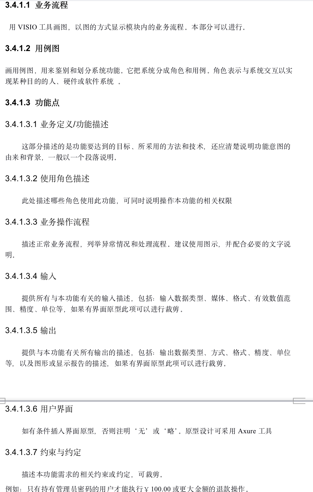

# 需求文档

[TOC]

## 1 前言

### 1.1 编写目的

说明编写这份需求规格说明书的目的，指出预期的读者。

该需求规格说明书用于描述本项目的整体需求、设计和用途，以明确项目的基本功能。让项目开发人员明确各模块的任务需求以及实现细节，以便对开发进度进行整体把控、协调开展工作。

预期读者为项目团队全体成员和课程组监督人，用于项目开发的设计参考与进度参考。

### 1.2 范围

文档内容包括项目的描述和功能需求介绍，和开发进度的整体规划。

本文档主要阐述了项目的背景、目标、需求范围、用户特点、设计约束、功能性及非功能性需求。文档整体按照：文档介绍、概述、功能性需求、非功能性需求四个方面对阐述内容进行结构性组织。

“前言”章节对本文档的目的、范围、参考文档及文档中使用的术语和缩写进行了阐述；

“项目”章节对本项目进行了大体介绍，包括项目的用途、背景、适用的的用户群体、开发规范、包含及未包含的内容、各角色的职责；

“功能性需求”章节对本项目需要实现的功能给出了详细的阐述，包括功能性需求及对应功能的分类和各功能的简述、前提条件、主要流程及后继结果；

“非功能性需求”章节对本项目所需要实现的功能性需求进行了补充，包括但不限于用户界面需求、软硬件及运行环境需求、开发质量需求；

“外围系统和接口”章节对项目与其他系统的接口和关系进行了描述；

“数据字典”章节描述了系统的数据字典，主要包括有数据实体以及实体所包含的数据项；

“附件”中提供了原始需求等相关文件。

### 1.3 术语和缩略词

| 缩写、术语                          | 解释                                                         |
| ----------------------------------- | ------------------------------------------------------------ |
| 版块(Forum)                         | 活动的顶层分类，例如博雅、社团活动、志愿等，由超级管理员设定，无法随意添加或修改 |
| 组织(Organization, ORG)             | 从属于版块，由用户创建、经过审核后发布，创建者自动成为组织管理员 |
| 活动(Activity, ACT)                 | 从属于组织（社团、学生会等版块下）或版块（博雅、演出等官方版块，以及*个人版块*），由组织/个人发布 |
| 固定活动(Official Activity, OA)     | 具有（一定的）官方性质的活动，例如博雅、演出等，由超级管理员通过爬虫等渠道获取并更新至活动列表，不归特定组织所有 |
| 非固定活动(Unofficial Activity, UA) | 包括*组织活动*（由组织管理员代表组织发布）及*个人活动*（由个人发布），例如社团活动、约球约自习等 |

## 2 项目概述

### 2.1 项目背景

描述项目产生的背景，包括：

1. 产生该项目需求的原因或起源，如社会背景、市场发展、政策趋势、原有系统局限性、存在问题等方面。

2. 列出此项目的任务提出者、开发者

3. 软件项目的用途、软件项目的范围

4. 需开发的软件系统的名称，英文缩写（可选），项目编号（可选）

目前北航的学术讲座,博雅课堂,社团活动和各个学生会组织的活动并没有一个统一的发布平台和入口,学生,老师及活动组织者需要通过不同的网站进行注册报名,并且这些网站也没有相关的日程提醒功能,也无法让活动参与者对组织者提供反馈,我们旨在改变这一现状,方便北航师生的课余生活。

### 2.2 项目目标

描述项目建设的目标，即简要叙述该项目要达到的要求。例如：应用目标、作用范围，简述该软件系统能给用户的受益。

该系统为面向北航全校师生的活动发布、管理和社交平台，目的旨在方便全校的活动组织者和参与者，在活动发布、宣传通知、日程提醒和参与层面，给予一个统一的发布平台，并基于推荐算法为广大师生提供当前北航正在进行的、人气高的或用户感兴趣的活动。

### 2.3 需求范围

对项目的需求范围进行整体性的描述。

### 2.4 总体框架

用VISIO工具画图，以图的方式显示系统的内部模块和模块之间关系以及系统与外部系统的关系。

### 2.5 用户特点

列出本软件的最终可能用户，操作人员、维护人员的教育水平和技术专长，以及本软件的预期使用频度。这些是软件设计的重要约束。

本项目用户群体面向北航全校师生，预计本软件的使用频度为人均每日一次。

### 2.6 设计约束

 描述设计开发系统时的限制，例如经费限制、开发期限、实现的语言和平台约束等等。描述系统设计中最主要的约束，这些是由客户强制要求并在需求说明书写明的。

## 3 功能性需求

### 3.1 总体流程

用VISIO工具画图，以图的方式显示系统的内部模块之间的业务关系。

### 3.2 角色定义

|  角色名称  |             角色定位             |                             权限                             |
| :--------: | :------------------------------: | :----------------------------------------------------------: |
| 超级管理员 |        系统所有者与开发者        | 创建、维护版块与固定活动，审核与批准活动，管理版块管理员与普通用户，管理论坛信息等 |
| 版块管理员 |    *组织活动*的发起人与负责人    | 发起并负责*组织活动*，受到超级管理员审核，审核与批准用户加入活动的申请，设置其他版块管理员 |
|  普通用户  | 活动的参与人、*个人活动*的发起人 | 参与各类固定与非固定活动，在*个人版块*发起活动，可申请成为版块管理员 |

<!--按照不同的使用对象，紧密围绕使用对象的工作范围、工作性质和工作内容，进行角色分类描述。-->

<!--对使用系统的人员进行角色分类，并进行详细的定义与说明。-->

### 3.3 系统功能

概述系统所具有的主要功能，可以用VISIO画图的形式展示，建议有功能列表，列出功能分类，以及优先级，并加入必要文字说明。

### 3.4 功能描述

#### 3.4.1 用户端

#### 3.4.2 管理端

#### 3.4.3 推荐算法

## 4 非功能性需求

### 4.1 软件需求

#### 4.1.2 性能需求

说明系统整体性能需求，包括并发处理能力以及单事务响应时间等指标，甚至更多性能要求指标，如：数据精度、时间特性、容错性、可扩展性以及系统有效性等等。

#### 4.1.3 容量需求

说明系统整体容量，包括系统需要满足的用户规模以及对存储空间的要求等。

#### 4.1.4 数据安全

##### 4.1.4.1 数据保护/保密

对需要保护或保密的敏感性、局限性等方面的数据进行需求描述

##### 4.1.4.2 数据加密

描述关于在访问或传输过程中的数据加密方面的需求

#### 4.1.5 数据备份/回复

对数据备份与数据恢复的需求进行描述。

### 4.2 硬件需求

## 5 外围系统和接口

在本节中主要描述系统和哪些外围系统进行交互以及交互的接口说明。

### 5.1 与其他系统的接口和关系

#### 5.1.1 概述

此处简要描述外围系统基本情况。可裁剪

#### 5.1.2 接口描述

#### 5.1.2.1 与手机邮箱接口

此处描述接口的方式、接口数据内容，数据转换、数据安全、周期等信息。

## 6 数据字典

在本章中主要描述系统的数据字典。主要包括有哪些实体以及实体所包含的数据项。 

## 7 附件

### 7.1 原始需求要求

>**北航大学生活动发布与社交平台**
>
>**一、项目背景**
>
>目前北航的学术讲座、博雅课堂、社团活动和各个学生会组织的活动并没有
>
>一个统一的发布平台和入口，学生、老师及活动组织者需要通过不同的网站进行
>
>注册报名，并且这些网站也没有相关的日程提醒功能，也无法让活动参与者对组
>
>织者提供反馈，我们旨在改变这一现状，方便北航师生的课余生活。
>
>**二、项目目标**
>
>该系统为面向北航全校师生的活动发布、管理和社交平台，目的旨在方便全
>
>校的活动组织者和参与者，在活动发布、宣传通知、日程提醒和参与层面，给予
>
>一个统一的发布平台，并基于推荐算法为广大师生提供当前北航正在进行的、人
>
>气高的或用户感兴趣的活动。具体需求如下所示：
>
>1. 管理端需求(Web)
>
>需要实现管理员登录、审核注册用户、审核与批准活动、管理论坛信息等功
>
>能。
>
>2. 用户端需求(Android 或者 iOS APP)
>
>需要实现用户注册登录以及信息编辑。
>
>按活动类别进行分类展示，用户可以浏览当前全部开放的活动，或按照关键
>
>词搜索相关活动，并申请加入该活动；用户也可以以活动发起者的身份发起自己
>
>的活动，发起后应可以修改活动相关信息；基于已经参加的活动，用户端应以日
>
>程表的形式为用户展示即将到来的活动，并及时提醒；用户也可以对自己参加过
>
>的活动进行评价。用户可以订阅不同类别的活动以便收到该频道内的活动通知。
>
>3. 个性化推荐
>
>需要设计并实现一款推荐模型，将用户可能感兴趣的热门活动推荐给用户。
>
>**三、其他要求**
>
>包含但不限于以下页面：
>
>首页——展示所有活动的简要信息。
>
>运动——展示所有运动活动的信息，可以以地图形式展示正在进行或将要进
>
>行的活动。
>
>其他页面展示内容可自行设计。

