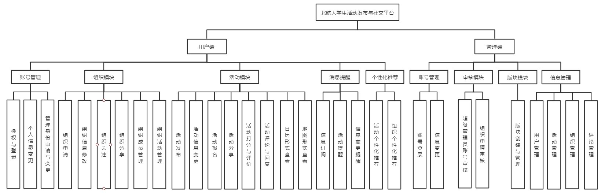

# 需求文档

## 版本历史

| 版本 | 作者                           | 更新日期  | 更新说明                                           |
| ---- | ------------------------------ | --------- | -------------------------------------------------- |
| 0.1  | 王肇凯，开聚实，王佳瑞，李永毅 | 2021.3.24 | 完成前言部分、角色定义及普通用户功能部分           |
| 0.2  | 全体成员                       | 2021.3.25 | 完成项目概述、用户端功能需求及系统端功能需求部分   |
| 0.3  | 李永毅，王肇凯，王佳瑞，开聚实 | 2021.3.30 | 完成非功能性需求，功能性需求中更新活动、通知等部分 |

[TOC]

## 1 前言

### 1.1 编写目的

该需求规格说明书用于描述本项目的整体需求、设计和用途，以明确项目的基本功能。让项目开发人员明确各模块的任务需求以及实现细节，以便对开发进度进行整体把控、协调开展工作。

预期读者为项目团队全体成员和课程组监督人，用于项目开发的设计参考与进度参考。

### 1.2 范围

本文档主要阐述了项目的背景、目标、需求范围、用户特点、设计约束、功能性及非功能性需求。文档整体按照：文档介绍、概述、功能性需求、非功能性需求四个方面对阐述内容进行结构性组织。

“前言”章节对本文档的目的、范围、参考文档及文档中使用的术语和缩写进行了阐述；

“项目”章节对本项目进行了大体介绍，包括项目的用途、背景、适用的的用户群体、开发规范、包含及未包含的内容、各角色的职责；

“功能性需求”章节对本项目需要实现的功能给出了详细的阐述，包括功能性需求及对应功能的分类和各功能的简述、前提条件、主要流程及后继结果；

“非功能性需求”章节对本项目所需要实现的功能性需求进行了补充，包括但不限于用户界面需求、软硬件及运行环境需求、开发质量需求；

“外围系统和接口”章节对项目与其他系统的接口和关系进行了描述；

“数据字典”章节描述了系统的数据字典，主要包括有数据实体以及实体所包含的数据项；

“附件”中提供了原始需求等相关文件。

### 1.3 术语和缩略词

| 缩写、术语                          | 解释                                                         |
| ----------------------------------- | ------------------------------------------------------------ |
| 版块(Forum)                         | 活动的顶层分类，例如博雅、社团活动、志愿等，由超级管理员设定，无法随意添加或修改 |
| 组织(Organization, ORG)             | 从属于版块，由用户创建、经过审核后发布，创建者自动成为组织管理员 |
| 活动(Activity, ACT)                 | 从属于组织（社团、学生会等版块下）或版块（博雅、演出等官方版块，以及*个人版块*），由组织/个人发布 |
| 固定活动(Official Activity, OA)     | 具有（一定的）官方性质的活动，例如博雅、演出等，由超级管理员通过爬虫等渠道获取并更新至活动列表，不归特定组织所有 |
| 非固定活动(Unofficial Activity, UA) | 包括*组织活动*（由组织管理员代表组织发布）及*个人活动*（由个人发布），例如社团活动、约球约自习等 |

## 2 项目概述

### 2.1 项目背景

北航的博雅课程要求学生每学期参加一定数量的博雅讲座、志愿活动，此外学生也有参与社团/学生会活动、观看演出的需求。目前北航对于上述活动并没有一个统一的发布平台和入口，学生，老师及活动组织者需要通过不同的网站进行注册报名。并且这些网站也没有相关的日程提醒功能,也无法让活动参与者对组织者提供反馈。

具体来说，博雅需要通过校内博雅网站进行选课，但网站缺少预选提醒、开课提醒功能。志愿活动则没有统一的发布渠道，志愿北京上志愿团体多而杂，有效活动数量不足，信息不对称；蓝协等志愿团体活动有限，难以满足众人需求。上述两个渠道亦不具有提醒功能。

我们旨在改变这一现状，方便北航师生的课余生活。本项目由计算机学院软件工程课程组提出，*Daddies of SE*团队开发与部署，力图借助微信小程序，构建北航完整统一的活动发布、管理、社交平台。以小程序作苇，即能在校园活动中畅游航行，故曰“一苇以航”。

* 项目名称：一苇以航
* 开发团队：乐洋 史鑫杰 开聚实 王肇凯 王佳瑞 李永毅

### 2.2 项目目标

该系统为面向北航全校师生的活动发布、管理和社交平台，目的旨在方便全校的活动组织者和参与者，在活动发布、宣传通知、日程提醒和参与层面，给予一个统一的发布平台，并基于推荐算法为广大师生提供当前北航正在进行的、人气高的或用户感兴趣的活动。

对于活动的发布者（例如社团负责人、学生会干部等），可以更加方便地、向更广范围的师生发布活动；对于活动参与者，可以更便捷的查找感兴趣的活动，并在活动发布、开始时收到通知提醒，还可以根据推荐算法获得针对自己喜好的活动推荐。

### 2.3 需求范围

系统包括如下方面：

1. 活动相关，包括发布者对于活动进行发布、修改，参与者参与、退出、评论活动
2. 组织相关，包括组织的创建、修改、关注，组织负责人和管理员的设置
3. 后台管理系统，包括审核与管理用户、活动和组织
4. 活动推荐系统，根据用户的浏览记录、历史参与活动数据，采用AI模型进行智能活动推荐

### 2.4 总体框架

### 2.5 用户群体

#### 2.5.1 活动发布者

活动发布者主要为社团、学生会、志愿协会等学生团体的负责人，可以通过本平台进行活动的发布与宣传、审核活动报名、统计参与人数等。对于个人活动，每个用户均可以成为发布者。活动发布者预期的使用频度为每人（团体）每周一次。

#### 2.5.2 活动参与者

活动参与者主要为广大学生群体，在有参与博雅、志愿活动等需求时可以通过四种方式查询活动：浏览全部版块/组织/活动、通过关键词搜索组织/活动、查看已关注的版块/组织发布的活动、查看推荐算法推荐的组织/活动。参与者可以通过平台进行报名活动、评价活动、关注组织/版块。用户可以设置是否接受新活动发布、已关注活动更新/删除、已关注活动开始等多种通知提醒。活动参与者预期的使用频度为每人每日一次。

#### 2.5.3 管理人员

管理人员主要为平台的开发者和维护者，负责对用户、评论、活动、组织进行审核与管理，并负责固定活动的发布与更新。

### 2.6 设计约束

* 部署平台：微信小程序

* 代码管理：华为云

* 开发期限：5月7日前发布Alpha版，6月11日前发布稳定版

## 3 功能性需求

### 3.1 角色定义

|  角色名称  |             角色定位             |                             权限                             |
| :--------: | :------------------------------: | :----------------------------------------------------------: |
| 超级管理员 |        系统所有者与开发者        | 创建、维护版块与固定活动，审核与批准活动，管理组织管理员与普通用户，管理论坛信息等 |
| 组织负责人 |         组织管理员任命者         |  受到超级管理员审核，设置其他组织管理员，转让组织负责人职位  |
| 组织管理员 |    *组织活动*的发起人与负责人    | 发起并负责*组织活动*，受到组织负责人审核，审核与批准用户加入活动的申请 |
|  普通用户  | 活动的参与人、*个人活动*的发起人 | 参与各类固定与非固定活动，在*个人版块*发起活动，可申请成为组织管理员 |

### 3.2 功能性需求分类

<table>
   <tr>
      <td>功能执行者</td>
      <td>功能名称</td>
      <td>功能描述</td>
   </tr>
   <tr>
      <td rowspan="18">普通用户</td>
      <td>申请创建组织</td>
      <td>普通用户可申请注册新组织，并成为组织负责人</td>
   </tr>
   <tr>
      <td>申请组织管理员</td>
      <td>用户申请成为指定组织管理员</td>
   </tr>
   <tr>
      <td>关注组织</td>
      <td>用户所关注的组织发布的活动信息将展示于“关注”页面</td>
   </tr>
   <tr>
      <td>取消关注组织</td>
      <td>不再展示被取消关注的组织的活动信息</td>
   </tr>
   <tr>
      <td>报名活动</td>
      <td>用户报名参加处于报名状态且未招满的活动</td>
   </tr>
   <tr>
      <td>退出活动</td>
      <td>退出已报名未进行的活动</td>
   </tr>
   <tr>
      <td>评价活动</td>
      <td>在活动结束后对参与的活动进行打分和评论</td>
   </tr>
   <tr>
      <td>删除评论</td>
      <td>删除在活动页面已发表活动评论</td>
   </tr>
   <tr>
      <td>发布个人活动</td>
      <td>用户可在个人板块发布不可报名的非固定活动</td>
   </tr>
   <tr>
      <td>编辑个人活动</td>
      <td>修改个人发布的活动信息</td>
   </tr>
   <tr>
      <td>删除个人活动</td>
      <td>删除发布的个人活动</td>
   </tr>
   <tr>
      <td>提交用户反馈</td>
      <td>将使用反馈发送给小程序开发者</td>
   </tr>
   <tr>
      <td>查看活动地图</td>
      <td>通过地图形式查看已报名活动的相关信息</td>
   </tr>
   <tr>
      <td>查看活动日历</td>
      <td>通过日历形式查看已报名活动的相关信息</td>
   </tr>
   <tr>
      <td>分享活动/组织</td>
      <td>对活动/组织进行分享</td>
   </tr>
   <tr>
      <td>搜索活动/组织</td>
      <td>对活动/组织进行搜索</td>
   </tr>
   <tr>
      <td>查看关注信息</td>
      <td>查看已关注的组织或板块的发布信息</td>
   </tr>
   <tr>
      <td>查看通知</td>
      <td>查看接收到的通知信息</td>
   </tr>
   <tr>
      <td rowspan="7">组织管理员</td>
      <td>编辑组织信息</td>
      <td>删除、增加、修改所管理组织的信息</td>
   </tr>
   <tr>
      <td>发布组织活动</td>
      <td>申请发布所管理组织的非固定活动</td>
   </tr>
   <tr>
      <td>编辑活动信息</td>
      <td>删除、增加、修改所管理组织发布的活动信息</td>
   </tr>
   <tr>
      <td>删除组织活动</td>
      <td>删除发布的组织活动</td>
   </tr>
   <tr>
      <td>审核活动报名</td>
      <td>批准或拒绝用户加入活动的申请</td>
   </tr>
   <tr>
      <td>移除活动参与者</td>
      <td>将已经加入活动的用户从活动名单中移出</td>
   </tr>
   <tr>
      <td>活动被评论通知</td>
      <td>管理的活动被评论后将收到通知提醒</td>
   </tr>
   <tr>
      <td rowspan="3">组织负责人</td>
      <td>转让负责人职位</td>
      <td>将组织负责人职位转让给其他用户，</td>
   </tr>
   <tr>
      <td>设置管理员</td>
      <td>授权其他用户成为所负责组织的管理员</td>
   </tr>
   <tr>
      <td>移除管理员</td>
      <td>取消对某用户成为所负责组织管理员的授权</td>
   </tr>
   <tr>
      <td rowspan="6">超级管理员</td>
      <td>编辑板块</td>
      <td>删除、增加、修改活动板块</td>
   </tr>
   <tr>
      <td>编辑固定活动</td>
      <td>删除、增加、修改固定活动信息</td>
   </tr>
   <tr>
      <td>审核活动</td>
      <td>批准或拒绝非固定活动发布的申请</td>
   </tr>
   <tr>
      <td>管理负责人</td>
      <td>批准或拒绝用户成为组织负责人的申请</td>
   </tr>
   <tr>
      <td>管理用户</td>
      <td>对用户所执行的功能进行直接操作</td>
   </tr>
   <tr>
      <td>管理评论</td>
      <td>删除、修改用户在活动页面发表的评论</td>
   </tr>
</table>

### 3.3 用户端功能描述

#### 3.3.1 普通用户

普通用户具有申请创建组织，申请组织管理员、关注组织、取消关注组织、报名参加活动、退出活动、评论活动、发布个人活动功能。

##### 3.3.1.1 申请创建组织

###### 3.3.1.1.1 简述

普通用户可以申请注册新组织，并申请成为组织负责人。

###### 3.3.1.1.2 操作流程

用户进入”分区“界面，选择”组织“页或者进入”我的“界面，点击右上角申请按钮，进入组织申请页面，填写信息，点击提交申请按钮。

###### 3.3.1.1.3 输入

| 输入     | 类别   |
| -------- | ------ |
| 组织名称 | 字符串 |
| 所属板块 | 选择   |
| 组织描述 | 字符串 |

###### 3.3.1.1.4 输出

| 反馈信号         | 类别   |
| ---------------- | ------ |
| 信息填写错误提示 | 字符串 |
| 申请提交成功提示 | 字符串 |

###### 3.3.1.1.5 约束与约定

申请组织名称不得与数据库中已有组织名称重复。

##### 3.3.1.2 申请组织管理员

###### 3.3.1.2.1 简述

用户可以申请特定组织管理员身份。

###### 3.3.1.2.2 操作流程

用户进入”分区“界面，选择”组织“页，通过搜索/浏览找到指定组织，点击进入特定组织页面，选择“成为管理员”按钮，展开申请框，输入申请信息，点击提交申请。

###### 3.3.1.2.3 输入

| 输入     | 类别   |
| -------- | ------ |
| 申请信息 | 字符串 |

###### 3.3.1.2.4 输出

| 反馈信号         | 类别   |
| ---------------- | ------ |
| 信息填写错误提示 | 字符串 |
| 申请提交成功提示 | 字符串 |

###### 3.3.1.2.5 约束与约定

该组织负责人、管理员不可重复申请成为组织管理员。

##### 3.3.1.3 关注组织

###### 3.3.1.3.1 简述

在”关注“页面展示用户已关注组织发布的消息。

###### 3.3.1.3.2 操作流程

用户进入”分区“界面，选择”组织“页，通过搜索/浏览找到指定组织，点击右边“关注”按钮，按钮状态变为“取消关注”

###### 3.3.1.3.3 输入

无

###### 3.3.1.3.4 输出

无

###### 3.3.1.3.5 约束与约定

只能对未关注的组织进行本操作。

##### 3.3.1.4 取消关注组织

###### 3.3.1.4.1 简述

对已关注的组织，可以取消关注。

###### 3.3.1.4.2 操作流程

用户进入”分区“界面，选择”组织“页，通过搜索/浏览/“关注”界面找到指定组织，点击右边“取消关注”按钮，按钮状态变为“关注”。

###### 3.3.1.4.3 输入

无

###### 3.3.1.4.4 输出

无

###### 3.3.1.4.5 约束与约定

用户只能对已经关注的组织取消关注。

##### 3.3.1.5 报名活动

###### 3.3.1.5.1 简述

对报名进行中，名额未满的活动，可以报名参加。

###### 3.3.1.5.2 操作流程

用户进入”分区“界面，选择”组织“页，通过搜索/浏览/“关注”界面找到指定组织，点击指定组织，展示组织发布的所有活动或“首页”界面，“推荐”页，点击活动公告more按钮展示活动列表，选择活动进入活动详情页面，点击报名活动。

或者直接通过搜索查找指定活动。

###### 3.3.1.5.3 输入

| 输入             | 类别   |
| ---------------- | ------ |
| 报名申请（可选） | 字符串 |

###### 3.3.1.5.4 输出

| 反馈信号     | 类别   |
| ------------ | ------ |
| 报名成功提示 | 字符串 |

###### 3.3.1.5.5 约束与约定

用户只能对报名进行中、人数未满的活动进行报名。不可重复报名活动。

##### 3.3.1.6 退出活动

###### 3.3.1.6.1 简述

可以选择退出已报名未进行的活动。

###### 3.3.1.6.2 操作流程

用户进入”日程“界面，选择”活动列表“页，在即将进行栏中找到待退出活动，点击退出按钮。

###### 3.3.1.6.3 输入

| 输入                               | 类别   |
| ---------------------------------- | ------ |
| 退出原因（提交给组织管理员，可选） | 字符串 |

###### 3.3.1.6.4 输出

| 反馈信号     | 类别   |
| ------------ | ------ |
| 退出活动提示 | 字符串 |

###### 3.3.1.6.5 约束与约定

用户只能退出已报名，未开始的活动。

##### 3.3.1.7 评价活动

###### 3.3.1.7.1 简述

用户可在参与的活动结束后给活动打分并给出评价。

###### 3.3.1.7.2 操作流程

用户在活动结束后，再次进入活动界面，系统自动弹出打分界面。用户选择评价星数以及输入评价，点击提交。

###### 3.3.1.7.3 输入

| 输入     | 类别            |
| -------- | --------------- |
| 评价星数 | 选择（1-5整数） |
| 评价内容 | 字符串          |

###### 3.3.1.7.4 输出

无。

###### 3.3.1.7.5 约束与约定

无。

##### 3.3.1.8 删除评论

###### 3.3.1.8.1 简述

用户可删除在活动页面已发表的活动评论 。

###### 3.3.1.8.2 操作流程

用户进入活动页面，在评论区找到自己的评论，选择删除。

###### 3.3.1.8.3 输入

无

###### 3.3.1.8.4 输出

无

###### 3.3.1.8.5 约束与约定

无

##### 3.3.1.9 发布个人活动

###### 3.3.1.9.1 简述

用户可在个人板块发布不可报名的非固定活动。

###### 3.3.1.9.2 操作流程

用户进入“我的”界面，点击活动发布按钮，进入活动发布页。

###### 3.3.1.9.3 输入

| 输入     | 类别   |
| -------- | ------ |
| 所属板块 | 选择   |
| 所属组织 | null   |
| 活动详情 | 字符串 |

###### 3.3.1.9.4 输出

| 反馈信号     | 类别   |
| ------------ | ------ |
| 发布成功提示 | 字符串 |

###### 3.3.1.9.5 约束与约定

非组织管理员不可选择组织发布活动。

##### 3.3.1.10 编辑个人活动

###### 3.3.1.10.1 功能描述

修改个人发布的活动信息。

###### 3.3.1.10.2 操作流程

点击进入“我的”界面，进入“我管理的活动”界面，在“未进行”的活动中查找需要修改信息的活动，点击“修改”按钮修改活动信息，点击“发布”按钮。

###### 3.3.1.10.3 输入

| 输入     | 类别   |
| -------- | ------ |
| 活动详情 | 字符串 |

###### 3.3.1.10.4 输出

| 反馈信号         | 类别   |
| ---------------- | ------ |
| 信息修改成功提示 | 字符串 |

###### 3.3.1.10.5 约束与约定

无

##### 3.3.1.11 删除个人活动

###### 3.3.1.11.1 功能描述

删除已发布且未进行的个人活动。

###### 3.3.1.11.2 操作流程

点击进入“我的”界面，进入“我管理的活动”界面，在“未进行”的活动中查找需要修改信息的活动，点击“删除”按钮。在弹出的对话框中点击“确认”按钮。

###### 3.3.1.11.3 输入

无

###### 3.3.1.11.4 输出

| 反馈信号         | 类别   |
| ---------------- | ------ |
| 成功删除活动提示 | 字符串 |

###### 3.3.1.11.5 约束与约定

无

##### 3.3.1.12 提交用户反馈

###### 3.3.1.12.1 功能描述

将反馈发送给小程序开发者，以帮助开发者改进。

###### 3.3.1.12.2 操作流程

点击进入“我的”界面，进入“用户反馈”界面，填写“反馈内容”和“联系方式”，点击“提交”。

###### 3.3.1.12.3 输入

| 输入             | 类别   |
| ---------------- | ------ |
| 反馈内容         | 字符串 |
| 联系方式（可选） | 字符串 |

###### 3.3.1.12.4 输出

| 反馈信号     | 类别   |
| ------------ | ------ |
| 成功提交提示 | 字符串 |

###### 3.3.1.12.5 约束与约定

无

##### 3.3.1.13 查看活动地图

###### 3.3.1.13.1 功能描述

通过地图形式显示已报名活动的地点

###### 3.3.1.13.2 操作流程

点击进入“日程”界面，进入“活动地图”界面，显示已报名活动的位置，并可点击进入查看更多信息。

###### 3.3.1.13.3 输入

无

###### 3.3.1.13.4 输出

无

###### 3.3.1.13.5 约束与约定

无

##### 3.3.1.14 查看活动日历

###### 3.3.1.14.1 功能描述

通过日历形式显示已报名活动的开始时间

###### 3.3.1.14.2 操作流程

点击进入“日程”界面，进入“活动日历”界面，显示已报名活动的开始时间（月视图），并可点击进入查看更多信息。

###### 3.3.1.14.3 输入

无

###### 3.3.1.14.4 输出

无

###### 3.3.1.14.5 约束与约定

无

##### 3.3.1.15 分享活动/组织

###### 3.3.1.15.1 功能描述

分享活动/组织，将对应页面导出为二维码图片、分享到群聊、分享到朋友圈

###### 3.3.1.15.2 操作流程

点击进入相应活动/组织，点击”分享“按钮，选择分享方式。

###### 3.3.1.15.3 输入

无

###### 3.3.1.15.4 输出

| 反馈信号 | 类别 |
| -------- | ---- |
| 二维码   | 图片 |
| 页面链接 | 链接 |

###### 3.3.1.15.5 约束与约定

无

##### 3.3.1.16 搜索活动/组织

###### 3.3.1.16.1 功能描述

根据组织/活动的名称/描述进行搜索。

###### 3.3.1.16.2 操作流程

在首页/分区页面点击搜索框，输入查询关键词，通过下拉框选择搜索组织或搜索活动，点击”搜索“按钮，跳转到搜索结果页面。

###### 3.3.1.16.3 输入

| 输入       | 类型   |
| ---------- | ------ |
| 查询关键词 | 字符串 |

###### 3.3.1.16.4 输出

| 反馈信号     | 类别   |
| ------------ | ------ |
| 搜索结果提示 | 字符串 |

###### 3.3.1.16.5 约束与约定

无

##### 3.3.1.17 查看关注信息

###### 3.3.1.17.1 功能描述

用户可在关注板块查看已关注的组织发布的公告、通知、最新活动或已关注板块活动发布信息。

###### 3.3.1.17.2 操作流程

在关注页面点击综合，可查看已关注组织、板块发布的最新通知、活动列表；点击活动，仅查看最新活动列表。

###### 3.3.1.17.3 输入

无

###### 3.3.1.17.4 输出

无

###### 3.3.1.17.5 约束与约定

无

##### 3.3.1.18 查看通知

###### 3.3.1.18.1 功能描述

用户可接收与查看两类通知：

- 活动通知：对于已报名的活动，用户可接受活动变更通知与活动开始提醒
- 管理通知：对于自己所管理权限，被超级管理员删除或修改，会收到通知信息。用户可对所接受的通知进行查看。

###### 3.3.1.18.2 操作流程

- 活动通知：用户收到小程序发送的活动通知微信。在日程页面，活动变更或开始时出现指定颜色提示气泡，页面变更提醒栏查看活动变更信息。
- 管理通知：用户收到小程序发送的管理通知微信。在我的页面出现指定颜色提示气泡，在系统通知栏中出现数字提示信息，点击进入系统通知栏目，查看被系统修改通知。

###### 3.3.1.18.3 输入

无

###### 3.3.1.18.4 输出

无

###### 3.3.1.18.5 约束与约定

无

#### 3.3.2 组织管理员

组织管理员具有发布组织活动、修改组织活动、删除组织活动功能。

##### 3.3.2.1 编辑组织信息

###### 3.3.2.1.1 功能描述

组织管理员可以删除、增加、修改所管理组织的信息。

###### 3.3.2.1.2 操作流程

1. 点击进入“我的”界面
2. 点击进入“我的组织”界面
3. 从组织列表中选择将要修改信息的组织，点击进入该组织的详情界面
4. 从顶部菜单栏选择“基本”进入基本信息界面
5. 编辑将要修改的信息
6. 点击保存按钮

###### 3.3.2.1.3 输入

| 输入     | 类别   |
| -------- | ------ |
| 组织名称 | 字符串 |
| 所属板块 | 选择   |
| 组织描述 | 字符串 |

###### 3.3.2.1.4 输出

| 反馈信号         | 类别   |
| ---------------- | ------ |
| 信息修改成功提示 | 字符串 |

###### 3.3.2.1.5 约束与约定

组织名称输入不能是空字符串。组织描述可以输入空字符串，代表删除组织描述信息。

##### 3.3.2.2 发布组织活动

###### 3.3.2.2.1 功能描述

申请发布所管理组织的非固定活动。

###### 3.3.2.2.2 操作流程

1. 点击进入“我的”界面
2. 点击进入“活动发布”界面
3. 填写所属板块、所属组织、活动详情设置
4. 点击“发布”按钮

###### 3.3.2.2.3 输入

| 输入             | 类别    |
| ---------------- | ------- |
| 所属板块         | 选择    |
| 所属组织         | 选择    |
| 活动详情         | 字符串  |
| 报名是否需要审批 | boolean |

###### 3.3.2.2.4 输出

| 反馈信号     | 类别   |
| ------------ | ------ |
| 发布成功提示 | 字符串 |

###### 3.3.2.2.5 约束与约定

用户只能在自己是组织管理员的组织内发起活动。

##### 3.3.2.3 编辑活动信息

###### 3.3.2.3.1 功能描述

删除、增加、修改所管理组织发布的活动信息。

###### 3.3.2.3.2 操作流程

1. 点击进入“我的”界面
2. 点击进入“我管理的活动”界面
3. 在“未进行”的活动中查找需要修改信息的活动，点击“修改”按钮。
4. 修改活动信息，点击“发布”按钮。

###### 3.3.2.3.3 输入

| 输入     | 类别   |
| -------- | ------ |
| 所属板块 | 选择   |
| 所属组织 | 选择   |
| 活动详情 | 字符串 |

###### 3.3.2.3.4 输出

| 反馈信号         | 类别   |
| ---------------- | ------ |
| 信息修改成功提示 | 字符串 |

###### 3.3.2.3.5 约束与约定

无

##### 3.3.2.4 删除组织活动

###### 3.3.2.4.1 功能描述

删除发布的组织活动。

###### 3.3.2.4.2 操作流程

1. 点击进入“我的”界面
2. 点击进入“我管理的活动”界面
3. 在“未进行”的活动中查找需要修改信息的活动，点击“删除”按钮。
4. 在弹出的对话框中点击“确认”按钮。

###### 3.3.2.4.3 输入

无

###### 3.3.2.4.4 输出

| 反馈信号         | 类别   |
| ---------------- | ------ |
| 成功删除活动提示 | 字符串 |

###### 3.3.2.4.5 约束与约定

无

##### 3.3.2.5 移除活动参与者

###### 3.3.2.5.1 功能描述

将已经加入活动的用户从活动名单中移出。

###### 3.3.2.5.2 操作流程

1. 点击进入“我的”界面
2. 点击进入“我管理的活动”界面
3. 在“未进行”的活动中查找需要修改信息的活动，进入活动管理页
4. 在活动参与者中选择要删除的人，点击删除

###### 3.3.2.5.3 输入

| 输入          | 类别   |
| ------------- | ------ |
| 用户名/用户id | 字符串 |

###### 3.3.2.5.4 输出

| 反馈信号               | 类别   |
| ---------------------- | ------ |
| 成功移除活动参与者提示 | 字符串 |

###### 3.3.2.5.5 约束与约定

只能移除”未进行“的活动的参与者。

##### 3.3.2.6 审核活动报名

###### 3.3.2.6.1 功能描述

批准或拒绝用户加入活动的申请。

###### 3.3.2.6.2 操作流程

1. 点击进入“我的”界面
2. 点击进入“我管理的活动”界面
3. 在“未进行”的活动中查找需要修改信息的活动，进入活动管理页
4. 在未审核报名者中选择要处理的人，点击“批准”或“拒绝”

###### 3.3.2.6.3 输入

| 输入             | 类别    |
| ---------------- | ------- |
| 用户名/用户id    | 字符串  |
| 是否批准         | boolean |
| 拒绝理由（可选） | 字符串  |

###### 3.3.2.6.4 输出

无

###### 3.3.2.6.5 约束与约定

只有'可加入活动的用户'为“管理员审批”的活动才需要管理员审批。'可加入活动的用户'为“所有人可加入”的活动不需要管理员审批。

##### 3.3.2.7 活动被评论通知

###### 3.3.1.7.1 功能描述

自己管理的活动被评论后，收到活动被评论提醒通知。

###### 3.3.1.7.2 操作流程

在我的页面出现指定颜色提示气泡，我管理的活动栏出现数字提示，点击进入我管理的活动，查看被评论信息。

###### 3.3.1.7.3 输入

无

###### 3.3.1.7.4 输出

无

###### 3.3.1.7.5 约束与约定

无

#### 3.3.3 组织负责人

组织负责人具有转让负责人职位、添加组织管理员、移除组织管理员功能。

##### 3.3.3.1 转让负责人职位

###### 3.3.3.1.1 功能描述

  将组织负责人职位转让给其他用户。

###### 3.3.3.1.2 操作流程

1. 点击进入“我的”界面
2. 点击进入“我的组织”界面
3. 从组织列表中选择将要转让负责人的组织，点击进入组织详情
4. 从顶部菜单栏选择“成员”进入成员界面
5. 点击“转让”按钮
6. 在弹出的信息框中点击“确认”按钮

###### 3.3.3.1.3 输入

无

###### 3.3.3.1.4 输出

| 反馈信号           | 类别   |
| ------------------ | ------ |
| 成功转让负责人提示 | 字符串 |

###### 3.3.3.1.5 约束与约定

获得转让成为组织负责人的前提是已经是该组织的组织管理员。

##### 3.3.3.2 设置组织管理员

###### 3.3.3.2.1 功能描述

授权其他用户成为所负责组织的管理员。

###### 3.3.3.2.2 操作流程

1. 点击进入“我的”界面
2. 点击进入“我的组织”界面
3. 从组织列表中选择目标组织
4. 从顶部菜单栏选择“成员”进入成员界面
5. 点击给”管理员“右侧的“添加”按钮
6. 输入要被添加为管理员的用户的id
7. 确认用户信息后点击确定

###### 3.3.3.2.3 输入

| 输入   | 类别   |
| ------ | ------ |
| 用户id | 字符串 |

###### 3.3.3.2.4 输出

无

###### 3.3.3.2.5 约束与约定

组织中只有”组织负责人“和”组织管理员“两种角色。因此要添加”组织管理员"时要从该软件所有的用户中搜索，为了保证搜索结果唯一，输入只能是id，不能是用户名。

##### 3.3.3.3 移除组织管理员

###### 3.3.3.3.1 功能描述

取消对某用户成为所负责组织管理员的授权。

###### 3.3.3.3.2 操作流程

1. 点击进入“我的”界面
2. 点击进入“我的组织”界面
3. 从组织列表中选择目标组织
4. 从顶部菜单栏选择“成员”进入成员界面
5. 点击“删除”按钮
6. 在弹出的信息框中点击“确认”按钮

###### 3.3.3.3.3 输入

| 输入   | 类别   |
| ------ | ------ |
| 用户id | 字符串 |

###### 3.3.3.3.4 输出

无

###### 3.3.3.3.5 约束与约定

无

### 3.4 管理端功能描述

本节所有功能均在web端管理员系统使用。

#### 3.4.1 管理员登录

##### 3.4.1.1 功能描述

超级管理员在登录页面输入其超级管理员账号和对应的密码后，进入管理页面。

##### 3.4.1.2 操作流程

超级管理员输入账号和密码，服务器端验证账号是否为超级管理员账号、密码是否为该账号的密码，若均匹配，则完成登录，界面自动跳转至管理页面；否则界面提示“用户名或密码有误”。

##### 3.4.1.3 输入

| 输入 | 类别   |
| ---- | ------ |
| 账号 | 字符串 |
| 密码 | 字符串 |

##### 3.4.3.4 输出

| 反馈信息      | 类别   |
| ------------- | ------ |
| 成功/错误提示 | 字符串 |

##### 3.4.3.5 约束与约定

输入的账号必须为超级管理员账号，输入的密码必须为该账号对应的密码。

#### 3.4.2 删除用户

##### 3.4.2.1 功能描述

超级管理员在用户管理页面可以删除选定用户的账户。

##### 3.4.2.2 操作流程

超级管理员进入用户管理页面，选择需要删除账户的用户，对其进行删除，若该用户存在，则删除该用户并提示“删除成功”，否则提示“该用户不存在”。

##### 3.4.2.3 输入

| 输入           | 类别   |
| -------------- | ------ |
| 被删除用户的id | 字符串 |

##### 3.4.2.4 输出

| 反馈信息 | 类别    |
| -------- | ------- |
| 删除结果 | boolean |

##### 3.4.2.5 约束与约定

被删除的用户在超级管理员对其删除时存在。

#### 3.4.3 审核组织创建

##### 3.4.3.1 功能描述

在待审核页面，超级管理员可以查看所有创建组织的申请，并选择同意或拒绝申请。

##### 3.4.3.2 操作流程

进入待审核页面，超级管理员选择要审核的申请，选择同意或拒绝该组织的创建申请，如果拒绝，可以填写拒绝原因，如果提交时该申请未被审核，则提示“审核完成”，否则提示“审核失败”。

##### 3.4.3.3 输入

| 输入             | 类别   |
| ---------------- | ------ |
| 拒绝原因（可选） | 字符串 |

##### 3.4.3.4 输出

| 反馈信息 | 类别    |
| -------- | ------- |
| 审核结果 | boolean |

##### 3.4.3.5 约束与约定

该申请在超级管理员提交审核结果时未被审核。

#### 3.4.4 修改组织信息

##### 3.4.4.1 功能描述

在组织管理页面，超级管理员可以选择目前存在的组织，修改其名称、简介、组织负责人等信息。

##### 3.4.4.2 操作流程

进入组织管理页面，超级管理员选择要修改信息的组织，修改其名称、简介、组织负责人等信息后提交，若提交时该组织仍存在，则提示“修改成功”，否则提示“该组织不存在”。

##### 3.4.4.3 输入

| 输入           | 类别   |
| -------------- | ------ |
| 被修改的组织id | 字符串 |
| 修改后的信息   | 字符串 |

##### 3.4.4.4 输出

| 反馈信息 | 类别    |
| -------- | ------- |
| 修改结果 | boolean |

##### 3.4.4.5 约束与约定

提交时，待修改的组织必须存在。

#### 3.4.5 删除组织

##### 3.4.5.1 功能描述

在组织管理页面，超级管理员可以选择目前存在的组织，对其进行删除。

##### 3.4.5.2 操作流程

超级管理员选择要删除的组织并提交，如果提交时要删除的组织存在，则提示“删除成功”，否则提示“该组织不存在”。

##### 3.4.5.3 输入

| 输入           | 类别   |
| -------------- | ------ |
| 被删除的组织id | 字符串 |

##### 3.4.5.4 输出

| 反馈信息 | 类别    |
| -------- | ------- |
| 删除结果 | boolean |

##### 3.4.5.5 约束与约定

提交时，待删除的组织必须存在。

#### 3.4.6 发布官方活动

##### 3.4.6.1 功能描述

在活动管理页面，超级管理员可以发布官方活动。

##### 3.4.6.2 操作流程

超级管理员选择活动所属的版块与组织，填写活动的时间、地点、简介等信息后发布活动。

##### 3.4.6.3 输入

| 输入           | 类别   |
| -------------- | ------ |
| 活动所属组织id | 字符串 |
| 活动详情       | 字符串 |

##### 3.4.6.4 输出

无。

##### 3.4.6.5 约束与约定

无。

#### 3.4.7 修改活动信息

##### 3.4.7.1 功能描述

在活动管理页面，超级管理员可以修改已发布的活动的信息。

##### 3.4.7.2 操作流程

超级管理员选择要修改信息的活动，填写修改后活动的时间、地点、简介等信息后提交，若提交时活动仍存在，则提示“修改成功”，否则提示“活动不存在”。

##### 3.4.7.3 输入

| 输入           | 类别   |
| -------------- | ------ |
| 被修改的活动id | 字符串 |
| 修改后的信息   | 字符串 |

##### 3.4.7.4 输出

| 反馈信息 | 类别    |
| -------- | ------- |
| 修改结果 | boolean |

##### 3.4.7.5 约束与约定

提交修改时，活动必须存在。

#### 3.4.8 删除活动

##### 3.4.8.1 功能描述

在活动管理页面，超级管理员可以删除已经发布的活动。

##### 3.4.8.2 操作流程

超级管理员选择要删除的活动，进行删除，若提交时活动仍存在，则提示“删除成功”，否则提示“活动不存在”。

##### 3.4.8.3 输入

| 输入           | 类别   |
| -------------- | ------ |
| 被删除的活动id | 字符串 |

##### 3.4.8.4 输出

| 反馈信息 | 类别    |
| -------- | ------- |
| 删除结果 | boolean |

##### 3.4.8.5 约束与约定

提交删除时，活动必须存在。

#### 3.4.9 修改评论

##### 3.4.9.1 功能描述

在评论管理页面，超级管理员可以对已发布的评论进行修改。

##### 3.4.9.2 操作流程

超级管理员选择要修改的评论，填写修改后的评论内容后提交，若提交时评论仍存在，则提示“修改成功”，否则提示“评论不存在”。

##### 3.4.9.3 输入

| 输入           | 类别   |
| -------------- | ------ |
| 被修改的评论id | 字符串 |
| 修改后的评论   | 字符串 |

##### 3.4.9.4 输出

| 反馈信息 | 类别    |
| -------- | ------- |
| 修改结果 | boolean |

##### 3.4.9.5 约束与约定

提交修改时，待修改的评论必须存在。

#### 3.4.10 删除评论

##### 3.4.10.1 功能描述

在评论管理页面，超级管理员可以对已发布的评论进行删除。

##### 3.4.10.2 操作流程

超级管理员选择要删除的评论，进行删除，若删除时评论仍存在，则提示“删除成功”，否则提示“评论不存在”。

##### 3.4.10.3 输入

| 输入           | 类别   |
| -------------- | ------ |
| 被删除的评论id | 字符串 |

##### 3.4.10.4 输出

| 反馈信息 | 类别    |
| -------- | ------- |
| 删除结果 | boolean |

##### 3.4.10.5 约束与约定

提交删除时，待删除的评论必须存在。

### 3.5 推荐算法功能描述

## 4 非功能性需求

### 4.1 软件需求

#### 4.1.1 界面需求

界面采用扁平化设计。整体界面简洁美观。界面层次清晰，各操作分区功能明确，简单易用。

#### 4.1.2 性能需求

本项目预期最高并发数据量可达每秒千条请求。单事物响应时间应不多于1秒。

本项目前端数据相较于数据库数据可以容许有5秒钟的滞后。对于除网络原因的数据操作失败率应小于$\frac{1}{1000}$。

本项目还应具有良好的拓展性，支持功能增量开发。

#### 4.1.3 容量需求

本系统预期用户数量可达万人规模；组织数量百余个；活动预期保存时间为4年，活动最大存储容量为6万条记录。

#### 4.1.4 数据安全

本项目用户端由微信授权登录，因此不存在账户密码等信息安全问题。管理端的超级管理员用户存在账号密码的保存，应对其进行加密存储。

### 4.2 硬件需求

#### 4.2.1 服务端

本项目部署于华为云之上，服务端硬件需求由华为云提供支持。

#### 4.2.2 客户端

##### 4.2.2.1 用户端

支持 iOS 6.5.8 / 安卓 6.5.7 及以上版本微信客户端。

##### 4.2.2.2 管理端

支持Chrome，Microsoft Edge，Firefox等主流浏览器。

## 5 附件

### 5.1 原始需求要求

>**北航大学生活动发布与社交平台**
>
>**一、项目背景**
>
>目前北航的学术讲座、博雅课堂、社团活动和各个学生会组织的活动并没有
>
>一个统一的发布平台和入口，学生、老师及活动组织者需要通过不同的网站进行
>
>注册报名，并且这些网站也没有相关的日程提醒功能，也无法让活动参与者对组
>
>织者提供反馈，我们旨在改变这一现状，方便北航师生的课余生活。
>
>**二、项目目标**
>
>该系统为面向北航全校师生的活动发布、管理和社交平台，目的旨在方便全
>
>校的活动组织者和参与者，在活动发布、宣传通知、日程提醒和参与层面，给予
>
>一个统一的发布平台，并基于推荐算法为广大师生提供当前北航正在进行的、人
>
>气高的或用户感兴趣的活动。具体需求如下所示：
>
>1. 管理端需求(Web)
>
>需要实现管理员登录、审核注册用户、审核与批准活动、管理论坛信息等功
>
>能。
>
>2. 用户端需求(Android 或者 iOS APP)
>
>需要实现用户注册登录以及信息编辑。
>
>按活动类别进行分类展示，用户可以浏览当前全部开放的活动，或按照关键
>
>词搜索相关活动，并申请加入该活动；用户也可以以活动发起者的身份发起自己
>
>的活动，发起后应可以修改活动相关信息；基于已经参加的活动，用户端应以日
>
>程表的形式为用户展示即将到来的活动，并及时提醒；用户也可以对自己参加过
>
>的活动进行评价。用户可以订阅不同类别的活动以便收到该频道内的活动通知。
>
>3. 个性化推荐
>
>需要设计并实现一款推荐模型，将用户可能感兴趣的热门活动推荐给用户。
>
>**三、其他要求**
>
>包含但不限于以下页面：
>
>首页——展示所有活动的简要信息。
>
>运动——展示所有运动活动的信息，可以以地图形式展示正在进行或将要进
>
>行的活动。
>
>其他页面展示内容可自行设计。
