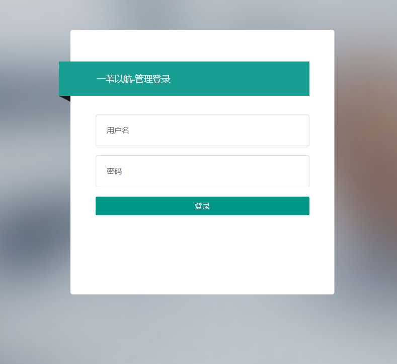
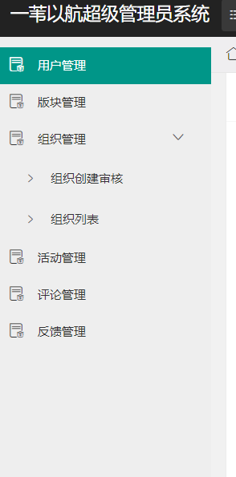
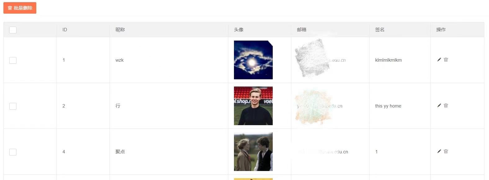

# 一苇以航—Web端 用户使用说明书

## 版本历史

| 版本 | 作者 | 更新日期 | 更新说明 |
| ---- | ---- | -------- | -------- |
|      |      |          |          |

## 目录

[TOC]

## 1 引言

### 1.1 编写目的

引导系统管理员正确使用web端，管理系统运营中的各项事务。建议用户在使用系统之前阅读本手册，了解系统中的各项功能与约定。在使用过程中，如果遇到问题也可查阅本手册。

预期读者为系统上线后的超级管理员。

### 1.2 项目背景

本系统由北京航空航天大学计算机学院2021年春季学期软件工程（欧阳元新、王德庆教学班）课程组指导，高等理工学院计算机方向乐洋、史鑫杰、开聚实、王肇凯、王佳瑞、李永毅开发与主管。

### 1.3 定义

| 缩写、术语                          | 解释                                                         |
| ----------------------------------- | ------------------------------------------------------------ |
| 版块(Forum)                         | 活动的顶层分类，例如博雅、社团活动、志愿等，由超级管理员设定，无法随意添加或修改 |
| 组织(Organization, ORG)             | 从属于版块，由用户创建、经过审核后发布，创建者自动成为组织管理员 |
| 活动(Activity, ACT)                 | 从属于组织（社团、学生会等版块下）或版块（博雅、演出等官方版块，以及*个人版块*），由组织/个人发布 |
| 固定活动(Official Activity, OA)     | 具有（一定的）官方性质的活动，例如博雅、演出等，由超级管理员通过爬虫等渠道获取并更新至活动列表，不归特定组织所有 |
| 非固定活动(Unofficial Activity, UA) | 包括*组织活动*（由组织管理员代表组织发布）及*个人活动*（由个人发布），例如社团活动、约球约自习等 |

## 2 软件概述

### 2.1 目标

该系统为面向北航全校师生的活动发布、管理和社交平台，目的旨在方便全校的活动组织者和参与者，在活动发布、宣传通知、日程提醒和参与层面，给予一个统一的发布平台，并基于推荐算法为广大师生提供当前北航正在进行的、人气高的或用户感兴趣的活动。

超级管理员可以在web端对小程序中的各类信息和用户操作进行审核与管理，统筹协调系统的正常运行，并且可获得用户反馈来改进系统以更好地提供服务。

### 2.2 功能

<table>
   <tr>
      <td>功能执行者</td>
      <td>功能名称</td>
      <td>功能描述</td>
   </tr>
   <tr>
      <td rowspan="13">超级管理员</td>
      <td>管理员登录</td>
      <td>登录管理端超级管理员账号</td>
   </tr>
   <tr>   
      <td>删除用户</td>
      <td>删除选定用户的账户</td>
   </tr>
   <tr>   
      <td>审核组织创建</td>
      <td>可以查看所有创建组织的申请，并选择同意或拒绝申请</td>
   </tr>
   <tr>
      <td>修改组织信息</td>
      <td>可以查看并修改组织信息</td>
   </tr>
   <tr>
      <td>删除组织</td>
      <td>可以选择目前存在的组织，对其进行删除</td>
   </tr>
   <tr>
      <td>发布官方活动</td>
      <td>可以发布官方活动</td>
   </tr>
   <tr>
      <td>修改活动信息</td>
      <td>可以修改已发布的活动的信息</td>
   </tr>
   <tr>
      <td>删除活动</td>
      <td>可以删除已经发布的活动</td>
   </tr>
   <tr>
      <td>修改评论</td>
      <td>修改用户在活动页面发表的评论</td>
   </tr>
   <tr>
      <td>删除评论</td>
      <td>删除用户在活动页面发表的评论</td>
   </tr>
   <tr>
      <td>查看反馈</td>
      <td>可以从收到的反馈中进行选择并查看其详情</td>
   </tr>
   <tr>
      <td>删除反馈</td>
      <td>可以对收到的反馈进行删除</td>
   </tr>
</table>

## 3 运行环境

支持Chrome或Firefox浏览器

## 4 使用说明

### 4.1 安装和初始化

### 4.2 输入

#### 4.2.1 数据背景

#### 4.2.2 数据格式

#### 4.2.3 输入举例

### 4.3 输出

#### 4.3.1 数据背景

#### 4.3.2 数据格式

#### 4.3.3 输入举例

### 4.4 出错和回复

### 4.5 求助查询

## 5 用户使用说明

### 5.1 管理员登录

https://www.reedsailing.xyz/login.html

对于已分配管理员权限的用户，输入用户名、密码完成登录，进入管理端。

### 5.2 管理端使用

管理员具有用户管理、版块管理、组织管理、活动管理、评论管理、反馈管理的权限

#### 5.2.1 用户管理

进入用户管理页面，管理员可查看小程序用户列表，获得用户id、昵称、头像、认证邮箱、签名信息。管理员对用户的操作有编辑用户信息（昵称、签名）和删除用户。可勾选列表右侧白框批量删除用户。

## 6 非常规过程

## 7 操作命令一览表

## 8 程序文件和数据文件一览表

### 8.1 小程序前端

| 目录/文件    | 描述                                             |
| ------------ | ------------------------------------------------ |
| components/  | 自定义组件目录                                   |
| icon/        | 图标文件目录                                     |
| lib/         | 使用的第三方UI库（iview、vant）目录              |
| pages/       | 页面源代码目录，每个页面包括wxml、js、wxss、json |
| utils/       | 工具脚本目录，包括登录、交互和一些常用工具       |
| app.js       | 全局数据和函数                                   |
| app.json     | 全局页面、组件配置                               |
| app.wxss     | 全局样式                                         |
| README.md    | 自述文件，包含页面详细说明                       |
| sitemap.json | 小程序索引配置                                   |
| theme.json   | 小程序全局主题样式                               |

### 8.2 Web前端

| 目录/文件                | 描述             |
| ------------------------ | ---------------- |
| css/                     | 样式文件目录     |
| fonts/                   | 字体文件目录     |
| images/                  | 图片目录         |
| js/                      | 脚本目录         |
| lib/                     | layui库目录      |
| activity-add.html        | 新建活动页面     |
| activity-edit.html       | 编辑活动页面     |
| activity-list.html       | 活动列表页面     |
| application-confirm.html | 组织审核确认页面 |
| application-list.html    | 组织审核列表页面 |
| block-add.html           | 新建版块页面     |
| block-edit.html          | 编辑板块页面     |
| block-list.html          | 版块列表页面     |
| comment-detail.html      | 评论详情页面     |
| comment-list.html        | 评论列表页面     |
| feedback-detail.html     | 反馈详情页面     |
| feedback-list.html       | 反馈列表页面     |
| index.html               | 主页             |
| login.html               | 登录页面         |
| member-edit.html         | 用户编辑页面     |
| member-list.html         | 用户列表页面     |
| organization-add.html    | 新建组织页面     |
| organization-edit.html   | 编辑组织页面     |
| organization-list.html   | 组织列表页面     |
| README.md                | 自述文件         |

### 8.3 后端

| 目录/文件        | 描述                 |
| ---------------- | -------------------- |
| LiberalQuery/    | 博雅爬虫脚本目录     |
| django_backend/  | django后端文件目录   |
| requirements.txt | python依赖包列表文件 |
| README.md        | 自述文件             |

