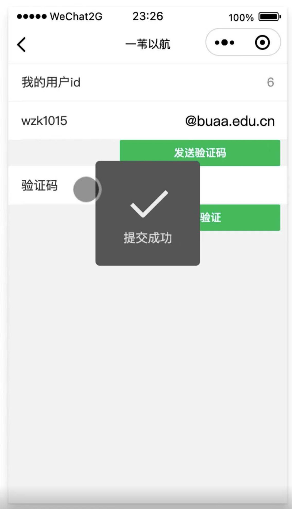
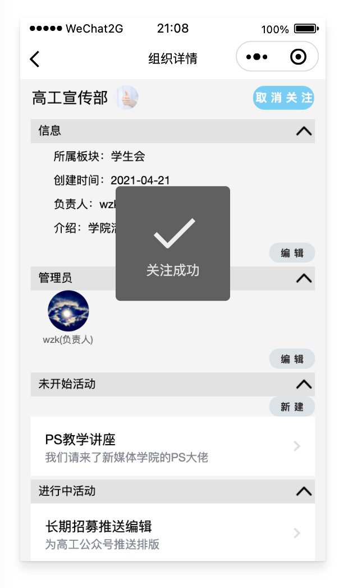
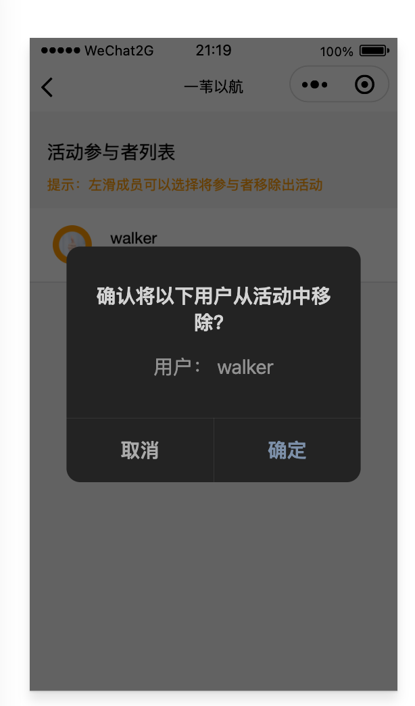

# 『一苇以航』 概要设计报告

## 版本历史

| 版本 | 作者     | 更新日期 | 更新说明                                             |
| ---- | -------- | -------- | ---------------------------------------------------- |
| 1.0  | 全体成员 | 4.24     | 完成初稿                                             |
| 1.1  | 王肇凯   | 5.5      | 更新功能列表；增加用户界面截图；修正部分用户界面说明 |
| 1.2  | 王肇凯   | 6.5      | 根据beta版实际设计，更新部分功能说明                 |

## 目录

[TOC]

## 1 文档介绍

### 1.1 文档目的

本文档给出“大学生活动发布与社交平台”产品“一苇以航”的整体概述，对于产品的各项功能进行系统描述，明确该产品的定位，用作之后系统测试的基础，同时也作为完成后验收确认的依据。

### 1.2 文档范围

该文档介绍活动发布系统的微信小程序，后端以及Web端的功能及其实现方式，错误处理等。

### 1.3 读者对象

本文档面向用户、开发人员、产品人员和验收方。

### 1.4 参考文献

| 编号          | 作者           | 文档名称                   | 单位                                                         | 日期       |
| ------------- | -------------- | -------------------------- | ------------------------------------------------------------ | ---------- |
| GB/T9235-2008 | 冯慧、王宝艾等 | 计算机软件需求规格说明规范 | 中华人民共和国国家质量监督检验检疫总局、中国国家标准化管理委员会 | 2008-04-11 |

### 1.5 术语与缩写解释

| 缩写、术语                          | 解释                                                         |
| ----------------------------------- | ------------------------------------------------------------ |
| 版块(Forum)                         | 活动的顶层分类，例如博雅、社团活动、志愿等，由超级管理员设定，无法随意添加或修改 |
| 组织(Organization, ORG)             | 从属于版块，由用户创建、经过审核后发布，创建者自动成为组织管理员 |
| 活动(Activity, ACT)                 | 从属于组织（社团、学生会等版块下）或版块（博雅、演出等官方版块，以及*个人版块*），由组织/个人发布 |
| 固定活动(Official Activity, OA)     | 具有（一定的）官方性质的活动，例如博雅、演出等，由超级管理员通过爬虫等渠道获取并更新至活动列表，不归特定组织所有 |
| 非固定活动(Unofficial Activity, UA) | 包括*组织活动*（由组织管理员代表组织发布）及*个人活动*（由个人发布），例如社团活动、约球约自习等 |

## 2 设计要点

### 2.1 设计报告范围

本设计报告主要描述了“一苇以航”——大学生活动发布与社交平台的功能设计，包括用户、版块、组织、活动及管理等48项功能的设计。

### 2.2 关键业务功能

本平台实现了大学生活动发布与社交功能，整合了北航校园内所有的活动信息，解决了学校现有各活动平台分散以及通知不及时的问题。本平台采用了版块、组织、活动的三级结构，使得活动分类清楚，方便用户查找。同时本平台实现超级管理员、组织负责人、组织管理员的三级管理结构，基本符合现有组织实际结构，能够实现活动发布地良好管理。本平台还优化了用户体验，用户可关注指定组织，获取指定组织发布的活动通知。以及本平台提供个性推荐，根据用户使用习惯，推荐合适的活动，降低用户寻找成本。本平台还提供了活动评论功能，能够满足用户基本社交功能。

### 2.3 技术实现难点

服务器性能：由于服务器性能较低，可能无法满足火爆活动出现较大规模用户同时报名的场景。数据库表项过大时，数据库操作的开销可能会受服务器性能影响。对于高并发量可以通过缓存功能提高一定的服务质量。数据库中对于未开始的活动以及结束活动应该分开处理，优先保证未开始的活动操作。

推荐算法效果：由于前期缺少实际使用数据，实际推荐模型的效果可能无法达到较好的效果。需要经过一段时间的试运营后，积累一定的用户数据后才能达到更好的训练效果。

### 2.4 其他

本平台前端界面及交互需要有较好的用户亲和力。

## 3 普通用户功能设计

| 功能类别       | 功能类别、标识符  | 描述                                                         |
| -------------- | ----------------- | ------------------------------------------------------------ |
| 用户账户相关   | 用户注册 A01      | 首次使用此小程序时，微信用户通过微信的授权认证成为此小程序的用户 |
|                | 用户登录 A02      | 用户直接通过微信的小程序页面进入此微信小程序                 |
|                | 编辑用户信息 A03  | 修改用户的信息                                               |
|                | 查看用户id A04    | 查看用户本人的id                                             |
|                | 身份验证 A05      | 验证用户是否是北航师生                                       |
| 组织管理相关   | 申请创建组织 A06  | 普通用户可申请注册新组织，并成为组织负责人                   |
| 用户反馈相关   | 提交用户反馈 A07  | 将使用反馈发送给小程序开发者                                 |
| 组织关注相关   | 关注组织 A08      | 用户所关注的组织发布的活动信息将展示于“关注”页面             |
|                | 取消关注组织 A09  | 不再展示被取消关注的组织的活动信息                           |
|                | 查看关注信息 A10  | 看已关注的组织或板块的发布信息                               |
| 活动参与相关   | 报名活动 A11      | 用户报名参加处于报名状态且未招满的活动                       |
|                | 退出活动 A12      | 退出已报名未进行的活动                                       |
|                | 评价活动 A13      | 在活动结束后对参与的活动进行打分和评论                       |
|                | 删除评论 A14      | 删除在活动页面已发表活动评论                                 |
|                | 查看活动地图 A15  | 通过地图形式查看已报名活动的相关信息                         |
|                | 查看活动日历 A16  | 通过日历形式查看已报名活动的相关信息                         |
| 个人活动相关   | 发布个人活动 A17  | 用户可在个人板块发布不可报名的非固定活动                     |
|                | 编辑个人活动 A18  | 修改个人发布的活动信息                                       |
|                | 删除个人活动 A19  | 删除发布的个人活动                                           |
| 分享功能相关   | 分享活动/组织 A20 | 对活动/组织进行分享                                          |
| 搜索功能相关   | 搜索活动/组织 A21 | 对活动/组织进行搜索                                          |
| 个性化推荐相关 | 个性化推荐 A22    | 个性化推荐可能想要关注的活动和想参与的组织                   |
| 通知信息相关   | 查看通知 A23      | 查看接收到的通知信息                                         |

### 3.1 用户注册 A01 
#### 3.1.1 实现简述及约定  

首次使用此小程序时，微信用户通过微信的授权认证成为此小程序的用户。

用户注册后，小程序用户信息默认使用微信的昵称和头像。之后用户可以自行编辑用户信息。

#### 3.1.2 功能实现流程

首次进入此小程序时，会弹出“获取你的昵称、头像、地区及性别”的弹框，用户需点击“允许”。

#### 3.1.3 用户界面设计

| **NO** | **类型** | **信息内容** | **信息表现** | **说明**                                                 |
| ------ | -------- | ------------ | ------------ | -------------------------------------------------------- |
| 1      | 必选     | 授权按钮     | 按钮         | 点击后将微信账号的昵称、头像、地区及性别信息授权给小程序 |

输出：注册成功，跳转到小程序首页界面。

#### 3.1.4 相关接口

| 序号 | 类型 | 接口编号/名称     | 来源/文档编号                                                | 说明                                                         |
| ---- | ---- | ----------------- | ------------------------------------------------------------ | ------------------------------------------------------------ |
| 1    | 外部 | wx.login          | [wx.login](https://developers.weixin.qq.com/miniprogram/dev/api/open-api/login/wx.login.html) | 调用接口获取登录凭证（code）。通过凭证进而换取用户登录态信息。 |
| 2    | 外部 | wx.getUserProfile | [wx.getUserProfile](https://developers.weixin.qq.com/miniprogram/dev/api/open-api/user-info/wx.getUserProfile.html) | 获取用户信息。每次请求都会弹出授权窗口，用户同意后返回 `userInfo` |
| 3    | 内部 | 用户登录          | 接口文档                                                     | 验证登录信息，在数据库中保存该用户信息，取得登录凭证`token`  |

#### 3.1.5 出错处理设计

无

#### 3.1.6 出错信息

无

### 3.2 用户登录 A02 
#### 3.2.1 实现简述及约定  

注册后，用户直接通过微信的小程序页面进入此微信小程序。

#### 3.2.2 功能实现流程

在微信首页下滑拉出小程序菜单，点击本小程序图标。

#### 3.2.3 用户界面设计

无输入界面。

输出：登录成功，跳转到小程序首页界面。

#### 3.2.4 相关接口

| 序号 | 类型 | 接口编号/名称 | 来源/文档编号                                                | 说明                                                         |
| ---- | ---- | ------------- | ------------------------------------------------------------ | ------------------------------------------------------------ |
| 1    | 外部 | wx.login      | [wx.login](https://developers.weixin.qq.com/miniprogram/dev/api/open-api/login/wx.login.html) | 调用接口获取登录凭证（code）。通过凭证进而换取用户登录态信息。 |
| 2    | 内部 | 用户登录      | 接口文档                                                     | 验证登录信息，在数据库中保存该用户信息，取得登录凭证`token`  |

#### 3.2.5 出错处理设计

无

#### 3.2.6 出错信息

无

### 3.3 编辑用户信息  A03 
#### 3.3.1 实现简述及约定  

用户可以编辑自己的昵称、头像、地区、性别等个人信息。

#### 3.3.2 功能实现流程

进入“我的”界面，再进入“个人信息”界面，输出需要修改的信息，点击提交，即可修改。

#### 3.3.3 用户界面设计

| **NO** | **类型** | **信息内容** | **信息表现** | **说明**       |
| ------ | -------- | ------------ | ------------ | -------------- |
| 1      | 必选     | 昵称         | 输入框       | 输入用户昵称   |
| 2      | 可选     | 个人描述     | 输入框       | 输入个人描述   |
| 3      | 必选     | 修改按钮     | 按钮         | 点击后完成修改 |

输出：提交后会更新用户信息。

#### 3.3.4 相关接口

| 序号 | 类型 | 接口编号/名称    | 来源/文档编号 | 说明                                   |
| ---- | ---- | ---------------- | ------------- | -------------------------------------- |
| 1    | 内部 | 获取指定用户信息 | 接口文档      | 获取编号为id的用户的信息               |
| 2    | 内部 | 修改指定用户信息 | 接口文档      | 用于修改编号为id的用户的昵称，个人描述 |

#### 3.3.5 出错处理设计

“昵称”字段为空：弹窗提示“昵称不能为空”

#### 3.3.6 出错信息

| 序号 | 错误编码 | 错误信息       | 说明/处理办法 |
| ---- | -------- | -------------- | ------------- |
| 1    | 1        | “昵称不能为空” | 用户重新输入  |

### 3.4 查看用户id A04 
#### 3.4.1 实现简述及约定 

普通用户可以查看当前用户的id。

每个用户的id唯一，不可以修改。而且每两个用户的id都不相同。id是准确辨识用户身份的唯一凭证。

#### 3.4.2 功能实现流程

进入“我的”界面，再进入“个人信息”界面，就可以找到用户id。

#### 3.4.3 用户界面设计

| **NO** | **类型** | **信息内容** | **信息表现** | **说明**     |
| ------ | -------- | ------------ | ------------ | ------------ |
| 1      | 必选     | 用户id       | 文本框       | 显示用户的id |

输出：无

#### 3.4.4 相关接口

| 序号 | 类型 | 接口编号/名称 | 来源/文档编号 | 说明                     |
| ---- | ---- | ------------- | ------------- | ------------------------ |
| 2    | 内部 | 用户登录      | 接口文档      | 该接口返回字段中包含`id` |

#### 3.4.5 出错处理设计

无

#### 3.4.6 出错信息

无

### 3.5 身份验证  A05 
#### 3.5.1 实现简述及约定  

验证用户是否是北航师生。

首次登录小程序，系统会引导用户进行身份验证。

用户可以选择不进行身份验证。未身份验证的用户拥有关注组织、查看组织、查看活动的权限。但是无法创建组织、无法报名活动、无法成为组织管理员、无法发布个人活动。

用户只需要进行一次身份验证，以后登录不再需要验证身份。

#### 3.5.2 功能实现流程

用户进入“我的”界面，再进入“个人信息”。

用户输入北航邮箱，点击“发送验证码”按钮，之后会收到一封含有验证码的邮件，需要在五分钟内将验证码输入到微信小程序界面的验证码输入框内，点击“提交验证”即可完成身份验证。

如果在点击“发送验证码”一分钟后还没有收到验证码，可以再次点击“发送验证码”按钮。

#### 3.5.3 用户界面设计

| **NO** | **类型** | **信息内容**               | **信息表现** | **说明**                                                     |
| ------ | -------- | -------------------------- | ------------ | ------------------------------------------------------------ |
| 1      | 必选     | 北航邮箱地址               | 文本框       | 输入北航邮箱的前缀（不需要输入@buaa.edu.cn）                 |
| 2      | 必选     | 发送验证码按钮             | 按钮         | 点击后向北航邮箱发送验证码                                   |
| 3      | 可选     | 重发验证码还需要等待的时间 | 显示框       | 点击“发送验证码”按钮后的一分钟内，“发送验证码”按钮变为重新发送(x s)”,  x为还需要等待的秒数。 |
| 4      | 必选     | 提交验证                   | 按钮         | 点击后提交验证码                                             |

输出：身份验证成功后，个人信息的身份验证栏会显示为“已完成身份验证”。

#### 3.5.4 相关接口

| 序号 | 类型 | 接口编号/名称  | 来源/文档编号 | 说明                                                         |
| ---- | ---- | -------------- | ------------- | ------------------------------------------------------------ |
| 1    | 内部 | 发送验证码邮件 | 接口文档      | 向指定邮箱发送验证码，缓存中保存邮箱和验证码配对信息         |
| 2    | 内部 | 验证码验证     | 接口文档      | 验证用户输入的验证码是否和邮箱对应。如果成功验证，则在数据库中保存用户的邮箱（以后登录则不必认证） |

#### 3.5.5 出错处理设计

验证码错误：弹窗提示“验证失败，请重新输入验证码”

#### 3.5.6 出错信息

| 序号 | 错误编码 | 错误信息     | 说明/处理办法 |
| ---- | -------- | ------------ | ------------- |
| 1    | 1        | “验证码错误” | 用户重新输入  |

### 3.6 申请创建组织 A06 
#### 3.6.1 实现简述及约定  

普通用户可以申请注册新组织，并申请成为组织负责人。

申请组织名称不得与数据库中已有组织名称重复。

#### 3.6.2 功能实现流程

用户进入”分区“界面，选择”组织“页或者进入”我的“界面，点击右上角申请按钮，进入组织申请页面，填写信息，点击提交申请按钮。

#### 3.6.3 用户界面设计

| **NO** | **类型** | **信息内容** | **信息表现** | **说明**                 |
| ------ | -------- | ------------ | ------------ | ------------------------ |
| 1      | 必选     | 组织名称     | 输入框       | 输入将要创建的组织的名称 |
| 2      | 必选     | 申请原因     | 输入框       | 输入创建组织的原因       |
| 3      | 必选     | 提交申请按钮 | 按钮         | 点击后提交申请           |

输出：提交后会有“提交成功”对话框。

#### 3.6.4 相关接口

| 序号 | 类型 | 接口编号/名称 | 来源/文档编号 | 说明                                                   |
| ---- | ---- | ------------- | ------------- | ------------------------------------------------------ |
| 1    | 内部 | 创建组织申请  | 接口文档      | 用户可以提交组织申请，用于向管理员申请创建一个新的组织 |

#### 3.6.5 出错处理设计

某个必填字段为空：弹窗提示“字段不能为空”

组织名与已存在的组织名重复：弹窗提示“该组织名已存在”

组织名与已经提交的，未经审批的组织名相同：弹窗提示“该组织名已存在”

#### 3.6.6 出错信息

| 序号 | 错误编码 | 错误信息       | 说明/处理办法 |
| ---- | :------- | -------------- | ------------- |
| 1    | 1        | 字段不能为空   | 用户重新输入  |
| 2    | 2        | 该组织名已存在 | 用户重新输入  |

### 3.7  提交用户反馈-A07

#### 3.7.1 实现简述及约定  

将反馈发送给小程序开发者，以帮助开发者改进。

#### 3.7.2 功能实现流程

点击进入“我的”界面，进入“用户反馈”界面，填写“反馈内容”和“联系方式”，点击“提交”。

#### 3.7.3 用户界面设计

| **NO** | **类型** | **信息内容** | **信息表现** | **说明**           |
| ------ | -------- | ------------ | ------------ | ------------------ |
| 1      | 必选     | 反馈内容     | 字符串       | 需遵循字符提示信息 |
| 2      | 可选     | 联系方式     | 字符串       | 需遵循字符提示信息 |

输出：用户反馈提交成功的提示

#### 3.7.4 相关接口

| 序号 | 类型 | 接口编号/名称 | 来源/文档编号 | 说明                                 |
| ---- | ---- | ------------- | ------------- | ------------------------------------ |
| 1    | 内部 | 进行用户反馈  | 本文档        | 管理员的反馈列表中将增加新的用户反馈 |

#### 3.7.5 出错处理设计

当无法连接服务器时会弹出提示网络连接失败。

#### 3.7.6 出错信息

| 序号 | 错误编码 | 错误信息     | 说明/处理办法  |
| ---- | -------- | ------------ | -------------- |
| 1    | 1        | 网络连接失败 | 无法获取新消息 |

### 3.8 关注组织 A08 
#### 3.8.1 实现简述及约定  

在”关注“页面展示用户已关注组织发布的消息。只能对未关注的组织进行本操作。

只能对未关注的组织进行本操作。

#### 3.8.2 功能实现流程

用户进入”分区“界面，选择”组织“页，通过搜索/浏览找到指定组织，点击右边“关注”按钮。

#### 3.8.3 用户界面设计

| **NO** | **类型** | **信息内容** | **信息表现** | **说明**         |
| ------ | -------- | ------------ | ------------ | ---------------- |
| 1      | 必选     | 关注按钮     | 按钮         | 点击后关注该组织 |

输出：按钮状态变为“取消关注”。

#### 3.8.4 相关接口

| 序号 | 类型 | 接口编号/名称 | 来源/文档编号 | 说明         |
| ---- | ---- | ------------- | ------------- | ------------ |
| 1    | 内部 | 关注组织      | 接口文档      | 用户关注组织 |

#### 3.8.5 出错处理设计

无

#### 3.8.6 出错信息

无

### 3.9 取消关注组织  A09 
#### 3.9.1 实现简述及约定  

对已关注的组织，可以取消关注。用户只能对已经关注的组织取消关注。

#### 3.9.2 功能实现流程

用户进入”分区“界面，选择”组织“页，通过搜索/浏览/“关注”界面找到指定组织，点击右边“取消关注”按钮，按钮状态变为“关注”。

#### 3.9.3 用户界面设计

| **NO** | **类型** | **信息内容** | **信息表现** | **说明**             |
| ------ | -------- | ------------ | ------------ | -------------------- |
| 1      | 必选     | 取消关注按钮 | 按钮         | 点击后取消关注该组织 |

输出：按钮状态变为“关注”。

#### 3.9.4 相关接口

| 序号 | 类型 | 接口编号/名称    | 来源/文档编号 | 说明                         |
| ---- | ---- | ---------------- | ------------- | ---------------------------- |
| 1    | 内部 | 用户取消关注组织 | 接口文档      | 对应id用户取消关注对应id组织 |

#### 3.9.5 出错处理设计

无

#### 3.9.6 出错信息

无

### 3.10 查看关注信息 A10 
#### 3.10.1 实现简述及约定  

用户可在关注板块查看已关注的组织的信息、活动或已关注板块的活动列表。

#### 3.10.2 功能实现流程

点击底部导航栏的”关注“，可查看已关注组织或已关注板块发布的最新通知、新闻、活动的列表。

#### 3.10.3 用户界面设计

| **NO** | **类型** | **信息内容**     | **信息表现** | **说明**                                   |
| ------ | -------- | ---------------- | ------------ | ------------------------------------------ |
| 1      | 必选     | 信息、活动的列表 | 列表         | 已关注组织或已关注板块发布的信息、活动列表 |

输出：无

#### 3.10.4 相关接口

| 序号 | 类型 | 接口编号/名称          | 来源/文档编号 | 说明                                           |
| ---- | ---- | ---------------------- | ------------- | ---------------------------------------------- |
| 1    | 1    | 获取关注对象的动态列表 | 接口文档      | 请求获取已关注组织或已关注板块的信息、活动列表 |

#### 3.10.5 出错处理设计

无

#### 3.10.6 出错信息

无

### 3.11 报名活动 A11 
#### 3.11.1 实现简述及约定  

对报名进行中，名额未满的活动，可以报名参加。

用户只能对报名进行中、人数未满的活动进行报名。不可重复报名活动。

#### 3.11.2 功能实现流程

用户进入”分区“界面，选择”组织“页，通过搜索/浏览/“关注”界面找到指定组织，点击指定组织，展示组织发布的所有活动；“首页”界面，“推荐”页，点击活动公告more按钮展示活动列表，选择活动进入活动详情页面；或者直接通过搜索查找指定活动。点击报名活动。

#### 3.11.3 用户界面设计

| **NO** | **类型** | **信息内容** | **信息表现** | **说明**           |
| ------ | -------- | ------------ | ------------ | ------------------ |
| 1      | 必选     | 报名按钮     | 按钮         | 点击后提交报名申请 |

输出：报名成功提示。

#### 3.11.4 相关接口

| 序号 | 类型 | 接口编号/名称 | 来源/文档编号 | 说明     |
| ---- | ---- | ------------- | ------------- | -------- |
| 1    | 1    | 活动参与      | 接口文档      | 参与活动 |

#### 3.11.5 出错处理设计

报名已经结束的活动：弹窗提示”报名失败，该活动已结束“

报名人数已满的活动：弹窗提示”报名失败，该活动名额已满“

报名已报名的活动：弹窗提示”不可重复报名“

#### 3.11.6 出错信息

| 序号 | 错误编码 | 错误信息                   | 说明/处理办法 |
| ---- | -------- | -------------------------- | ------------- |
| 1    | 1        | ”报名失败，该活动已结束“   | 用户停止操作  |
| 2    | 2        | ”报名失败，该活动名额已满“ | 用户停止操作  |
| 3    | 3        | ”不可重复报名“             | 用户停止操作  |

### 3.12 退出活动 A12 
#### 3.12.1 实现简述及约定  

可以选择退出已报名未进行的活动。

用户只能退出已报名，未开始的活动，不能退出正在进行或者已经结束的活动。

#### 3.12.2 功能实现流程

用户进入”日程“界面，选择”活动列表“页，在即将进行栏中找到待退出活动，点击退出按钮。

#### 3.12.3 用户界面设计

| **NO** | **类型** | **信息内容** | **信息表现** | **说明**               |
| ------ | -------- | ------------ | ------------ | ---------------------- |
| 1      | 必选     | 取消报名按钮 | 按钮         | 点击后提交退出报名申请 |

输出：成功退出活动提示

#### 3.12.4 相关接口

| 序号 | 类型 | 接口编号/名称 | 来源/文档编号 | 说明                   |
| ---- | ---- | ------------- | ------------- | ---------------------- |
| 1    | 内部 | 退出活动      | 接口文档      | 用户退出还未开始的活动 |

#### 3.12.5 出错处理设计

退出正在进行的活动：弹窗提示”不能退出已经开始的活动“

退出已经结束的活动：弹窗提示”不能退出已经结束的活动“

#### 3.12.6 出错信息

| 序号 | 错误编码 | 错误信息                 | 说明/处理办法 |
| ---- | -------- | ------------------------ | ------------- |
| 1    | 1        | ”不能退出已经开始的活动“ | 用户停止操作  |
| 2    | 2        | ”不能退出已经结束的活动“ | 用户停止操作  |

### 3.13  评价活动-A13 
#### 3.13.1 实现简述及约定  

用户可在参与的活动结束后给活动打分并给出评价，用户的打分和评价将显示在活动页面。

#### 3.13.2 功能实现流程

用户在活动结束后，再次进入活动界面，系统自动弹出打分界面。用户选择评价星数以及输入评价，点击提交。

#### 3.13.3 用户界面设计

| **NO** | **类型** | **信息内容** | **信息表现** | **说明**                                      |
| ------ | -------- | ------------ | ------------ | --------------------------------------------- |
| 1      | 必选     | 活动打分     | 星星个数     | 最少0个星星，最多5个星星，以1个星星为打分单位 |
| 2      | 必选     | 活动评论     | 字符提示     | 遵循字符提示要求                              |

输出：活动打分和评价将显示在活动页面。

#### 3.13.4 相关接口

| 序号 | 类型 | 接口编号/名称 | 来源/文档编号 | 说明                             |
| ---- | ---- | ------------- | ------------- | -------------------------------- |
| 1    | 内部 | 进行活动评论  | 本文档        | 指定活动的评论列表中增加新的评论 |

#### 3.13.5 出错处理设计

当无法连接服务器时会弹出提示网络连接失败。

#### 3.13.6 出错信息

| 序号 | 错误编码 | 错误信息     | 说明/处理办法  |
| ---- | -------- | ------------ | -------------- |
| 1    | 1        | 网络连接失败 | 无法获取新消息 |

### 3.14  删除评论-A14

#### 3.14.1 实现简述及约定 

用户可删除在活动页面已发表的活动评论 。

#### 3.14.2 功能实现流程

用户进入活动页面，在评论区找到自己的评论，选择删除。

#### 3.14.3 用户界面设计

| **NO** | **类型** | **信息内容** | **信息表现** | **说明**           |
| ------ | -------- | ------------ | ------------ | ------------------ |
| 1      | 必选     | 评论列表     | 列表         | 显示活动的全部评论 |
| 2      | 必选     | 删除按钮     | 按钮         | 点击后弹出确认窗口 |
| 3      | 必选     | 确认按钮     | 按钮         | 点击后删除评论     |

输出：提交后删除指定的评论。

#### 3.14.4 相关接口

| 序号 | 类型 | 接口编号/名称 | 来源/文档编号 | 说明                   |
| ---- | ---- | ------------- | ------------- | ---------------------- |
| 1    | 内部 | 获取活动评论  | 本文档        | 获取指定活动的评论列表 |
| 2    | 内部 | 删除活动评论  | 本文档        | 删除指定的评论         |

#### 3.14.5 出错处理设计

当无法连接服务器时会弹出提示网络连接失败。

#### 3.14.6 出错信息

| 序号 | 错误编码 | 错误信息     | 说明/处理办法  |
| ---- | -------- | ------------ | -------------- |
| 1    | 1        | 网络连接失败 | 无法获取新消息 |

### 3.15  查看活动地图-A15 
#### 3.15.1 实现简述及约定  

通过地图形式显示已报名活动的地点。

#### 3.15.2 功能实现流程

点击进入“日程”界面，进入“活动地图”界面，显示已报名活动的位置，并可点击进入查看更多信息。

#### 3.15.3 用户界面设计

| **NO** | **类型** | **信息内容** | **信息表现** | **说明**                     |
| ------ | -------- | ------------ | ------------ | ---------------------------- |
| 1      | 必选     | 活动地图     | 地图         | 在地图上显示已报名活动的信息 |

输出：无

#### 3.15.4 相关接口

| 序号 | 类型 | 接口编号/名称 | 来源/文档编号 | 说明                                                 |
| ---- | ---- | ------------- | ------------- | ---------------------------------------------------- |
| 1    | 外部 | 地图          | 微信          | 使用微信中的地图API                                  |
| 2    | 内部 | 获取活动信息  | 本文档        | 获取用户已报名的活动列表，并按照位置信息显示在地图上 |

#### 3.15.5 出错处理设计

当无法连接服务器时会弹出提示网络连接失败。

#### 3.15.6 出错信息

| 序号 | 错误编码 | 错误信息     | 说明/处理办法  |
| ---- | -------- | ------------ | -------------- |
| 1    | 1        | 网络连接失败 | 无法获取新消息 |

### 3.16  查看活动日历-A16

#### 3.16.1 实现简述及约定  

通过日历形式显示已报名活动的开始时间。

#### 3.16.2 功能实现流程

点击进入“日程”界面，进入“活动日历”界面，显示已报名活动的开始时间（月视图），并可点击进入查看更多信息。

#### 3.16.3 用户界面设计

| **NO** | **类型** | **信息内容** | **信息表现** | **说明**                     |
| ------ | -------- | ------------ | ------------ | ---------------------------- |
| 1      | 必选     | 活动日历     | 日历         | 在日历上显示已报名活动的信息 |

输出：无

#### 3.16.4 相关接口

| 序号 | 类型 | 接口编号/名称 | 来源/文档编号 | 说明                                                     |
| ---- | ---- | ------------- | ------------- | -------------------------------------------------------- |
| 1    | 外部 | 日历          | 微信          | 使用微信中的地日历API                                    |
| 2    | 内部 | 获取活动信息  | 本文档        | 获取用户已报名的活动列表，并按照开始时间信息显示在日历上 |

#### 3.16.5 出错处理设计

当无法连接服务器时会弹出提示网络连接失败。

#### 3.16.6 出错信息

| 序号 | 错误编码 | 错误信息     | 说明/处理办法  |
| ---- | -------- | ------------ | -------------- |
| 1    | 1        | 网络连接失败 | 无法获取新消息 |

### 3.17  发布个人活动-A17

#### 3.17.1 实现简述及约定  

用户可在个人板块发布个人的非固定活动，个人活动不属于组织活动，所以不可接受其他用户报名。

#### 3.17.2 功能实现流程

用户进入“我的”界面，点击活动发布按钮，进入活动发布页，填写活动的相关信息即可发布。

#### 3.17.3 用户界面设计

| **NO** | **类型** | **信息内容** | **信息表现** | **说明**             |
| ------ | -------- | ------------ | ------------ | -------------------- |
| 1      | 必选     | 活动名称     | 字符提示     | 填写活动名称         |
| 2      | 可选     | 活动详情     | 字符提示     | 填写活动详情         |
| 3      | 必选     | 最大人数     | 字符提示     | 填写活动最大参与人数 |
| 4      | 必选     | 起始时间     | 下拉框       | 选择活动起始时间     |
| 5      | 必选     | 结束时间     | 下拉框       | 选择活动结束时间     |

输出：发布成功提示框

#### 3.17.4 相关接口

| 序号 | 类型 | 接口编号/名称 | 来源/文档编号 | 说明         |
| ---- | ---- | ------------- | ------------- | ------------ |
| 1    | 内部 | 新建活动      | 本文档        | 新建一个活动 |

#### 3.17.5 出错处理设计

当无法连接服务器时会弹出提示网络连接失败。

#### 3.17.6 出错信息

| 序号 | 错误编码 | 错误信息     | 说明/处理办法  |
| ---- | -------- | ------------ | -------------- |
| 1    | 1        | 网络连接失败 | 无法获取新消息 |

### 3.18  编辑个人活动-A18 
#### 3.18.1 实现简述及约定  

修改个人发布的活动信息。

#### 3.18.2 功能实现流程

进入需要修改信息的“未进行”的活动，修改活动信息，点击“修改”按钮。

#### 3.18.3 用户界面设计

| **NO** | **类型** | **信息内容** | **信息表现** | **说明**             |
| ------ | -------- | ------------ | ------------ | -------------------- |
| 1      | 必选     | 活动名称     | 字符提示     | 填写活动名称         |
| 2      | 可选     | 活动详情     | 字符提示     | 填写活动详情         |
| 3      | 必选     | 最大人数     | 字符提示     | 填写活动最大参与人数 |
| 4      | 必选     | 起始时间     | 下拉框       | 选择活动起始时间     |
| 5      | 必选     | 结束时间     | 下拉框       | 选择活动结束时间     |

输出：信息修改成功提示框

#### 3.18.4 相关接口

| 序号 | 类型 | 接口编号/名称    | 来源/文档编号 | 说明                 |
| ---- | ---- | ---------------- | ------------- | -------------------- |
| 1    | 内部 | 获取指定活动信息 | 本文档        | 获取对应id的活动信息 |
| 2    | 内部 | 修改指定活动信息 | 本文档        | 修改对应id的活动信息 |

#### 3.18.5 出错处理设计

当无法连接服务器时会弹出提示网络连接失败。

#### 3.18.6 出错信息

| 序号 | 错误编码 | 错误信息     | 说明/处理办法  |
| ---- | -------- | ------------ | -------------- |
| 1    | 1        | 网络连接失败 | 无法获取新消息 |

### 3.19  删除个人活动-A19 
#### 3.19.1 实现简述及约定  

删除已发布且未进行的个人活动。

#### 3.19.2 功能实现流程

进入要删除的活动，点击“删除”按钮，点击“确认”。

#### 3.19.3 用户界面设计

| **NO** | **类型** | **信息内容** | **信息表现** | **说明**           |
| ------ | -------- | ------------ | ------------ | ------------------ |
| 1      | 必选     | 删除按钮     | 按钮         | 点击后弹出确认窗口 |
| 2      | 必选     | 确认按钮     | 按钮         | 点击后删除活动     |

输出：活动删除成功提示框。

#### 3.19.4 相关接口

| 序号 | 类型 | 接口编号/名称 | 来源/文档编号 | 说明             |
| ---- | ---- | ------------- | ------------- | ---------------- |
| 1    | 内部 | 删除指定活动  | 本文档        | 删除对应id的活动 |

#### 3.19.5 出错处理设计

当无法连接服务器时会弹出提示网络连接失败。

#### 3.19.6 出错信息

| 序号 | 错误编码 | 错误信息     | 说明/处理办法  |
| ---- | -------- | ------------ | -------------- |
| 1    | 1        | 网络连接失败 | 无法获取新消息 |

### 3.20  分享活动/组织-A20 
#### 3.20.1 实现简述及约定  

分享活动/组织，将对应页面导出为二维码图片、分享到群聊、分享到朋友圈

#### 3.20.2 功能实现流程

点击进入相应活动/组织，点击”分享“按钮，选择分享方式。

#### 3.20.3 用户界面设计

| **NO** | **类型** | **信息内容** | **信息表现** | **说明**                                                     |
| ------ | -------- | ------------ | ------------ | ------------------------------------------------------------ |
| 1      | 必选     | 分享按钮     | 按钮         | 每个活动、组织的标题旁有删除按键，点击后即可删除相应的活动、组织 |

输出：二维码图片和页面链接

#### 3.20.4 相关接口

| 序号 | 类型 | 接口编号/名称    | 来源/文档编号 | 说明                                                       |
| ---- | ---- | ---------------- | ------------- | ---------------------------------------------------------- |
| 1    | 内部 | 获取分享页面信息 | 本文档        | 生成的二维码和连接均可以转到所分享的活动或组织页面         |
| 2    | 外部 | 获取分享目标     | 微信          | 分享内容可选择分享到微信好友、朋友圈、QQ好友、QQ空间等目标 |

#### 3.20.5 出错处理设计

当无法连接服务器时会弹出提示网络连接失败。

#### 3.20.6 出错信息

| 序号 | 错误编码 | 错误信息     | 说明/处理办法  |
| ---- | -------- | ------------ | -------------- |
| 1    | 1        | 网络连接失败 | 无法获取新消息 |

### 3.21  搜索活动/组织-A21 
#### 3.21.1 实现简述及约定

根据组织/活动的名称/描述进行搜索。

#### 3.21.2 功能实现流程

在首页/分区页面点击搜索框，输入查询关键词，通过下拉框选择搜索组织或搜索活动，点击”搜索“按钮，跳转到搜索结果页面。

#### 3.21.3 用户界面设计

| **NO** | **类型** | **信息内容** | **信息表现**   | **说明**               |
| ------ | -------- | ------------ | -------------- | ---------------------- |
| 1      | 必选     | 查询关键词   | 搜索框字符提示 | 遵循搜索框字符提示要求 |

输出：符合条件的搜索条目

#### 3.21.4 相关接口

| 序号 | 类型 | 接口编号/名称 | 来源/文档编号 | 说明                                 |
| ---- | ---- | ------------- | ------------- | ------------------------------------ |
| 1    | 内部 | 获取活动信息  | 本文档        | 根据活动关键词获取符合条件的活动信息 |
| 1    | 内部 | 获取组织信息  | 本文档        | 根据活动关键词获取符合条件的组织信息 |

#### 3.21.5 出错处理设计

当无法连接服务器时会弹出提示网络连接失败。

#### 3.21.6 出错信息

| 序号 | 错误编码 | 错误信息     | 说明/处理办法  |
| ---- | -------- | ------------ | -------------- |
| 1    | 1        | 网络连接失败 | 无法获取新消息 |

### 3.22  个性化推荐-A22 
#### 3.22.1 实现简述及约定  

根据用户偏好信息、用户关注的组织的信息、用户的历史活动的信息，用户对历史活动的评价、用户的学院，性别等信息个性化推荐可能想要关注的活动和想参与的组织。用户无需主动输入任何信息。后台自动根据用户的信息和活动信息进行推荐。

#### 3.22.2 功能实现流程

用户进入小程序首页，点击上栏的推荐，即可以看到推荐的活动、组织。

#### 3.22.3 用户界面设计

| **NO** | **类型** | **信息内容** | **信息表现** | **说明**             |
| ------ | -------- | ------------ | ------------ | -------------------- |
| 1      | 必选     | 推荐列表     | 列表         | 推荐的活动、组织列表 |

输出：推荐活动列表与推荐组织列表

#### 3.22.4 相关接口

| 序号 | 类型 | 接口编号/名称 | 来源/文档编号 | 说明                                                         |
| ---- | ---- | ------------- | ------------- | ------------------------------------------------------------ |
| 1    | 内部 | 推荐算法      | 本文档        | 通过推荐算法根据用户个人信息和操作记录为用户推荐可能感兴趣的活动与组织 |

#### 3.22.5 出错处理设计

当无法连接服务器时会弹出提示网络连接失败。

#### 3.22.6 出错信息

| 序号 | 错误编码 | 错误信息     | 说明/处理办法  |
| ---- | -------- | ------------ | -------------- |
| 1    | 1        | 网络连接失败 | 无法获取新消息 |

### 3.23  查看通知-A23 
#### 3.23.1 实现简述及约定

 用户可接收与查看两类通知：

- 活动通知：对于已报名的活动，用户可接受活动变更通知与活动开始提醒
- 管理通知：对于自己所管理权限，被超级管理员删除或修改，会收到通知信息。用户可对所接受的通知进行查看。

#### 3.23.2 功能实现流程

- 活动通知：用户收到小程序发送的活动通知微信。在日程页面，活动变更或开始时出现指定颜色提示气泡，页面变更提醒栏查看活动变更信息。
- 管理通知：用户收到小程序发送的管理通知微信。在我的页面出现指定颜色提示气泡，在系统通知栏中出现数字提示信息，点击进入系统通知栏目，查看被系统修改通知。

#### 3.23.3 用户界面设计

| **NO** | **类型** | **信息内容** | **信息表现**       | **说明**                   |
| ------ | -------- | ------------ | ------------------ | -------------------------- |
| 1      | 必选     | 通知提醒     | 微信消息与提示气泡 | 阅读完通知后提示气泡将消失 |
| 2      | 必选     | 通知         | 通知条目           | 用户所收到的相应通知       |

输出：收到通知时小程序将在微信中向用户发送通知消息，并在小程序相应页面显示指定提示气泡；阅读完通知后提示气泡将消失。

#### 3.23.4 相关接口

| 序号 | 类型 | 接口编号/名称 | 来源/文档编号 | 说明                       |
| ---- | ---- | ------------- | ------------- | -------------------------- |
| 1    | 内部 | 获取通知信息  | 本文档        | 获取要发送给用户的通知信息 |

#### 3.23.5 出错处理设计

当无法连接服务器时会弹出提示网络连接失败。

#### 3.23.6 出错信息

| 序号 | 错误编码 | 错误信息     | 说明/处理办法  |
| ---- | -------- | ------------ | -------------- |
| 1    | 1        | 网络连接失败 | 无法获取新消息 |

## 4 组织管理员功能设计

| 功能类别     | 功能类别、标识符   | 描述                                             |
| ------------ | ------------------ | ------------------------------------------------ |
| 组织管理相关 | 查看管理的组织 B01 | 查看被此用户管理的所有组织的列表。               |
|              | 编辑组织信息 B02   | 删除、增加、修改所管理组织的信息。               |
| 活动信息相关 | 发布组织活动 B03   | 申请发布所管理组织的非固定活动。                 |
|              | 编辑活动信息 B04   | 删除、增加、修改所管理组织发布的活动信息。       |
|              | 删除组织活动 B05   | 删除发布的组织活动。                             |
| 活动报名相关 | 移除活动参与者 B06 | 将已经加入活动的用户从活动名单中移出。           |
| 活动评论相关 | 删除活动的评论 B07 | 删除活动参与者在其管理的组织的活动下面的评论。   |
|              | 活动被评论通知 B08 | 自己管理的活动被评论后，收到活动被评论提醒通知。 |

### 4.1 查看管理的组织 B01

#### 4.1.1 实现简述及约定

查看被此用户管理的所有组织的列表。

#### 4.1.2 功能实现流程

点击进入“我的”界面，点击进入“我管理的组织”界面，即可以查看所有管理的组织。

#### 4.1.3 用户界面设计

| **NO** | **类型** | **信息内容** | **信息表现** | **说明**                 |
| ------ | -------- | ------------ | ------------ | ------------------------ |
| 1      | 必选     | 组织列表     | 列表         | 显示每个管理的组织的名称 |

输出：无

#### 4.1.4 相关接口

| 序号 | 类型 | 接口编号/名称              | 来源/文档编号 | 说明                           |
| ---- | ---- | -------------------------- | ------------- | ------------------------------ |
| 1    | 内部 | 获取指定用户管理的所有组织 | 接口文档      | 获得指定id的用户管理的所有组织 |

#### 4.1.5 出错处理设计

无

#### 4.1.6 出错信息

无

### 4.2 编辑组织信息 B02

#### 4.2.1 实现简述及约定

组织管理员可以删除、增加、修改所管理组织的信息。

#### 4.2.2 功能实现流程

进入将要修改信息的组织，在信息栏中选择“编辑”进入基本信息界面，编辑将要修改的信息，点击提交按钮。

#### 4.2.3 用户界面设计

| **NO** | **类型** | **信息内容** | **信息表现** | **说明**         |
| ------ | -------- | ------------ | ------------ | ---------------- |
| 1      | 必选     | 组织名称     | 输入框       | 输入要修改的名称 |
| 2      | 必选     | 组织描述     | 输入框       | 输入要修改的描述 |
| 3      | 必选     | 提交按钮     | 按钮         | 点击后完成提交   |

输出：提交后会更新组织的信息。

#### 4.2.4 相关接口

| 序号 | 类型 | 接口编号/名称    | 来源/文档编号 | 说明                 |
| ---- | ---- | ---------------- | ------------- | -------------------- |
| 1    | 内部 | 获取指定组织信息 | 接口文档      | 获取指定id的组织信息 |
| 2    | 内部 | 修改指定组织信息 | 接口文档      | 修改指定id的组织信息 |

#### 4.2.5 出错处理设计

输入组织名称为空：弹窗提示“名称不能为空”

修改后的组织名name与已有组织名重复：弹窗提示“名称已存在”

#### 4.2.6 出错信息

| 序号 | 错误编码 | 错误信息                                 | 说明/处理办法 |
| ---- | -------- | ---------------------------------------- | ------------- |
| 1    | 1        | "name字段不能为空。"                     | 用户重新输入  |
| 2    | 2        | "具有 组织名称 的 organization 已存在。" | 用户重新输入  |

### 4.3 发布组织活动 B03

#### 4.3.1 实现简述及约定

申请发布所管理组织的非固定活动。

用户只能在自己是组织管理员的组织内发起活动。

#### 4.3.2 功能实现流程

点击进入“我的”界面，点击进入“活动发布”界面填写所属板块、所属组织、活动详情设置，点击“发布”按钮。

#### 4.3.3 用户界面设计

| **NO** | **类型** | **信息内容**  | **信息表现** | **说明**              |
| ------ | -------- | ------------- | ------------ | --------------------- |
| 1      | 必选     | 活动名称      | 输入框       | 输入活动名称          |
| 2      | 可选     | 活动描述      | 输入框       | 输入活动描述          |
| 3      | 必选     | 活动起止时间  | 单选         | 选择活动起止时间      |
| 4      | 必选     | 活动类别      | 单选         | 选择活动类别          |
| 5      | 必选     | 活动人数      | 输入框       | 输入活动人数          |
| 6      | 必选     | 是否需要审核  | 单选         | 选择活动是否需要审核  |
| 7      | 必选     | 所属组织/版块 | 单选         | 选择活动所属组织/版块 |
| 8      | 必选     | 提交按钮      | 按钮         | 点击后完成提交        |

输出：提交后会发布活动到指定组织/版块。

#### 4.3.4 相关接口

| 序号 | 类型 | 接口编号/名称 | 来源/文档编号 | 说明         |
| ---- | ---- | ------------- | ------------- | ------------ |
| 1    | 内部 | 新建活动      | 接口文档      | 新建一个活动 |

#### 4.3.5 出错处理设计

某个必填字段为空：弹窗提示“字段不能为空”

活动人数少于1或超过上限：弹窗提示“人数不合法”

开始/结束时间格式错误：弹窗提示“时间格式不匹配”

#### 4.3.6 出错信息

| 序号 | 错误编码 | 错误信息         | 说明/处理办法 |
| ---- | -------- | ---------------- | ------------- |
| 1    | 1        | “字段不能为空”   | 用户重新输入  |
| 2    | 2        | “人数不合法”     | 用户重新输入  |
| 3    | 3        | “时间格式不匹配” | 用户重新输入  |

### 4.4 编辑活动信息 B04

#### 4.4.1 实现简述及约定

删除、增加、修改所管理组织发布的活动信息。

#### 4.4.2 功能实现流程

进入要修改信息的活动，修改活动信息，点击“修改”按钮。

#### 4.4.3 用户界面设计

| **NO** | **类型** | **信息内容** | **信息表现** | **说明**             |
| ------ | -------- | ------------ | ------------ | -------------------- |
| 1      | 必选     | 活动名称     | 输入框       | 输入活动名称         |
| 2      | 可选     | 活动描述     | 输入框       | 输入活动描述         |
| 3      | 必选     | 活动起止时间 | 单选         | 选择活动起止时间     |
| 4      | 必选     | 活动类别     | 单选         | 选择活动类别         |
| 5      | 必选     | 活动人数     | 输入框       | 输入活动人数         |
| 6      | 必选     | 是否需要审核 | 单选         | 选择活动是否需要审核 |
| 7      | 必选     | 修改按钮     | 按钮         | 点击后完成修改       |

输出：提交后会更新活动信息。

#### 4.4.4 相关接口

| 序号 | 类型 | 接口编号/名称    | 来源/文档编号 | 说明                 |
| ---- | ---- | ---------------- | ------------- | -------------------- |
| 1    | 内部 | 获取指定活动信息 | 接口文档      | 获取对应id的活动信息 |
| 2    | 内部 | 修改指定活动信息 | 接口文档      | 修改对应id的活动信息 |

#### 4.4.5 出错处理设计

某个必填字段为空：弹窗提示“字段不能为空”

活动人数少于1或超过上限：弹窗提示“人数不合法”

开始/结束时间格式错误：弹窗提示“时间格式不匹配”

#### 4.4.6 出错信息

| 序号 | 错误编码 | 错误信息         | 说明/处理办法 |
| ---- | -------- | ---------------- | ------------- |
| 1    | 1        | “字段不能为空”   | 用户重新输入  |
| 2    | 2        | “人数不合法”     | 用户重新输入  |
| 3    | 3        | “时间格式不匹配” | 用户重新输入  |

### 4.5 删除组织活动 B05

#### 4.5.1 实现简述及约定

删除发布的组织活动。

#### 4.5.2 功能实现流程

进入要修改信息的活动，点击“删除”按钮，点击“确认”。

#### 4.5.3 用户界面设计

| **NO** | **类型** | **信息内容** | **信息表现** | **说明**           |
| ------ | -------- | ------------ | ------------ | ------------------ |
| 1      | 必选     | 删除按钮     | 按钮         | 点击后弹出确认窗口 |
| 2      | 必选     | 确认按钮     | 按钮         | 点击后删除活动     |

输出：提交后会删除活动。

#### 4.5.4 相关接口

| 序号 | 类型 | 接口编号/名称 | 来源/文档编号 | 说明             |
| ---- | ---- | ------------- | ------------- | ---------------- |
| 1    | 内部 | 删除指定活动  | 接口文档      | 删除对应id的活动 |

#### 4.5.5 出错处理设计

无

#### 4.5.6 出错信息

无

### 4.6 移除活动参与者 B06

#### 4.6.1 实现简述及约定

将已经加入活动的用户从活动名单中移出。

只能移除”未进行“的活动的参与者。

#### 4.6.2 功能实现流程

进入活动，在活动参与者中选择要删除的人，点击“删除”按钮，点击“确认”。

#### 4.6.3 用户界面设计

| **NO** | **类型** | **信息内容** | **信息表现** | **说明**             |
| ------ | -------- | ------------ | ------------ | -------------------- |
| 1      | 必选     | 参与者列表   | 列表         | 显示活动的所有参与者 |
| 2      | 必选     | 删除按钮     | 按钮         | 点击后弹出确认窗口   |
| 3      | 可选     | 确认按钮     | 按钮         | 点击后删除参与者     |

输出：提交后会在指定活动中删除该参与者。

#### 4.6.4 相关接口

| 序号 | 类型 | 接口编号/名称 | 来源/文档编号 | 说明           |
| ---- | ---- | ------------- | ------------- | -------------- |
| 1    | 内部 | 退出活动      | 接口文档      | 将用户移出活动 |

#### 4.6.5 出错处理设计

无

#### 4.6.6 出错信息

无

### 4.7 删除活动的评论 B07

#### 4.7.1 实现简述及约定

删除活动参与者在其管理的组织的活动下面的评论。

#### 4.7.2 功能实现流程

进入活动，点击要删除的评论，点击“删除”按钮，点击“确认”。

#### 4.7.3 用户界面设计

| **NO** | **类型** | **信息内容** | **信息表现** | **说明**           |
| ------ | -------- | ------------ | ------------ | ------------------ |
| 1      | 必选     | 评论列表     | 列表         | 显示活动的全部评论 |
| 2      | 必选     | 删除按钮     | 按钮         | 点击后弹出确认窗口 |
| 3      | 必选     | 确认按钮     | 按钮         | 点击后删除评论     |

输出：提交后删除指定的评论。

#### 4.7.4 相关接口

| 序号 | 类型 | 接口编号/名称 | 来源/文档编号 | 说明                   |
| ---- | ---- | ------------- | ------------- | ---------------------- |
| 1    | 内部 | 获取活动评论  | 接口文档      | 获取指定活动的评论列表 |
| 2    | 内部 | 删除活动评论  | 接口文档      | 删除指定的评论         |

#### 4.7.5 出错处理设计

无

#### 4.7.6 出错信息

无

### 4.8 活动被评论通知 B08

#### 4.8.1 实现简述及约定

自己管理的活动被评论后，收到活动被评论提醒通知。

#### 4.8.2 功能实现流程

点击”我管理的活动“，点击进入有提醒的活动，查看被评论信息。

#### 4.8.3 用户界面设计

| **NO** | **类型** | **信息内容** | **信息表现** | **说明**     |
| ------ | -------- | ------------ | ------------ | ------------ |
| 1      | 必选     | 消息通知     | 图标         | 显示通知数量 |

输出：无。

#### 4.8.4 相关接口

| 序号 | 类型 | 接口编号/名称 | 来源/文档编号 | 说明                   |
| ---- | ---- | ------------- | ------------- | ---------------------- |
| 1    | 内部 | 获取活动评论  | 接口文档      | 获取指定活动的评论列表 |

#### 4.8.5 出错处理设计

无

#### 4.8.6 出错信息

无

## 5 组织负责人功能设计

| 功能类别       | 功能类别、标识符   | 描述                                     |
| -------------- | ------------------ | ---------------------------------------- |
| 组织负责人相关 | 转让负责人岗位 C01 | 将组织负责人职位转让给其他用户。         |
|                | 设置组织管理员 C02 | 授权其他用户成为所负责组织的管理员。     |
|                | 移除组织管理员 C03 | 取消对某用户成为所负责组织管理员的授权。 |

### 5.1 转让负责人岗位 C01

#### 5.1.1 实现简述及约定

将组织负责人职位转让给其他用户。

获得转让成为组织负责人的前提是已经是该组织的组织管理员。

#### 5.1.2 功能实现流程

点击进入组织，在“管理员”栏找到要转让的管理员，点击“转让”按钮，在弹出的信息框中点击“确认”按钮。

#### 5.1.3 用户界面设计

| **NO** | **类型** | **信息内容** | **信息表现** | **说明**             |
| ------ | -------- | ------------ | ------------ | -------------------- |
| 1      | 必选     | 管理员列表   | 列表         | 显示组织的全部管理员 |
| 2      | 必选     | 转让按钮     | 按钮         | 点击后弹出确认窗口   |
| 3      | 可选     | 确认按钮     | 按钮         | 点击后转让负责人     |

输出：提交后将指定组织的负责人更新为所选的管理员。

#### 5.1.4 相关接口

| 序号 | 类型 | 接口编号/名称            | 来源/文档编号 | 说明                           |
| ---- | ---- | ------------------------ | ------------- | ------------------------------ |
| 1    | 内部 | 获取指定组织的全部管理员 | 接口文档      | 获取编号为id的组织的全部管理员 |
| 2    | 内部 | 组织负责人转让           | 接口文档      | 将组织负责人转让给指定用户     |

#### 5.1.5 出错处理设计

无

#### 5.1.6 出错信息

无

### 5.2 设置组织管理员 C02

#### 5.2.1 实现简述及约定

授权其他用户成为所负责组织的管理员。

组织中只有”组织负责人“和”组织管理员“两种角色。因此要添加”组织管理员"时要从该软件所有的用户中搜索，为了保证搜索结果唯一，输入只能是id，不能是用户名。

#### 5.2.2 功能实现流程

点击进入组织，在“管理员”栏点击“添加”按钮，输入用户id，点击“查找”，确认用户信息后点击“确认”。

#### 5.2.3 用户界面设计

| **NO** | **类型** | **信息内容** | **信息表现** | **说明**                   |
| ------ | -------- | ------------ | ------------ | -------------------------- |
| 1      | 必选     | 用户id       | 输入框       | 输入要添加的管理员的id     |
| 2      | 必选     | 添加按钮     | 按钮         | 点击后弹出输入框和查找按钮 |
| 3      | 必选     | 查找按钮     | 按钮         | 点击后弹出用户信息确认界面 |
| 4      | 可选     | 用户头像     | 文本         | 显示查找到的用户的头像     |
| 5      | 可选     | 用户昵称     | 文本         | 显示查找到的用户的昵称     |
| 6      | 可选     | 确认按钮     | 按钮         | 点击后添加管理员           |

输出：提交后将用户添加为指定组织的管理员。

#### 5.2.4 相关接口

| 序号 | 类型 | 接口编号/名称    | 来源/文档编号 | 说明                                 |
| ---- | ---- | ---------------- | ------------- | ------------------------------------ |
| 1    | 内部 | 获取指定用户信息 | 接口文档      | 获取编号为id的用户的信息的名称、头像 |
| 2    | 内部 | 组织添加管理员   | 接口文档      | 指定组织添加指定用户为管理员         |

#### 5.2.5 出错处理设计

用户id不存在：弹窗提示“用户不存在”

用户已经是指定组织的管理员：弹窗提示“用户已是管理员”

#### 5.2.6 出错信息

| 序号 | 错误编码 | 错误信息         | 说明/处理办法 |
| ---- | -------- | ---------------- | ------------- |
| 1    | 1        | “用户不存在”     | 用户重新输入  |
| 2    | 2        | “用户已是管理员” | 用户重新输入  |

### 5.3 移除组织管理员 C03

#### 5.3.1 实现简述及约定

取消对某用户成为所负责组织管理员的授权。

删除指定用户的前提是已经是该组织的组织管理员。

#### 5.3.2 功能实现流程

点击进入组织，在“管理员”栏找到要移除的管理员，点击“移除”按钮，在弹出的信息框中点击“确认”按钮。

#### 5.3.3 用户界面设计

| **NO** | **类型** | **信息内容** | **信息表现** | **说明**             |
| ------ | -------- | ------------ | ------------ | -------------------- |
| 1      | 必选     | 管理员列表   | 列表         | 显示组织的全部管理员 |
| 2      | 必选     | 移除按钮     | 按钮         | 点击后弹出确认窗口   |
| 3      | 可选     | 确认按钮     | 按钮         | 点击后移除管理员     |

输出：提交后将用户从指定组织管理员中移除。

#### 5.3.4 相关接口

| 序号 | 类型 | 接口编号/名称            | 来源/文档编号 | 说明                                 |
| ---- | ---- | ------------------------ | ------------- | ------------------------------------ |
| 1    | 内部 | 获取指定组织的全部管理员 | 接口文档      | 获取编号为id的组织的全部管理员       |
| 2    | 内部 | 取消组织管理员           | 接口文档      | 取消对应用户的对应id组织的管理员身份 |

#### 5.3.5 出错处理设计

无

#### 5.3.6 出错信息

无

## 6 超级管理员功能设计

| 功能类别     | 功能名称、标识符 | 描述                                                         |
| ------------ | ---------------- | ------------------------------------------------------------ |
| 账户功能     | 管理员登录-D01   | 超级管理员在登录页面输入其超级管理员账号和对应的密码后，进入管理页面。 |
| 用户管理功能 | 删除用户-D02     | 超级管理员可以删除选定用户的账户。                           |
| 组织管理功能 | 审核组织创建-D03 | 超级管理员可以查看所有创建组织的申请，并选择同意或拒绝申请。 |
|              | 修改组织信息-D04 | 超级管理员可以选择目前存在的组织，修改其名称、简介、组织负责人等信息。 |
|              | 删除组织-D05     | 超级管理员可以选择目前存在的组织，对其进行删除。             |
| 活动管理功能 | 发布官方活动-D06 | 超级管理员可以发布官方活动。                                 |
|              | 修改活动信息-D07 | 超级管理员可以修改已发布的活动的信息。                       |
|              | 删除活动-D08     | 超级管理员可以删除已经发布的活动。                           |
| 评论管理功能 | 删除评论-D09     | 超级管理员可以对已发布的评论进行删除。                       |
| 反馈功能     | 查看反馈-D10     | 超级管理员可以从收到的反馈中进行选择并查看其详情。           |
|              | 删除反馈-D11     | 超级管理员可以对收到的反馈进行删除。                         |

### 6.1 管理员登录 D01

#### 6.1.1 实现简述及约定  

超级管理员在登录页面输入其超级管理员账号和对应的密码后，进入管理页面。

输入的账号必须为超级管理员账号，输入的密码必须为该账号对应的密码。

#### 6.1.2 功能实现流程

超级管理员输入账号和密码，服务器端验证账号是否为超级管理员账号、密码是否为该账号的密码，若均匹配，则完成登录，界面自动跳转至管理页面；否则界面提示“用户名或密码有误”。

#### 6.1.3 用户界面设计

| **NO** | **类型** | **信息内容** | **信息表现** | **说明**               |
| ------ | -------- | ------------ | ------------ | ---------------------- |
| 1      | 必选     | 用户名       | 输入框       | 超级管理员账户的用户名 |
| 2      | 必选     | 密码         | 输入框       | 用户名对应的密码       |

输出：登录是否成功

#### 6.1.4 相关接口

| 序号 | 类型 | 接口编号/名称  | 来源/文档编号 | 说明                                       |
| ---- | ---- | -------------- | ------------- | ------------------------------------------ |
| 1    | 内部 | 超级管理员登录 | 本文档        | 校验输入的用户名密码是否匹配，返回登录状态 |

#### 6.1.5 出错处理设计

某个必填字段为空：提示“此项不能为空”。

#### 6.1.6 出错信息

| 序号 | 错误编码 | 错误信息     | 说明/处理办法      |
| ---- | -------- | ------------ | ------------------ |
| 1    | 1        | 此项不能为空 | 用户对该项进行输入 |

### 6.2 删除用户 D02 
#### 6.2.1 实现简述及约定  

超级管理员在用户管理页面可以删除选定用户的账户。

被删除的用户在超级管理员对其删除时存在。

#### 6.2.2 功能实现流程

超级管理员进入用户管理页面，选择需要删除账户的用户，对其进行删除，若该用户存在，则服务器端删除该用户，web端提示“删除成功”；否则web端提示“该用户不存在”。

#### 6.2.3 用户界面设计

| **NO** | **类型** | **信息内容** | **信息表现** | **说明**           |
| ------ | -------- | ------------ | ------------ | ------------------ |
| 1      | 必选     | 删除按钮     | 按钮         | 点击后弹出确认窗口 |
| 2      | 必选     | 确认按钮     | 按钮         | 点击后删除所选用户 |

输出：提交后会删除用户

#### 6.2.4 相关接口

| 序号 | 类型 | 接口编号/名称 | 来源/文档编号 | 说明               |
| ---- | ---- | ------------- | ------------- | ------------------ |
| 1    | 内部 | 删除用户      | 本文档        | 对所选用户进行删除 |

#### 6.2.5 出错处理设计

无

#### 6.2.6 出错信息

无

### 6.3 审核组织创建 D03 

#### 6.3.1 实现简述及约定  

在待审核页面，超级管理员可以查看所有创建组织的申请，并选择同意或拒绝申请。

该申请在超级管理员提交审核意见时未被审核。

#### 6.3.2 功能实现流程

进入待审核页面，超级管理员选择要审核的申请，选择同意或拒绝该组织的创建申请，如果拒绝，可以填写拒绝原因。提交后由服务器端检查该申请是否已被审核，如果该申请未被审核，则web端提示“审核完成”，服务器端创建该组织；否则web端提示“审核失败”。

#### 6.3.3 用户界面设计

| **NO** | **类型** | **信息内容** | **信息表现** | **说明**               |
| ------ | -------- | ------------ | ------------ | ---------------------- |
| 1      | 必选     | 处理按钮     | 按钮         | 可以选择“同意”或“拒绝” |

输出：提交后被同意的申请将创建组织

#### 6.3.4 相关接口

| 序号 | 类型 | 接口编号/名称 | 来源/文档编号 | 说明                       |
| ---- | ---- | ------------- | ------------- | -------------------------- |
| 1    | 内部 | 新建组织      | 本文档        | 组织申请审批通过后创建组织 |

#### 6.3.5 出错处理设计

无

#### 6.3.6 出错信息

无

### 6.4 修改组织信息 D04 

#### 6.4.1 实现简述及约定  

在组织管理页面，超级管理员可以选择目前存在的组织，修改其名称、简介、组织负责人等信息。

提交时，待修改的组织必须存在。

#### 6.4.2 功能实现流程

进入组织管理页面，超级管理员选择要修改信息的组织，修改其名称、简介、组织负责人等信息后提交，若提交时该组织仍存在，则服务器端对信息进行修改，web端提示“修改成功”；否则web端提示“该组织不存在”。

#### 6.4.3 用户界面设计

| **NO** | **类型** | **信息内容** | **信息表现** | **说明**               |
| ------ | -------- | ------------ | ------------ | ---------------------- |
| 1      | 可选     | 组织名称     | 输入框       | 输入修改后的组织名称   |
| 2      | 可选     | 组织简介     | 输入框       | 输入修改后的组织简介   |
| 3      | 可选     | 组织负责人   | 选择框       | 选择修改后的组织负责人 |

输出：提交后所选组织的信息将被修改。

#### 6.4.4 相关接口

| 序号 | 类型 | 接口编号/名称    | 来源/文档编号 | 说明                 |
| ---- | ---- | ---------------- | ------------- | -------------------- |
| 1    | 内部 | 修改指定组织信息 | 本文档        | 修改对应id的组织信息 |

#### 6.4.5 出错处理设计

 无

#### 6.4.6 出错信息

无

### 6.5 删除组织 D05 
#### 6.5.1 实现简述及约定  

在组织管理页面，超级管理员可以选择目前存在的组织，对其进行删除。

提交时，待删除的组织必须存在。

#### 6.5.2 功能实现流程

超级管理员选择要删除的组织并确认删除，如果提交时要删除的组织存在，则服务器端对该组织进行删除，web端提示“删除成功”；否则web端提示“该组织不存在”。

#### 6.5.3 用户界面设计

| **NO** | **类型** | **信息内容** | **信息表现** | **说明**           |
| ------ | -------- | ------------ | ------------ | ------------------ |
| 1      | 必选     | 删除按钮     | 按钮         | 点击后弹出确认窗口 |
| 2      | 必选     | 确认按钮     | 按钮         | 点击后删除所选组织 |

输出：提交后所选组织会被删除

#### 6.5.4 相关接口

| 序号 | 类型 | 接口编号/名称 | 来源/文档编号 | 说明               |
| ---- | ---- | ------------- | ------------- | ------------------ |
| 1    | 内部 | 删除指定组织  | 本文档        | 删除编号为id的组织 |

#### 6.5.5 出错处理设计

无

#### 6.5.6 出错信息

无

### 6.6 发布官方活动 D06 
#### 6.6.1 实现简述及约定  

在活动管理页面，超级管理员可以发布官方活动。

#### 6.6.2 功能实现流程

超级管理员选择活动所属的版块与组织，填写活动的时间、地点、简介等信息后发布活动。

#### 6.6.3 用户界面设计

| **NO** | **类型** | **信息内容** | **信息表现** | **说明**         |
| ------ | -------- | ------------ | ------------ | ---------------- |
| 1      | 必选     | 活动所属组织 | 选择框       | 选择活动所属组织 |
| 2      | 必选     | 活动时间     | 输入框       | 输入活动时间     |
| 3      | 必选     | 活动地点     | 输入框       | 输入活动地点     |
| 4      | 可选     | 活动简介     | 输入框       | 输入活动简介     |

输出：提交后所选组织将增加活动

#### 6.6.4 相关接口

| 序号 | 类型 | 接口编号/名称 | 来源/文档编号 | 说明         |
| ---- | ---- | ------------- | ------------- | ------------ |
| 1    | 内部 | 新建活动      | 本文档        | 新建一个活动 |

#### 6.6.5 出错处理设计

未选择活动所属组织：提示“必须选择活动所属组织”；

未填写活动时间/活动地点：提示“此项为必填项”。

#### 6.6.6 出错信息

| 序号 | 错误编码 | 错误信息             | 说明/处理办法        |
| ---- | -------- | -------------------- | -------------------- |
| 1    | 1        | 必须选择活动所属组织 | 用户选择活动所属组织 |
| 2    | 2        | 此项为必填项         | 用户填写该项         |

### 6.7 修改活动信息 D07 
#### 6.7.1 实现简述及约定  

在活动管理页面，超级管理员可以修改已发布的活动的信息。

提交修改时，活动必须存在。

#### 6.7.2 功能实现流程

超级管理员选择要修改信息的活动，填写修改后活动的时间、地点、简介等信息后提交，若提交时活动仍存在，则服务器端更新该活动，web端提示“修改成功”；否则web端提示“活动不存在”。

#### 6.7.3 用户界面设计

| **NO** | **类型** | **信息内容** | **信息表现** | **说明**             |
| ------ | -------- | ------------ | ------------ | -------------------- |
| 1      | 必选     | 活动         | 选择框       | 选择要修改的活动     |
| 2      | 可选     | 时间         | 输入框       | 输入修改后的活动时间 |
| 3      | 可选     | 地点         | 输入框       | 输入修改后的活动地点 |
| 4      | 可选     | 简介         | 输入框       | 输入修改后的活动简介 |

输出：提交后活动信息将被修改

#### 6.7.4 相关接口

| 序号 | 类型 | 接口编号/名称    | 来源/文档编号 | 说明                 |
| ---- | ---- | ---------------- | ------------- | -------------------- |
| 1    | 内部 | 修改指定活动信息 | 本文档        | 修改对应id的活动信息 |

#### 6.7.5 出错处理设计

未选择活动：提示“未选择要修改的活动”

#### 6.7.6 出错信息

| 序号 | 错误编码 | 错误信息           | 说明/处理办法        |
| ---- | -------- | ------------------ | -------------------- |
| 1    | 1        | 未选择要修改的活动 | 用户选择要修改的活动 |

### 6.8 删除活动 D08 
#### 6.8.1 实现简述及约定  

在活动管理页面，超级管理员可以删除已经发布的活动。

提交删除时，活动必须存在。

#### 6.8.2 功能实现流程

超级管理员选择要删除的活动并确认删除，若提交时活动仍存在，则服务器端删除该活动，web端提示“删除成功”；否则web端提示“活动不存在”。

#### 6.8.3 用户界面设计

| **NO** | **类型** | **信息内容** | **信息表现** | **说明**           |
| ------ | -------- | ------------ | ------------ | ------------------ |
| 1      | 必选     | 删除按钮     | 按钮         | 点击后弹出确认窗口 |
| 2      | 必选     | 确认按钮     | 按钮         | 点击后删除活动     |

输出：提交后所选活动将被删除

#### 6.8.4 相关接口

| 序号 | 类型 | 接口编号/名称 | 来源/文档编号 | 说明               |
| ---- | ---- | ------------- | ------------- | ------------------ |
| 1    | 内部 | 删除指定活动  | 本文档        | 删除编号为id的活动 |

#### 6.8.5 出错处理设计

无

#### 6.8.6 出错信息

无

### 6.9 删除评论 D09 
#### 6.9.1 实现简述及约定  

在评论管理页面，超级管理员可以对已发布的评论进行删除。

提交删除时，待删除的评论必须存在。

#### 6.9.2 功能实现流程

超级管理员选择要删除的评论并确认删除，若删除时评论仍存在，则服务器端删除评论，web端提示“删除成功”；否则web端提示“评论不存在”。

#### 6.9.3 用户界面设计

| **NO** | **类型** | **信息内容** | **信息表现** | **说明**           |
| ------ | -------- | ------------ | ------------ | ------------------ |
| 1      | 必选     | 删除按钮     | 按钮         | 点击后弹出确认窗口 |
| 2      | 必选     | 确认按钮     | 按钮         | 点击后删除所选评论 |

输出：提交后所选评论会被删除

#### 6.9.4 相关接口

| 序号 | 类型 | 接口编号/名称 | 来源/文档编号 | 说明               |
| ---- | ---- | ------------- | ------------- | ------------------ |
| 1    | 内部 | 删除指定评论  | 本文档        | 删除编号为id的评论 |

#### 6.9.5 出错处理设计

无

#### 6.9.6 出错信息

无

### 6.10 查看反馈 D10 
#### 6.10.1 实现简述及约定  

在反馈管理页面，超级管理员可以从收到的反馈中进行选择并查看其详情。

被查看的反馈在被查看时必须存在。

#### 6.10.2 功能实现流程

超级管理员进入反馈管理页面，选择要详细查看的反馈，若查看时该反馈仍存在，则web端显示完整反馈内容；否则web端提示“该反馈不存在”。

#### 6.10.3 用户界面设计

| **NO** | **类型** | **信息内容** | **信息表现** | **说明**           |
| ------ | -------- | ------------ | ------------ | ------------------ |
| 1      | 必选     | 查看详情     | 按钮         | 点击后弹出反馈详情 |

输出：提交后显示反馈详情

#### 6.10.4 相关接口

| 序号 | 类型 | 接口编号/名称    | 来源/文档编号 | 说明                   |
| ---- | ---- | ---------------- | ------------- | ---------------------- |
| 1    | 内部 | 获取指定用户反馈 | 本文档        | 获取编号为id的反馈详情 |

#### 6.10.5 出错处理设计

无

#### 6.10.6 出错信息

无

### 6.11 删除反馈 D11 
#### 6.11.1 实现简述及约定  

在反馈管理页面，超级管理员可以对收到的反馈进行删除。

提交删除时，待删除的反馈必须存在。

#### 6.11.2 功能实现流程

超级管理员进行反馈管理页面，选择要删除的反馈并确认删除，若删除时该反馈仍存在，则服务器端对反馈进行删除，web端提示“删除成功”；否则web端提示“该反馈不存在”。

#### 6.11.3 用户界面设计

| **NO** | **类型** | **信息内容** | **信息表现** | **说明**           |
| ------ | -------- | ------------ | ------------ | ------------------ |
| 1      | 必选     | 删除按钮     | 按钮         | 点击后弹出确认窗口 |
| 2      | 必选     | 确认按钮     | 按钮         | 点击后删除反馈     |

输出：提交后将删除所选反馈

#### 6.11.4 相关接口

| 序号 | 类型 | 接口编号/名称    | 来源/文档编号 | 说明                   |
| ---- | ---- | ---------------- | ------------- | ---------------------- |
| 1    | 内部 | 删除指定用户反馈 | 本文档        | 删除编号为id的用户反馈 |

#### 6.11.5 出错处理设计

无

#### 6.11.6 出错信息

无

## 7 接口设计

本节仅列出接口名称及其简单说明，其详细定义和说明见“**接口文档**”文件。

| 序号 | 类型 | 接口编号/名称                | 来源/文档编号 | 说明                                                         |
| ---- | ---- | ---------------------------- | ------------- | ------------------------------------------------------------ |
| 1    | 内部 | 用户登录                     | 接口文档      | 验证登录信息，在数据库中保存该用户信息，取得登录凭证         |
| 2    | 内部 | 发送验证码邮件               | 接口文档      | 向指定邮箱发送验证码，缓存中保存邮箱和验证码配对信息         |
| 3    | 内部 | 验证码验证                   | 接口文档      | 验证用户输入的验证码是否和邮箱对应，对应则在数据库中保存用户的邮箱（以后登录则不必认证） |
| 4    | 内部 | 获取所有用户                 | 接口文档      | 获取所有用户的信息                                           |
| 5    | 内部 | 获取指定用户信息             | 接口文档      | 获取编号为id的用户的信息，返回内容包括id，名称，头像地址，邮箱，个性签名 |
| 6    | 内部 | 删除指定用户                 | 接口文档      | 删除编号为id的用户                                           |
| 7    | 内部 | 修改指定用户信息             | 接口文档      | 用于修改编号为id的用户的昵称，个性签名                       |
| 8    | 内部 | 获取所有版块                 | 接口文档      | 获取所有版块的id和名称                                       |
| 9    | 内部 | 新建版块                     | 接口文档      | 创建一个新的版块                                             |
| 10   | 内部 | 修改指定版块信息             | 接口文档      | 修改编号为id的版块                                           |
| 11   | 内部 | 删除指定版块                 | 接口文档      | 删除编号为id的版块                                           |
| 12   | 内部 | 创建组织申请                 | 接口文档      | 用户可以提交组织申请，用于向管理员申请创建一个新的组织       |
| 13   | 内部 | 获取指定用户的所有组织申请   | 接口文档      | 用于获取id=user_id的用户的所有组织申请                       |
| 14   | 内部 | 获取指定组织申请             | 接口文档      | 获取编号为id的组织申请的信息                                 |
| 15   | 内部 | 获取所有组织申请             | 接口文档      | 用于获取所有的组织申请                                       |
| 16   | 内部 | 删除指定组织申请             | 接口文档      | 删除编号为id的组织申请                                       |
| 17   | 内部 | 审批组织申请                 | 接口文档      | 审核指定id的组织申请                                         |
| 18   | 内部 | 新建组织                     | 接口文档      | 组织申请审批通过后创建组织                                   |
| 19   | 内部 | 获取指定组织信息             | 接口文档      | 获取编号为id的组织的信息                                     |
| 20   | 内部 | 获取指定版块下所有组织       | 接口文档      | 获取对应id的版块下的所有组织                                 |
| 21   | 内部 | 修改指定组织信息             | 接口文档      | 修改对应id的组织信息                                         |
| 22   | 内部 | 删除指定组织                 | 接口文档      | 删除编号为id的组织                                           |
| 23   | 内部 | 组织负责人转让               | 接口文档      | 将编号为id的组织的负责人更改为指定用户                       |
| 24   | 内部 | 用户关注组织                 | 接口文档      | 用户关注组织                                                 |
| 25   | 内部 | 用户取消关注组织             | 接口文档      | 对应id用户取消关注对应id组织                                 |
| 26   | 内部 | 获取指定用户关注的所有组织   | 接口文档      | 获取编号为id的用户的关注的所有组织                           |
| 27   | 内部 | 组织添加管理员               | 接口文档      | 指定组织添加指定用户为管理员                                 |
| 28   | 内部 | 取消组织管理员               | 接口文档      | 取消对应id用户的对应id组织的管理员身份                       |
| 29   | 内部 | 获取指定用户管理的所有组织   | 接口文档      | 获取编号为id的用户的管理的所有组织                           |
| 30   | 内部 | 获取指定组织的全部管理员     | 接口文档      | 获取编号为id的组织的全部管理员                               |
| 31   | 内部 | 获取所有活动分类             | 接口文档      | 获取所有分类的id和名称                                       |
| 32   | 内部 | 新建活动分类                 | 接口文档      | 创建一个新的活动分类                                         |
| 33   | 内部 | 修改指定活动分类信息         | 接口文档      | 修改编号为id的活动分类                                       |
| 34   | 内部 | 删除指定活动分类             | 接口文档      | 删除编号为id的活动分类                                       |
| 35   | 内部 | 获取所有活动地址             | 接口文档      | 获取所有活动地址的id、名称、经度、纬度                       |
| 36   | 内部 | 新建活动地址                 | 接口文档      | 创建一个新的活动地址                                         |
| 37   | 内部 | 删除指定活动地址             | 接口文档      | 删除编号为id的活动地址                                       |
| 38   | 内部 | 新建活动                     | 接口文档      | 新建一个活动                                                 |
| 39   | 内部 | 获取指定活动信息             | 接口文档      | 获取编号为id的活动的信息                                     |
| 40   | 内部 | 修改指定活动信息             | 接口文档      | 修改对应id的活动信息                                         |
| 41   | 内部 | 删除指定活动                 | 接口文档      | 删除编号为id的活动                                           |
| 42   | 内部 | 获取指定组织下所有活动       | 接口文档      | 获取对应id的组织下的所有活动                                 |
| 43   | 内部 | 获得指定组织未开始活动       | 接口文档      | 获取对应id的组织下的所有开始时间大于当前时间的活动           |
| 44   | 内部 | 获得指定组织进行中活动       | 接口文档      | 获取对应id的组织下的所有开始时间大于当前时间的活动           |
| 45   | 内部 | 获得指定组织已结束活动       | 接口文档      | 获取对应id的组织下的所有开始时间大于当前时间的活动           |
| 46   | 内部 | 获取指定用户发布的所有活动   | 接口文档      | 获取对应id的用户发布的所有活动                               |
| 47   | 内部 | 获取指定版块下的所有活动     | 接口文档      | 获取对应id的用户发布的所有活动                               |
| 48   | 内部 | 用户加入非审核活动           | 接口文档      | 用户加入一个无需审核的活动                                   |
| 49   | 内部 | 用户退出活动                 | 接口文档      | 对应id用户退出对应id的活动                                   |
| 50   | 内部 | 获取指定用户参与的所有活动   | 接口文档      | 获取编号为id的用户加入的所有活动                             |
| 51   | 内部 | 获取指定用户参与的未开始活动 | 接口文档      | 获取编号为id的用户加入的开始时间大于当前时间的活动           |
| 52   | 内部 | 获取指定用户参与的进行中活动 | 接口文档      | 获取编号为id的用户加入的开始时间小于等于当前时间的活动  且结束时间大于等于当前时间的活动 |
| 53   | 内部 | 获取指定用户参与的已结束活动 | 接口文档      | 获取编号为id的用户加入的结束时间小于当前时间的活动           |
| 54   | 内部 | 获取指定活动的报名人数       | 接口文档      | 获取编号为id的活动的报名人数                                 |
| 55   | 内部 | 获取所有用户反馈             | 接口文档      | 获取所有用户反馈                                             |
| 56   | 内部 | 新建用户反馈                 | 接口文档      | 创建一个新的用户反馈                                         |
| 57   | 内部 | 删除指定用户反馈             | 接口文档      | 删除编号为id的用户反馈                                       |
| 58   | 内部 | Super User注册               | 接口文档      | 超级管理员注册                                               |
| 59   | 内部 | SuperUser登录                | 接口文档      | 超级管理员登录                                               |

## 8 数据结构设计

### 8.1 微信用户 WXUser

| 序号 | 字段   | 含义              | 长度  | 类型       | 说明                                         |
| ---- | ------ | ----------------- | ----- | ---------- | -------------------------------------------- |
| 1    | openid | 微信小程序open id | 1-500 | CharField  | 微信小程序认证登录时，每位用户自动生成openid |
| 2    | name   | 用户昵称          | 1-30  | CharField  | 微信认证登录用户微信昵称                     |
| 3    | avatar | 用户头像url       | 1-500 | CharField  | 微信用户头像url地址                          |
| 4    | email  | 邮箱              | 1-100 | EmailField | 认证北航邮箱                                 |
| 5    | sign   | 签名              | 1-200 | CharField  | 个性签名                                     |

### 8.2 活动Activity

| 序号 | 字段        | 含义         | 长度  | 类型          | 说明                              |
| ---- | ----------- | ------------ | ----- | ------------- | --------------------------------- |
| 1    | name        | 活动名称     | 1-100 | CharField     |                                   |
| 2    | begin_time  | 活动开始时间 |       | DateTimeField |                                   |
| 3    | end_time    | 活动结束时间 |       | DateTimeField |                                   |
| 4    | pub_time    | 活动发布时间 |       | DateTimeField | 活动发布时自动生成                |
| 5    | contain     | 人数限制     |       | CharField     | 活动最大人数限制，默认为0         |
| 6    | description | 活动描述     | 1-500 | CharField     | 活动描述                          |
| 7    | review      | 是否需要审核 |       | BooleanField  | 默认为False                       |
| 8    | owner       | 活动发起人   |       | ForeignKey    | WXUser，发布活动的人自动成为owner |
| 9    | type        | 活动类型     |       | ForeignKey    | Category                          |
| 10   | org         | 活动所属组织 |       | ForeignKey    | Organization                      |
| 11   | location    | 活动地点     |       | ForeignKey    | Address                           |

### 8.3 用户参加活动表 JoinedAct

| 序号 | 字段   | 含义 | 长度 | 类型       | 说明     |
| ---- | ------ | ---- | ---- | ---------- | -------- |
| 1    | act    | 活动 |      | ForeignKey | Activity |
| 2    | person | 用户 |      | ForeignKey | WXUser   |

### 8.4 活动类别Category

| 序号 | 字段 | 含义     | 长度 | 类型      | 说明 |
| ---- | ---- | -------- | ---- | --------- | ---- |
| 1    | name | 类别名称 | 1-50 | CharField |      |

### 8.5 地址Address

| 序号 | 字段      | 含义     | 长度            | 类型         | 说明 |
| ---- | --------- | -------- | --------------- | ------------ | ---- |
| 1    | name      | 地址名称 | 1-50            | CharField    |      |
| 2    | longitude | 经度     | 10，小数点后6位 | DecimalField |      |
| 3    | latitude  | 纬度     | 10，小数点后6位 | DecimalField |      |

### 8.6 组织 Organization

| 序号 | 字段        | 含义         | 长度  | 类型          | 说明                 |
| ---- | ----------- | ------------ | ----- | ------------- | -------------------- |
| 1    | name        | 组织名称     | 1-50  | CharField     |                      |
| 2    | description | 组织描述     | 1-500 | CharField     |                      |
| 3    | create_time | 组织创建时间 |       | DateTimeField | 组织被创建时自动生成 |
| 4    | avatar      | 组织头像     |       | CharField     | 对应前端url地址      |
| 5    | owner       | 组织负责人   |       | ForeignKey    | WXUser               |
| 6    | block       | 所属板块     |       | ForeignKey    | Block                |

### 8.7 组织管理员OrgManager

| 序号 | 字段   | 含义 | 长度 | 类型       | 说明         |
| ---- | ------ | ---- | ---- | ---------- | ------------ |
| 1    | org    | 组织 |      | ForeignKey | Organization |
| 2    | person | 用户 |      | ForeignKey | WXUser       |

### 8.8 关注组织表FollowedOrg

| 序号 | 字段   | 含义 | 长度 | 类型       | 说明         |
| ---- | ------ | ---- | ---- | ---------- | ------------ |
| 1    | org    | 组织 |      | ForeignKey | Organization |
| 2    | person | 用户 |      | ForeignKey | WXUser       |

### 8.9 评价Comment

| 序号 | 字段     | 含义     | 长度  | 类型          | 说明               |
| ---- | -------- | -------- | ----- | ------------- | ------------------ |
| 1    | content  | 评价内容 | 1-500 | CharField     |                    |
| 2    | pub_time | 发布时间 |       | DateTimeField | 随评论发布自动生成 |
| 3    | score    | 评分     |       | IntegerField  |                    |
| 4    | act      | 活动     |       | ForeignKey    | Activity           |
| 5    | person   | 用户     |       | ForeignKey    | WXUser             |

### 8.10 组织模块 Block

| 序号 | 字段 | 含义     | 长度 | 类型      | 说明 |
| ---- | ---- | -------- | ---- | --------- | ---- |
| 1    | name | 类别名称 | 1-50 | CharField |      |

### 8.11 组织管理员申请 ManagerApplication

| 序号 | 字段     | 含义     | 长度  | 类型          | 说明               |
| ---- | -------- | -------- | ----- | ------------- | ------------------ |
| 1    | org      | 组织     |       | ForeignKey    | Organization       |
| 2    | user     | 用户     |       | ForeignKey    | WXUser             |
| 3    | content  | 申请理由 | 1-500 | CharField     |                    |
| 4    | pub_time | 申请时间 |       | DateTimeField | 随评论发布自动生成 |

### 8.12 组织申请OrgApplication

| 序号 | 字段        | 含义     | 长度  | 类型              | 说明                                                      |
| ---- | ----------- | -------- | ----- | ----------------- | --------------------------------------------------------- |
| 1    | name        | 组织名称 | 1-50  | CharField         |                                                           |
| 2    | description | 组织描述 | 1-500 | CharField         |                                                           |
| 3    | pub_time    | 申请时间 |       | DateTimeField     | 发出申请时自动生成                                        |
| 4    | status      | 申请状态 |       | SmallIntegerField | (0, '待审批'),     (1, '审批通过'),     (2, '审批未通过') |
| 5    | user        | 申请用户 |       | ForeignKey        | WXUser                                                    |
| 6    | block       | 所属板块 |       | ForeignKey        | Block                                                     |

### 8.13 加入活动申请表JoinActApplication

| 序号 | 字段 | 含义 | 长度 | 类型       | 说明     |
| ---- | ---- | ---- | ---- | ---------- | -------- |
| 1    | act  | 活动 |      | ForeignKey | Activity |
| 2    | user | 用户 |      | ForeignKey | WXUser   |

### 8.14 超级管理员 SuperUser

| 序号 | 字段     | 含义     | 长度  | 类型       | 说明            |
| ---- | -------- | -------- | ----- | ---------- | --------------- |
| 1    | name     | 昵称     |       | CharField  |                 |
| 2    | avatar   | 用户头像 | 1-500 | CharField  | 用户头像url地址 |
| 3    | email    | 邮箱     | 1-100 | EmailField | 邮箱            |
| 4    | password | 密码     |       | CharField  |                 |

### 8.15 用户反馈UserFeedback

| 序号 | 字段     | 含义     | 长度  | 类型          | 说明     |
| ---- | -------- | -------- | ----- | ------------- | -------- |
| 1    | content  | 内容     | 1-500 | CharField     |          |
| 2    | pub_time | 发布时间 |       | DateTimeField | 自动生成 |
| 3    | user     | 用户     |       | ForeignKey    | WXUser   |

### 8.17 数据库关系图

