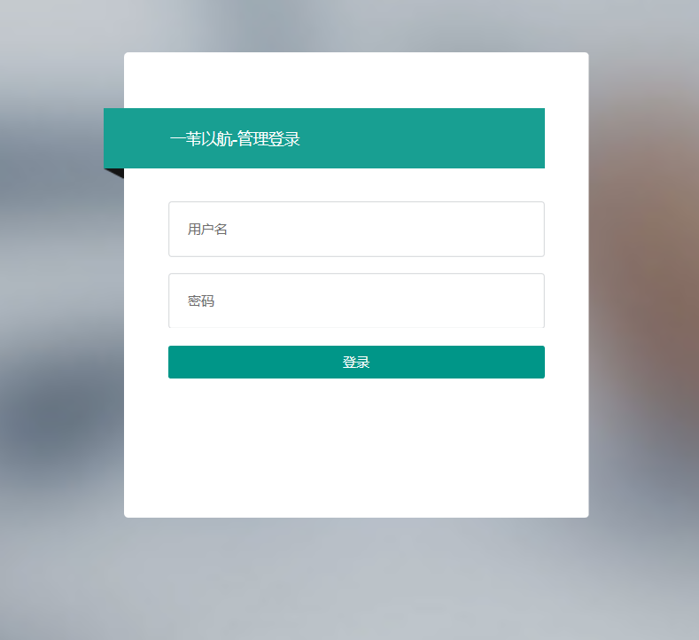

# 一苇以航—Web端 用户使用说明书

## 版本历史

| 版本 | 作者                        | 更新日期  | 更新说明 |
| ---- | --------------------------- | --------- | -------- |
| 1.0  | 王佳瑞 开聚实 李永毅 王肇凯 | 2021.5.27 | 完成初版 |


## 目录

[TOC]

## 1 引言

### 1.1 编写目的

引导系统管理员正确使用web端，管理系统运营中的各项事务。建议用户在使用系统之前阅读本手册，了解系统中的各项功能与约定。在使用过程中，如果遇到问题也可查阅本手册。

预期读者为系统上线后的超级管理员。

### 1.2 项目背景

本系统由北京航空航天大学计算机学院2021年春季学期软件工程（欧阳元新、王德庆教学班）课程组指导，高等理工学院计算机方向乐洋、史鑫杰、开聚实、王肇凯、王佳瑞、李永毅开发与主管。

### 1.3 定义

| 缩写、术语                          | 解释                                                         |
| ----------------------------------- | ------------------------------------------------------------ |
| 版块(Forum)                         | 活动的顶层分类，例如博雅、社团活动、志愿等，由超级管理员设定，无法随意添加或修改 |
| 组织(Organization, ORG)             | 从属于版块，由用户创建、经过审核后发布，创建者自动成为组织管理员 |
| 活动(Activity, ACT)                 | 从属于组织（社团、学生会等版块下）或版块（博雅、演出等官方版块，以及*个人版块*），由组织/个人发布 |
| 固定活动(Official Activity, OA)     | 具有（一定的）官方性质的活动，例如博雅、演出等，由超级管理员通过爬虫等渠道获取并更新至活动列表，不归特定组织所有 |
| 非固定活动(Unofficial Activity, UA) | 包括*组织活动*（由组织管理员代表组织发布）及*个人活动*（由个人发布），例如社团活动、约球约自习等 |


## 2 软件概述

### 2.1 目标

该系统为面向北航全校师生的活动发布、管理和社交平台，目的旨在方便全校的活动组织者和参与者，在活动发布、宣传通知、日程提醒和参与层面，给予一个统一的发布平台，并基于推荐算法为广大师生提供当前北航正在进行的、人气高的或用户感兴趣的活动。

超级管理员可以在web端对小程序中的各类信息和用户操作进行审核与管理，统筹协调系统的正常运行，并且可获得用户反馈来改进系统以更好地提供服务。

### 2.2 功能

<table>
   <tr>
      <td>功能执行者</td>
      <td>功能名称</td>
      <td>功能描述</td>
   </tr>
   <tr>
      <td rowspan="13">超级管理员</td>
      <td>管理员登录</td>
      <td>登录管理端超级管理员账号</td>
   </tr>
   <tr>   
      <td>删除用户</td>
      <td>删除选定用户的账户</td>
   </tr>
   <tr>   
      <td>审核组织创建</td>
      <td>可以查看所有创建组织的申请，并选择同意或拒绝申请</td>
   </tr>
   <tr>
      <td>修改组织信息</td>
      <td>可以查看并修改组织信息</td>
   </tr>
   <tr>
      <td>删除组织</td>
      <td>可以选择目前存在的组织，对其进行删除</td>
   </tr>
   <tr>
      <td>发布官方活动</td>
      <td>可以发布官方活动</td>
   </tr>
   <tr>
      <td>修改活动信息</td>
      <td>可以修改已发布的活动的信息</td>
   </tr>
   <tr>
      <td>删除活动</td>
      <td>可以删除已经发布的活动</td>
   </tr>
   <tr>
      <td>修改评论</td>
      <td>修改用户在活动页面发表的评论</td>
   </tr>
   <tr>
      <td>删除评论</td>
      <td>删除用户在活动页面发表的评论</td>
   </tr>
   <tr>
      <td>查看反馈</td>
      <td>可以从收到的反馈中进行选择并查看其详情</td>
   </tr>
   <tr>
      <td>删除反馈</td>
      <td>可以对收到的反馈进行删除</td>
   </tr>
</table>


## 3 运行环境

支持Chrome或Firefox等主流浏览器。


## 4 开发者使用说明

### 4.1 安装和初始化

#### 4.1.1 Web前端

- 克隆[Web端代码仓库](https://github.com/Daddies-of-SE/ReedSailing-Web)
- 在`js/`目录下的app.js中的server中配置后端接口服务器接口url。本地部署时应改为`http://127.0.0.1:8000/api/`

#### 4.1.2 后端

##### 4.1.2.1 mysql安装

* 安装mysql
* 运行`mysql_secure_installation`设置root账号密码
  * 建议暂时设置为12345678，否则  请修改`backend/settings.py`中的`DATABASES['default']['password']`为实际设置的密码
* 启动mysql：`mysql.server start`（每次重启电脑后需要运行）
* 运行`mysql -u root -p`，输入密码后`create database BUAA;`创建数据库

##### 4.1.2.2 django配置

* 克隆[后端代码仓库](https://github.com/Daddies-of-SE/ReedSailing-BackEnd)
* 在仓库根目录下运行`pip install -r requirements.txt`
* 进入`django_backend`目录，运行`python manage.py makemigrations`
* 运行`python manage.py migrate`


### 4.2 运行与调试

#### 4.2.1 Web端

* 注册管理员账号：直接在buaa数据库中表格BUAA_superAdmin添加，或开启后端`django_backend/backend/urls.py`中有`sudo_register`对应的`register/`路径后通过post请求创建

- 用浏览器打开`index.html`，将自动跳转到登录页面

#### 4.2.2 后端

* 运行`python manage.py collectstatic`将静态文件复制到`django_backend/static`

* 运行`python manage.py createcachetable`建立缓存表

* 运行`python manage.py runserver`
  * 运行时不要在本地开vpn代理，会导致报错退出
  * 会在默认的`http://127.0.0.1:8000`部署服务器


### 4.3 求助查询

后端Django相关资料请查询[文档仓库](https://github.com/Daddies-of-SE/SE2021_doc)的“django基础”、“DRF资料”目录


## 5 用户使用说明

### 5.1 管理员登录

登录https://www.reedsailing.xyz/login.html



对于已分配管理员权限的用户，输入用户名、密码完成登录，进入管理端。

### 5.2 管理端使用

管理员具有用户管理、组织管理、活动管理、评论管理、反馈管理的权限

#### 5.2.1 用户管理


进入用户管理页面，管理员可查看小程序用户列表，获得用户id、昵称、头像、认证邮箱、签名信息。管理员对用户的操作有编辑用户信息（昵称、签名）和删除用户。可勾选列表右侧白框批量删除用户。

#### 5.2.2 组织管理

组织管理分为组织审核、组织列表。

##### 5.2.2.1 组织审核

组织审核对用户申请创建的组织进行审核或拒绝。√表示审核通过、×表示审核拒绝，垃圾桶可删除待审核的组织，勾选方框可批量删除。


##### 5.2.2.2 组织列表

组织列表展示已通过审核的组织，可查看组织id、名称等信息。管理员可批量删除组织或点击添加按钮创建新的组织。组织列表中的组织可单独删除或编辑组织头像、名称、简介信息。


#### 5.2.3 活动管理


活动管理列表展示了所有活动，管理员通过添加按钮手动添加活动或批量删除活动。对于活动列表中的活动，管理员可直观看到活动详细信息，右侧操作选项管理员可以编辑活动的名称、地点、时间、人数、描述等信息或删除活动。

#### 5.2.4 评论管理


评论管理页面展示用户对活动进行评论的列表。可以看到用户名、活动名、用户评论内容、用户评论发布时间、用户评分。管理员对评论可以进行删除操作，也可以勾选白框批量删除评论。

#### 5.2.5 反馈管理


反馈管理页面展示用户对小程序的反馈。用户资源提交的联系信息附在反馈内容的联系方式字段后。管理员对反馈可以单独删除或批量删除。

## 6 非常规过程

### 6.1 日志文件位置

nginx的访问日志：`/var/log/nginx/access.log`

nginx的报错日志：`/var/log/nginx/error.log`

uwsgi的日志：`~/ReedSailing-Backend/django_backend/buaa.log`

django的日志：`~/ReedSailing-Backend/django_backend/logs/all.log`

### 6.2 服务器重启后恢复服务的流程

```shell
#启动nginx
nginx
#启动uwsgi
uwsgi --ini ~/ReedSailing-Backend/django_backend/uwsgi.ini

#启动mysql
#建议在tmux中做，执行完后kill-session，不会导致mysql被关闭
#因为启动完会阻塞命令行而且按Ctrl+C不能退出
tmux new
mysqld --user=root
#按Ctrl+B,然后按X,之后输入y

#启动daphne
cd ~/ReedSailing-BackEnd/django_backend/
tmux new -s daphne
daphne -p 8001 backend.asgi:application
#按Ctrl+B，然后按D，脱离tmux会话（tmux会话会后台运行，不会被杀死）

#在tmux中启动博雅爬取脚本
tmux new -s boya
#启动博雅脚本，记得输入用户名和密码
python ~/ReedSailing-Backend/liberal_query/bykc.py
#按下Ctrl+B，然后按%（要按Shift+5）
#在新打开的空格中启动定时任务
python ~/ReedSailing-Backend/django_backend/manage.py crontab add
#跟踪输出的日志
tail -f /home/get_boya.log
#按下Ctrl+B，然后按D，脱离tmux会话
```

## 7 程序文件和数据文件一览表

### 7.1 Web前端

| 目录/文件                | 描述             |
| ------------------------ | ---------------- |
| css/                     | 样式文件目录     |
| fonts/                   | 字体文件目录     |
| images/                  | 图片目录         |
| js/                      | 脚本目录         |
| lib/                     | layui库目录      |
| activity-add.html        | 新建活动页面     |
| activity-edit.html       | 编辑活动页面     |
| activity-list.html       | 活动列表页面     |
| application-confirm.html | 组织审核确认页面 |
| application-list.html    | 组织审核列表页面 |
| block-add.html           | 新建版块页面     |
| block-edit.html          | 编辑板块页面     |
| block-list.html          | 版块列表页面     |
| comment-detail.html      | 评论详情页面     |
| comment-list.html        | 评论列表页面     |
| feedback-detail.html     | 反馈详情页面     |
| feedback-list.html       | 反馈列表页面     |
| index.html               | 主页             |
| login.html               | 登录页面         |
| member-edit.html         | 用户编辑页面     |
| member-list.html         | 用户列表页面     |
| organization-add.html    | 新建组织页面     |
| organization-edit.html   | 编辑组织页面     |
| organization-list.html   | 组织列表页面     |
| README.md                | 自述文件         |

### 7.3 后端

| 目录/文件        | 描述                 |
| ---------------- | -------------------- |
| LiberalQuery/    | 博雅爬虫脚本目录     |
| django_backend/  | django后端文件目录   |
| requirements.txt | python依赖包列表文件 |
| README.md        | 自述文件             |

