# 一苇以航—小程序端 用户使用说明书

## 版本历史

| 版本 | 作者                        | 更新日期  | 更新说明 |
| ---- | --------------------------- | --------- | -------- |
| 1.0  | 王佳瑞 开聚实 李永毅 王肇凯 | 2021.5.27 | 完成初版 |


## 目录

[TOC]

## 1 引言

### 1.1 编写目的

引导用户正确使用**一苇以航**小程序，为更好地对系统进行管理，超级管理员也应阅读本手册与使用小程序。建议用户在使用系统之前阅读本手册，了解系统中的各项功能与约定。在使用过程中，如果遇到问题也可查阅本手册。

预期读者为系统上线后的全体用户与管理员。

### 1.2 项目背景

本系统由北京航空航天大学计算机学院2021年春季学期软件工程（欧阳元新、王德庆教学班）课程组指导，高等理工学院计算机方向乐洋、史鑫杰、开聚实、王肇凯、王佳瑞、李永毅开发与主管。

### 1.3 定义

| 缩写、术语                          | 解释                                                         |
| ----------------------------------- | ------------------------------------------------------------ |
| 版块(Forum)                         | 活动的顶层分类，例如博雅、社团活动、志愿等，由超级管理员设定，无法随意添加或修改 |
| 组织(Organization, ORG)             | 从属于版块，由用户创建、经过审核后发布，创建者自动成为组织管理员 |
| 活动(Activity, ACT)                 | 从属于组织（社团、学生会等版块下）或版块（博雅、演出等官方版块，以及*个人版块*），由组织/个人发布 |
| 固定活动(Official Activity, OA)     | 具有（一定的）官方性质的活动，例如博雅、演出等，由超级管理员通过爬虫等渠道获取并更新至活动列表，不归特定组织所有 |
| 非固定活动(Unofficial Activity, UA) | 包括*组织活动*（由组织管理员代表组织发布）及*个人活动*（由个人发布），例如社团活动、约球约自习等 |


## 2 软件概述

### 2.1 目标

该系统为面向北航全校师生的活动发布、管理和社交平台，目的旨在方便全校的活动组织者和参与者，在活动发布、宣传通知、日程提醒和参与层面，给予一个统一的发布平台，并基于推荐算法为广大师生提供当前北航正在进行的、人气高的或用户感兴趣的活动。

对于活动的发布者（例如社团负责人、学生会干部等），可以更加方便地、向更广范围的师生发布活动；对于活动参与者，可以更便捷的查找感兴趣的活动，并在活动发布、开始时收到通知提醒，还可以根据推荐算法获得针对自己喜好的活动推荐。

### 2.2 功能

<table>
   <tr>
      <td>功能执行者</td>
      <td>功能名称</td>
      <td>功能描述</td>
   </tr>
   <tr>
      <td rowspan="24">普通用户</td>
      <td>用户注册</td>
      <td>首次使用此小程序时，微信用户通过微信的授权认证成为此小程序的用户</td>
   </tr>
    <tr>
      <td>用户登录</td>
      <td>注册后，用户直接通过微信的小程序页面进入此微信小程序</td>
   </tr>
    <tr>
      <td>编辑用户信息</td>
      <td>修改用户的信息</td>
   </tr>
    <tr>
      <td>查看用户id</td>
      <td>查看用户本人的id</td>
   </tr>
     <tr>
      <td>身份验证</td>
      <td>验证用户是否是北航师生</td>
   </tr>
     <tr>
       <td>申请创建组织</td>
      <td>普通用户可申请注册新组织，并成为组织负责人</td>
   </tr>
   <tr>
      <td>申请组织管理员</td>
      <td>用户申请成为指定组织管理员</td>
   </tr>
   <tr>
      <td>关注组织</td>
      <td>用户所关注的组织发布的活动信息将展示于“关注”页面</td>
   </tr>
   <tr>
      <td>取消关注组织</td>
      <td>不再展示被取消关注的组织的活动信息</td>
   </tr>
       <tr>
      <td>查看关注信息</td>
      <td>查看已关注的组织或板块的发布信息</td>
   </tr>
   <tr>
      <td>报名活动</td>
      <td>用户报名参加处于报名状态且未招满的活动</td>
   </tr>
   <tr>
      <td>退出活动</td>
      <td>退出已报名未进行的活动</td>
   </tr>
   <tr>
      <td>评价活动</td>
      <td>在活动结束后对参与的活动进行打分和评论</td>
   </tr>
   <tr>
      <td>删除评论</td>
      <td>删除在活动页面已发表活动评论</td>
   </tr>
   <tr>
      <td>发布个人活动</td>
      <td>用户可在个人板块发布不可报名的非固定活动</td>
   </tr>
   <tr>
      <td>编辑个人活动</td>
      <td>修改个人发布的活动信息</td>
   </tr>
   <tr>
      <td>删除个人活动</td>
      <td>删除发布的个人活动</td>
   </tr>
   <tr>
      <td>查看活动地图</td>
      <td>通过地图形式查看已报名活动的相关信息</td>
   </tr>
   <tr>
      <td>查看活动日历</td>
      <td>通过日历形式查看已报名活动的相关信息</td>
   </tr>
   <tr>
      <td>分享活动/组织</td>
      <td>对活动/组织进行分享</td>
   </tr>
   <tr>
      <td>搜索活动/组织</td>
      <td>对活动/组织进行搜索</td>
   </tr>
        <tr>
      <td>个性化推荐</td>
      <td>个性化推荐可能想要关注的活动和想参与的组织</td>
   </tr>
   <tr>
      <td>查看通知</td>
      <td>查看接收到的通知信息</td>
   </tr>
       <tr>
      <td>提交用户反馈</td>
      <td>将使用反馈发送给小程序开发者</td>
   </tr>
   <tr>
      <td rowspan="9">组织管理员</td>
       <td>查看管理的组织</td>
      <td>查看被此用户管理的所有组织的列表</td>
   </tr>
        <tr>
        <td>编辑组织信息</td>
      <td>删除、增加、修改所管理组织的信息</td>
   </tr>
   <tr>
      <td>发布组织活动</td>
      <td>申请发布所管理组织的非固定活动</td>
   </tr>
   <tr>
      <td>编辑活动信息</td>
      <td>删除、增加、修改所管理组织发布的活动信息</td>
   </tr>
   <tr>
      <td>删除组织活动</td>
      <td>删除发布的组织活动</td>
   </tr>
       <tr>
      <td>移除活动参与者</td>
      <td>将已经加入活动的用户从活动名单中移出</td>
   </tr>
   <tr>
      <td>审核活动报名</td>
      <td>批准或拒绝用户加入活动的申请</td>
   </tr>
   <tr>
      <td>活动被评论通知</td>
      <td>管理的活动被评论后将收到通知提醒</td>
   </tr>
    <tr>
      <td>删除活动的评论</td>
      <td>删除活动参与者在此活动管理员管理的组织的活动下面的评论</td>
   </tr>
   <tr>
      <td rowspan="3">组织负责人</td>
      <td>转让负责人职位</td>
      <td>将组织负责人职位转让给其他用户，</td>
   </tr>
   <tr>
      <td>设置管理员</td>
      <td>授权其他用户成为所负责组织的管理员</td>
   </tr>
   <tr>
      <td>移除管理员</td>
      <td>取消对某用户成为所负责组织管理员的授权</td>
   </tr>
</table>


## 3 运行环境

微信（WeChat) 8.0.3及以上，需要网络和存储权限。操作系统为iOS或Android。


## 4 开发者使用说明

### 4.1 安装和初始化

#### 4.1.1 小程序前端

- 下载微信开发者工具
- 克隆[小程序端代码仓库](https://github.com/Daddies-of-SE/ReedSailing-Wechat)
- 安装[微信开发者工具](https://developers.weixin.qq.com/miniprogram/dev/devtools/download.html)稳定版
- 进入小程序项目->小程序，选择创建项目界面中的导入项目栏，目录选择该项目文件，AppID选择使用测试号，之后点击导入即可
- 在项目根目录下的app.js中的server中配置后端接口服务器接口url。本地部署时应改为`http://127.0.0.1:8000/api/`。由于小程序对安全性的要求较高，要求必须使用合法域名以及HTTPS证书，如果在本地部署后端，需要在开发者工具按钮栏详情中勾选“不验证合法域名”

#### 4.1.2 后端

##### 4.1.2.1 mysql安装

* 安装mysql
* 运行`mysql_secure_installation`设置root账号密码
  * 建议暂时设置为12345678，否则  请修改`backend/settings.py`中的`DATABASES['default']['password']`为实际设置的密码
* 启动mysql：`mysql.server start`（每次重启电脑后需要运行）
* 运行`mysql -u root -p`，输入密码后`create database BUAA;`创建数据库

##### 4.1.2.2 django配置

* 克隆[后端代码仓库](https://github.com/Daddies-of-SE/ReedSailing-BackEnd)
* 在仓库根目录下运行`pip install -r requirements.txt`
* 进入`django_backend`目录，运行`python manage.py makemigrations`
* 运行`python manage.py migrate`


### 4.2 运行与调试

#### 4.2.1 小程序端

- 在开发者工具中可以进行代码编辑，保存后左侧模拟器可以在电脑上进行操作模拟，调试器console中显示调试信息
- 点击”预览“可以生成二维码在手机上查看，半小时内有效

#### 4.2.2 后端

* 运行`python manage.py collectstatic`将静态文件复制到`django_backend/static`

* 运行`python manage.py createcachetable`建立缓存表

* 运行`python manage.py runserver`

  * 运行时不要在本地开vpn代理，会导致报错退出
  * 会在默认的`http://127.0.0.1:8000`部署服务器

* 检验运行是否成功：

  1. 打开小程序开发工具，进入”我的“——”我的账户“，输入邮箱地址点击”发送验证码“

  * 开发者工具中需要在”详情“——”本地配置“里勾选 ”不校验合法域名…“，否则request会无法访问
  * 此时后端console上显示”发送邮件成功“，邮箱里会收到验证码邮件
  * 小程序的`app.js`里的server设定为`http://127.0.0.1:8000`

  2. 打开`http://127.0.0.1:8000/api/docs/`，找到对应接口点击interact进行交互


### 4.3 求助查询

微信开发者工具以及小程序的其他相关信息请查询[微信开发者文档](https://developers.weixin.qq.com/miniprogram/dev/framework/)

后端Django相关资料请查询[文档仓库](https://github.com/Daddies-of-SE/SE2021_doc)的“django基础”、“DRF资料”目录


## 5 用户使用说明

### 5.1 小程序安装及初始化

### 5.1.1 小程序安装

在微信搜索一苇以航，或扫描下方二维码


### 5.1.2 小程序初始化

扫码后微信小程序将自动认证微信账号，获得微信头像。为进一步体验小程序，页面会出现北航邮箱认证提示信息

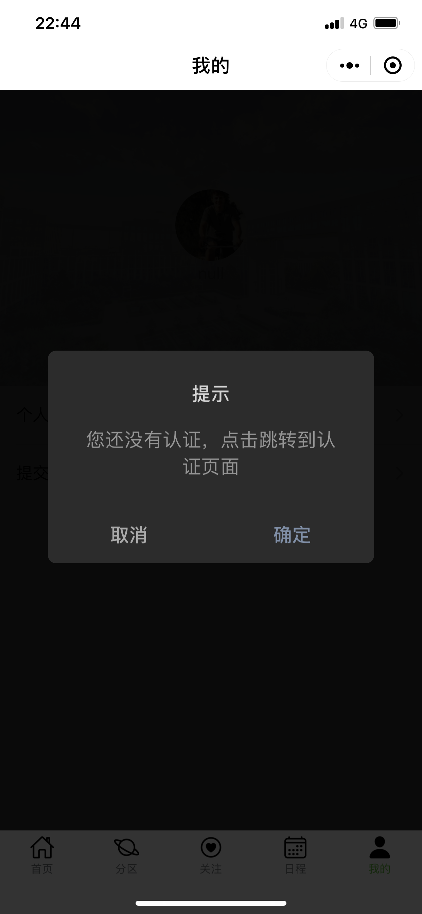

点击确认进入邮箱认证界面

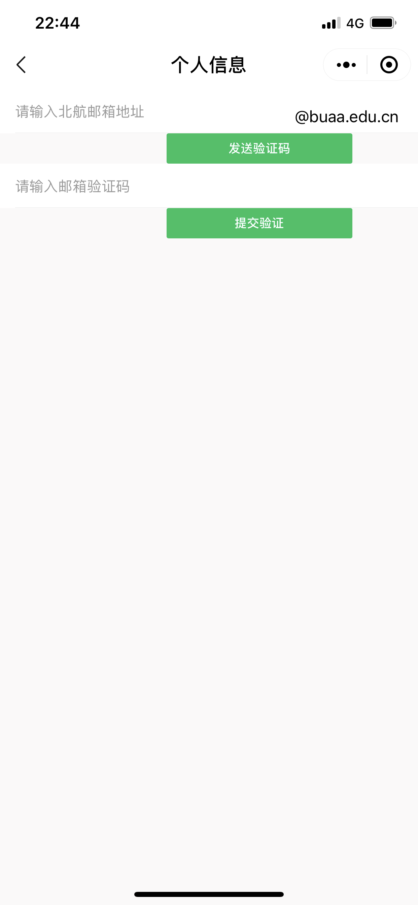

填写个人北航邮箱后，邮箱将收到小程序发送的验证码，验证码核验后用户方可体验小程序完整功能。

### 5.2 小程序使用

#### 5.2.1 首页 index/

首页上栏分为推荐页面、地图页面。

##### 5.2.1.1 推荐


推荐页面根据用户的关注喜好以及近期热点为用户推荐组织、活动。点击推荐的组织列表中组织头像可以进入组织详情页面、点击推荐的活动列表中活动框可以查看活动详情。

##### 5.1.1.2 地图


地图页面为用户推荐所在位置附近的活动，更直观地为用户展示身边开展的活动。点击红色地点图标显示活动名称，进入活动详情界面。

#### 5.2.2 分区 sections/sections-home

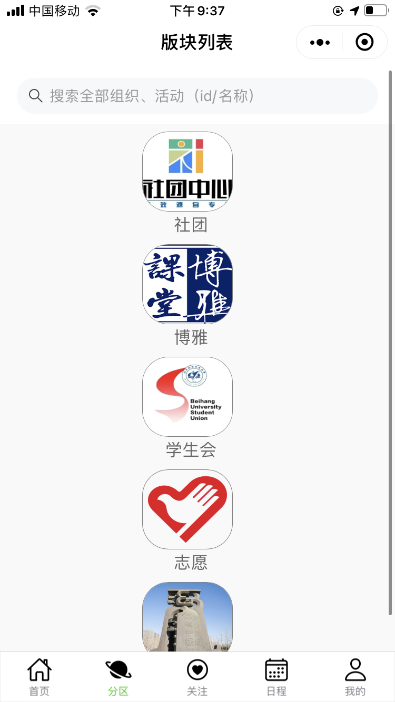

分区页面由搜索框和版块列表构成。

搜索框可以对活动和组织进行搜索。可以根据名称搜索：输入名称，将返回模糊匹配名称的所有组织、活动列表。点击搜索列表中的组织或活动可进入组织详情或活动详情页面。

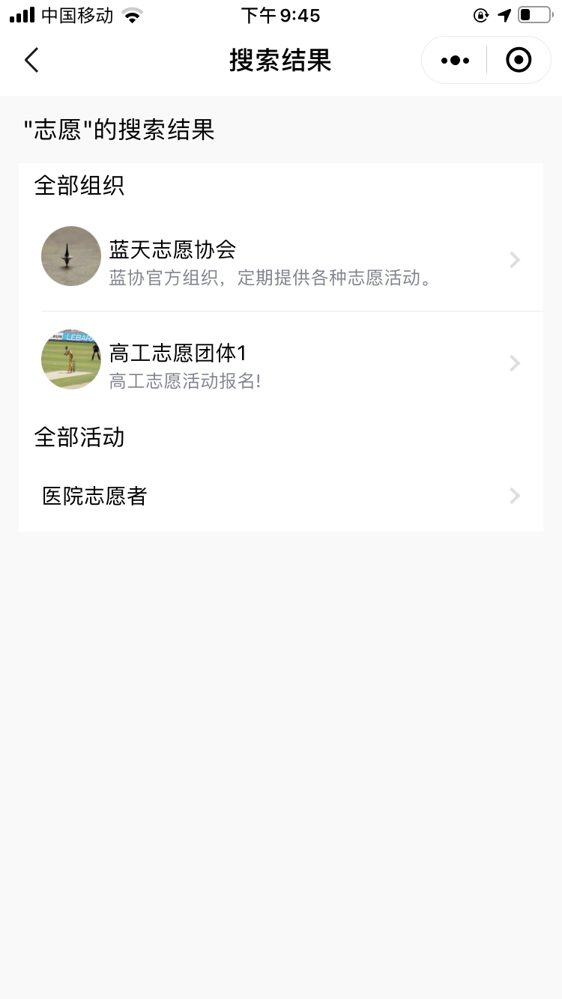

按id搜索：对于用户已知id的组织或活动，输入id可以查询到对应的组织或活动。点击搜索列表中的组织或活动可进入组织详情或活动详情页面。

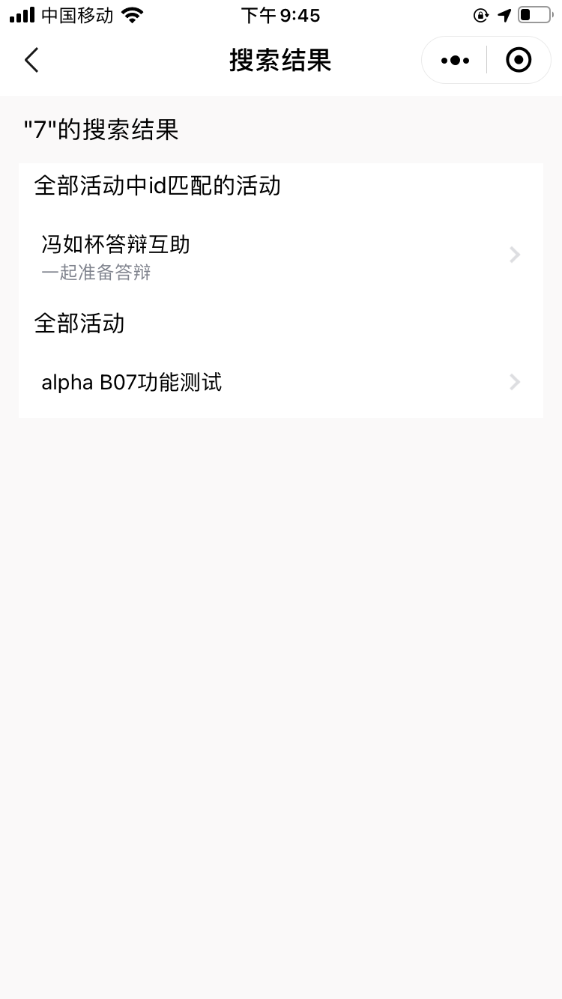

版块列表主要分为社团版块、博雅版块、学生会版块、志愿版块、个人版块。

##### 5.2.2.1 社团版块、学生会版块、志愿版块

社团版块、学生会版块、志愿版块下以组织为管理单位，通过组织发布活动。

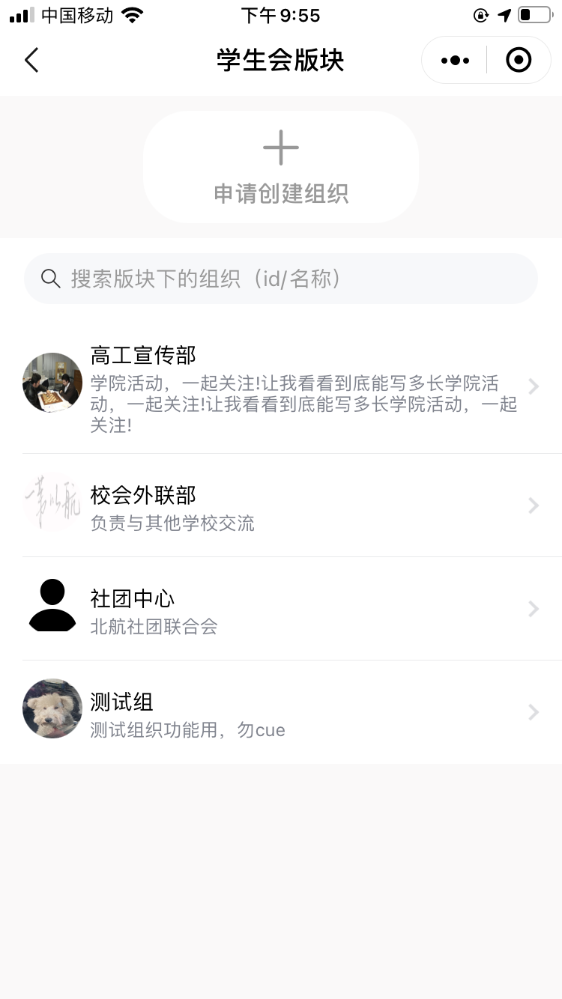

以学生会版块为例，页面由申请创建组织按钮，搜索框，版块下组织列表构成。点击申请创建组织可跳转到组织创建页面。搜索框可以按照组织名称模糊匹配该版块下的组织，或者根据组织id搜索全部版块下的组织。

组织列表展示的有组织头像，组织名称以及组织简介，点击进入组织详情页面。

##### 5.2.2.2 博雅版块

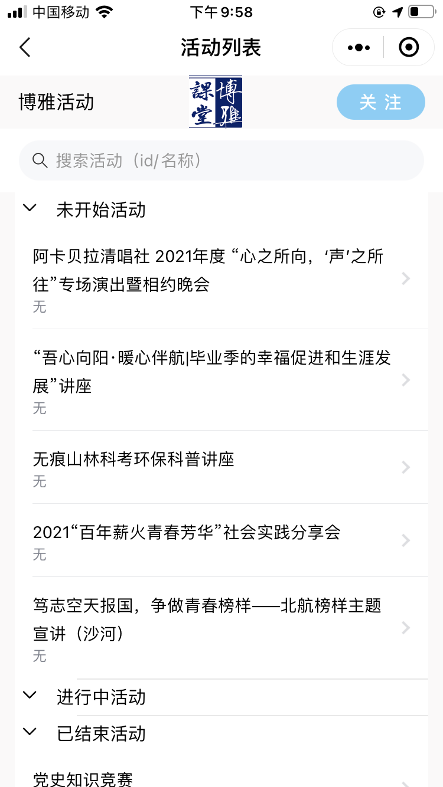

博雅版块由爬取自博雅选课网站的实时信息更新。右上角的关注按钮可以对博雅版块进行关注，该版块有新动态则会通知用户。

搜索框根据名称对博雅课程进行模糊搜索，或根据id搜索全部版块下的活动。

该板块下活动列表展示根据活动起止时间划分了未开始活动、进行中活动、已结束活动。用户根据自己身查阅需求可点击小箭头标志展开或隐藏列表。

##### 5.2.2.3 个人版块

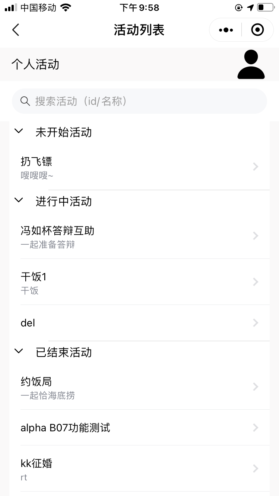

个人版块展示个人未通过组织发布的活动。上方搜索框根据名称搜索个人版块中的活动或者根据id搜索所有版块中的活动。个人活动版块活动列表同样用未开始活动、进行中活动、已结束活动划分。

#### 5.2.3 组织详情 sections/act-list

##### 5.2.3.1 非用户管理的组织

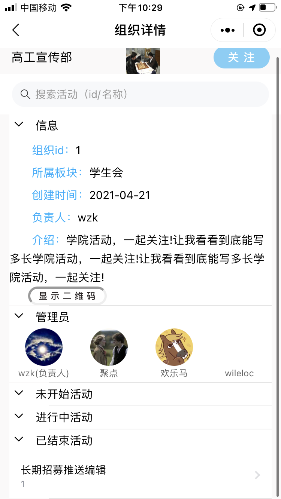

对于非用户管理的组织，页面显示关注选项、活动搜索框，组织信息。活动搜索根据名称搜索组织发布的活动或根据id搜索全部活动。

组织详情页面显示组织信息，包括组织id，所属版块、创建时间、负责人、介绍。组织管理员团队，点击管理员头像可显示管理员用户信息。显示二维码点击显示组织二维码，可截屏保存方便用户分享。组织发布的活动以未开始活动、进行中活动、已结束活动形式展示。

##### 5.2.3.2用户个人管理的组织

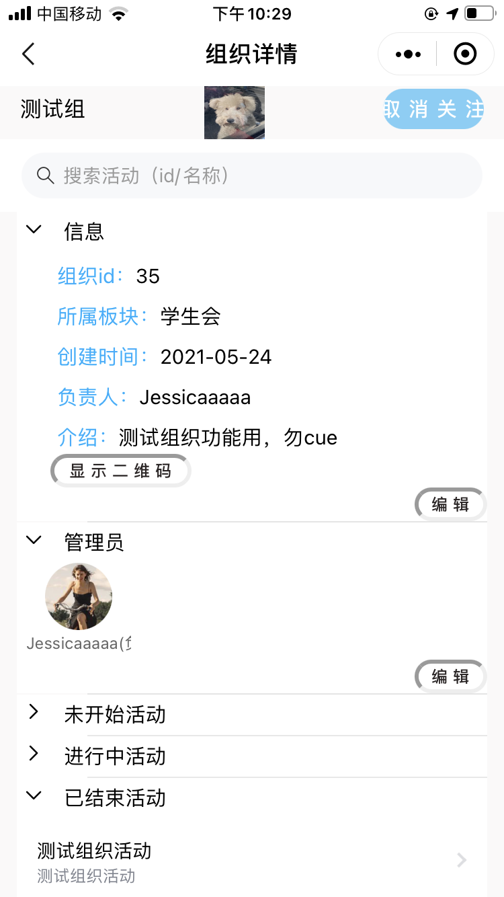

对于用户个人有管理权限的组织，用户具有编辑组织信息，管理组织活动的功能。组织管理员对组织名称、头像、组织描述具有编辑权限。

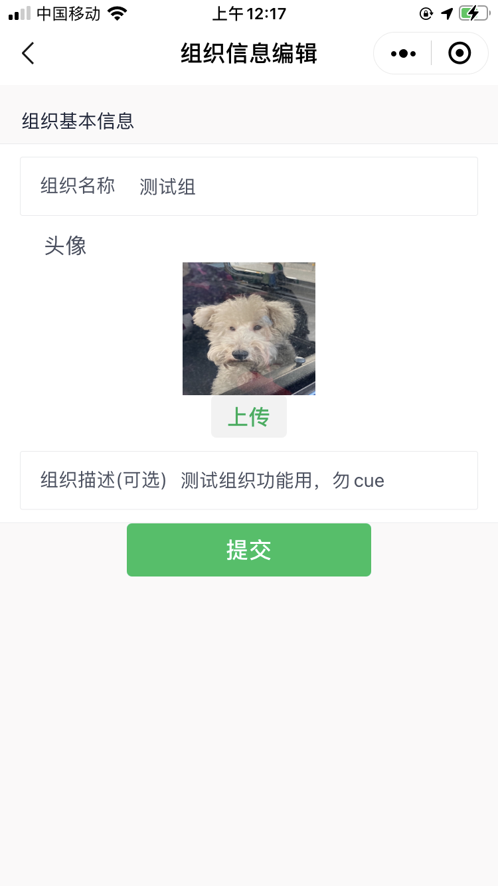

对于组织负责人，有权限增删组织管理员。

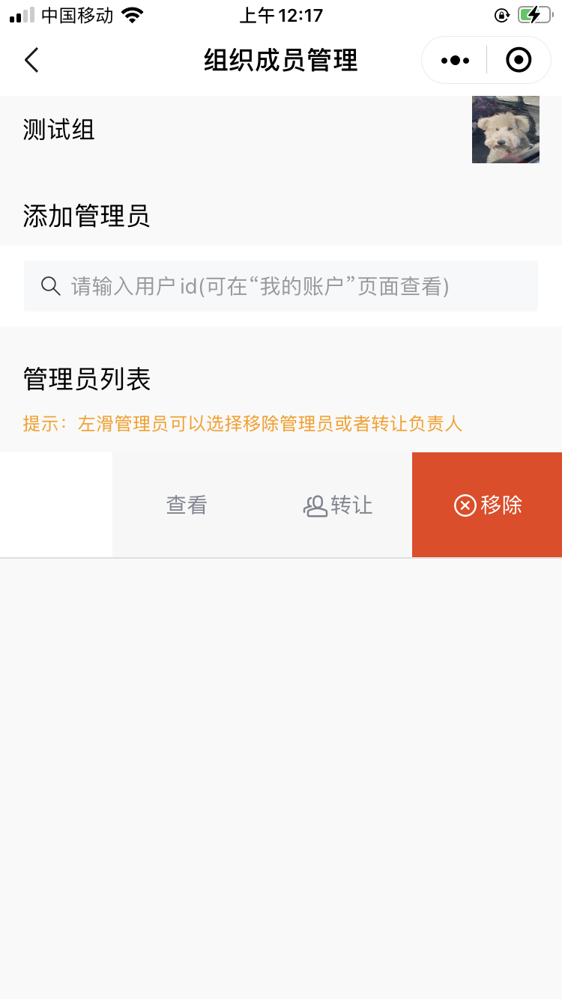

添加管理员的方式由搜索框搜索待添加人员的id，id有效弹出用户信息，点击确定即可添加用户为管理员。管理员列表展示所有管理员，左滑其中某位管理员，显示查看、转让、移除按钮分别对应查看该管理员用户信息，转让组织负责人给该用户、从管理员列表移除该用户的功能。

#### 5.2.4 活动详情 sections/act-detail

##### 5.2.4.1 非本人发布活动

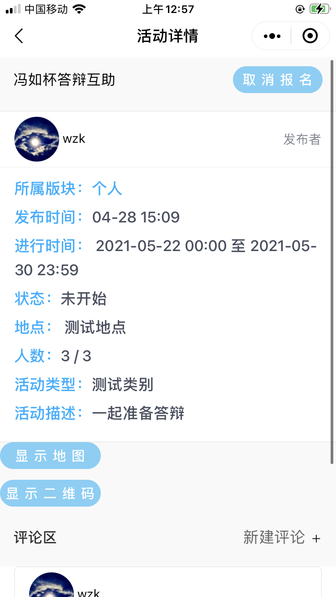

非本人发布活动右上角报名按钮用户可点击报名，界面中间展示活动详细信息。显示地图按钮将显示地图中该活动位置。显示二维码将展示该活动二维码，用户可截屏分享。


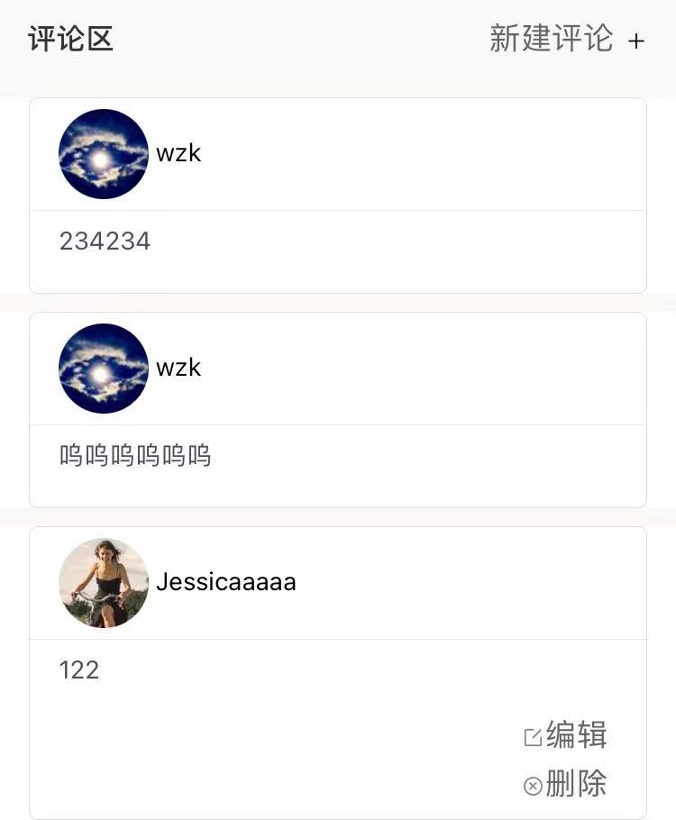

界面下部分评论区展示用户对该活动的评论内容。新建评论选项可对该活动新建评论，对于本人发出的评论，用户可编辑、删除。

未开始的活动只能填写评论内容（例如对活动内容提出疑问），已开始（进行中或已结束）的活动需要填写评论内容并进行评分。对于有评分的评论，评分将显示在评论区中。已开始的活动的平均评分将会显示在活动详情中。

##### 5.2.4.2 本人发布活动

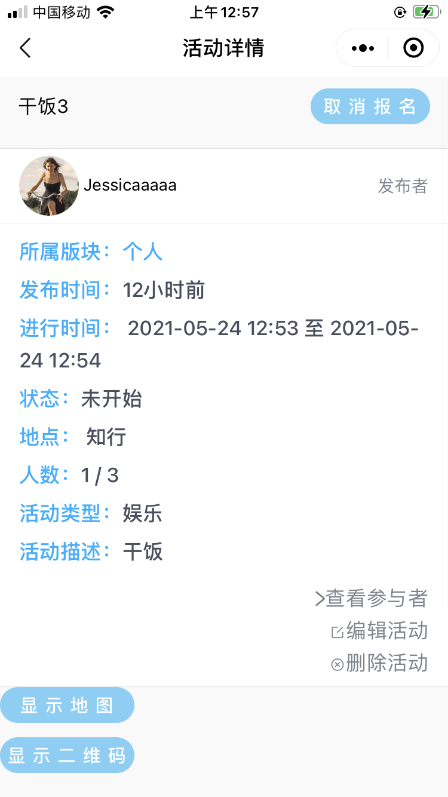

用户可对本人发布活动进行编辑、删除。编辑活动课对活动名称、人数、图片、时间、地点等信息进行修改。删除活动则可以将本人发布的活动删除。

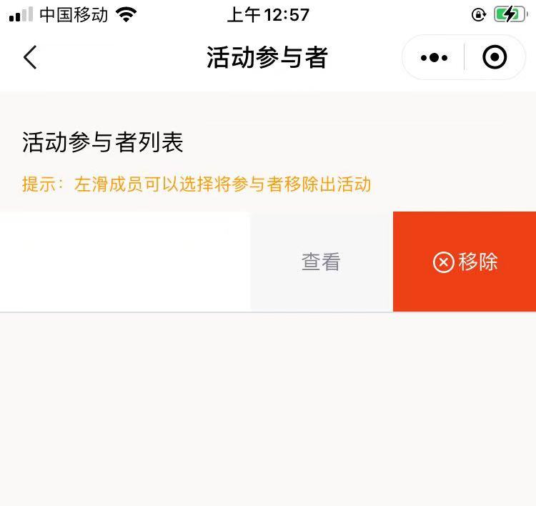

活动发布者点击查看参与者箭头可获得活动参与者列表。左滑用户，可查看用户信息或对参与者进行移除。

本人发布的活动同样可以新建/编辑/删除评论、报名、导出二维码等。

#### 5.2.5 关注follows/

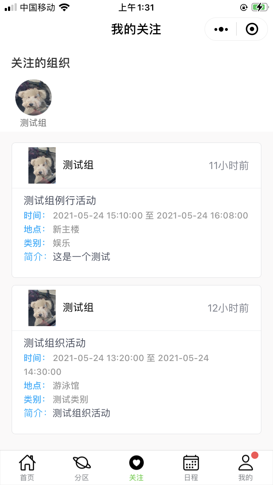

关注页面根据用户关注的组织推送组织发布的活动，用户点击活动列表可查看活动详情。

#### 5.2.6 日程 schedule/

##### 5.2.6.1 活动日历

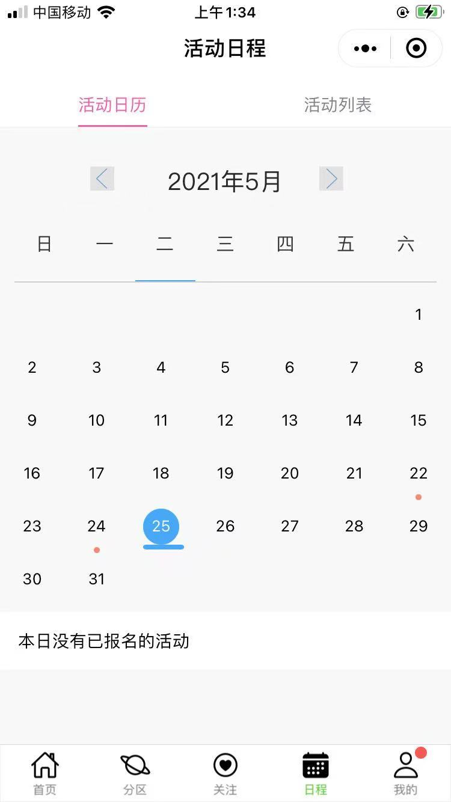

活动日程表以日历的形式为用户展示已报名活动日期。当前日期由蓝色实心圆圈出，有活动报名的日期下标注红点，点击日期下方白框显示活动列表，点击活动可查看详情。

##### 5.2.6.2 活动列表

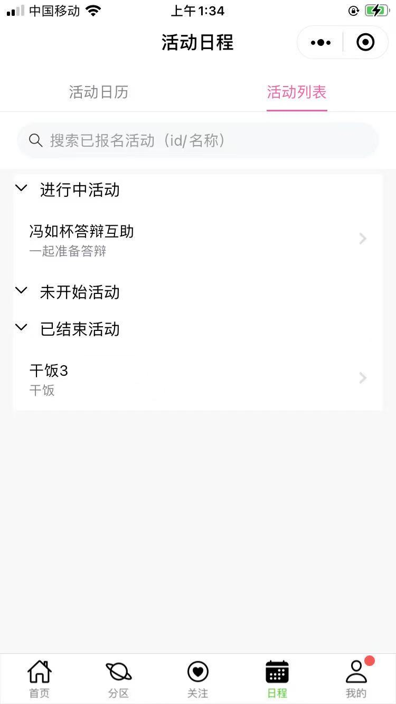

活动列表用活动起止时间划分为进行中活动、未开始活动、已结束活动。上方搜索框为用户提供根据名称搜索已报名活动以及根据id搜索所有活动的功能。

#### 5.2.7  我的 my/my-home

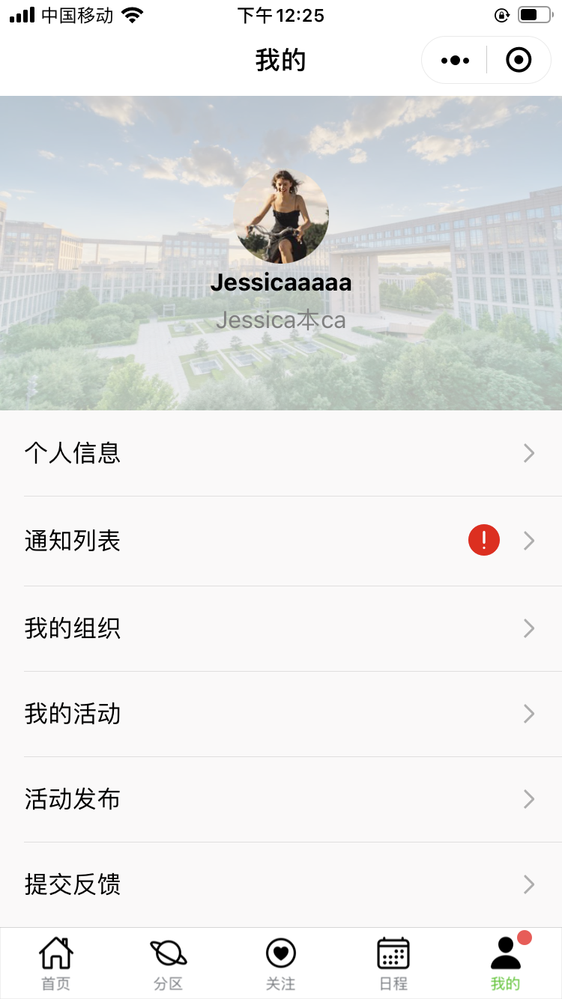

我的页面展示用户头像、昵称、个人描述。可以跳转到个人信息修改界面、通知列表界面、我管理的组织界面、我发布的活动界面、活动发布界面、提交反馈界面。

##### 5.2.7.1 个人信息

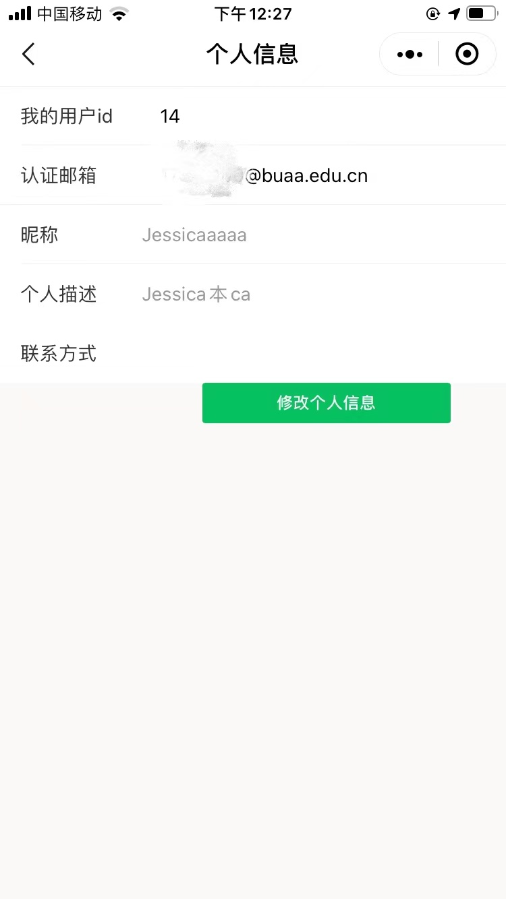

个人信息页面显示用户id，用户已认证的北航邮箱。可修改选项是用户昵称、个人描述以及联系方式。

##### 5.2.7.2 通知列表

本小程序在用户关注的组织或版块发布新活动、用户管理的组织或活动发生变更、用户报名的活动发生变更时对用户发出提醒，在页面下边栏我的图标处出现提示红点。通知列表出现提醒图标。

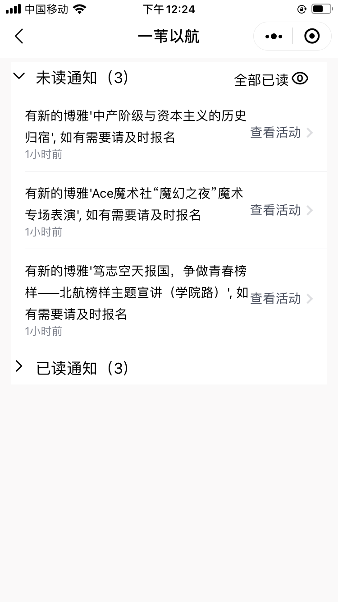

通知列表通知按已读通知、未读通知归类。点击通知内容展开变更项目页面通知状态由未读变为已读。全部已读后消息提醒红标会消失，点击右上角全部已读选项将所有通知变为已读。

##### 5.2.7.3 我管理的组织

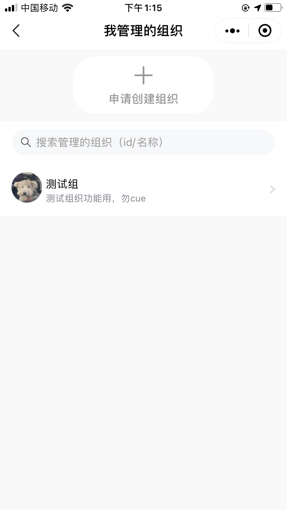

我管理的组织页面上方有申请组织创建按钮，上方搜索栏为用户提供根据组织名称搜索自己管理的组织或根据id搜索所有组织的功能。下方展示个人管理的组织列表，点击组织查看组织详情。

##### 5.2.7.4 我发布的活动

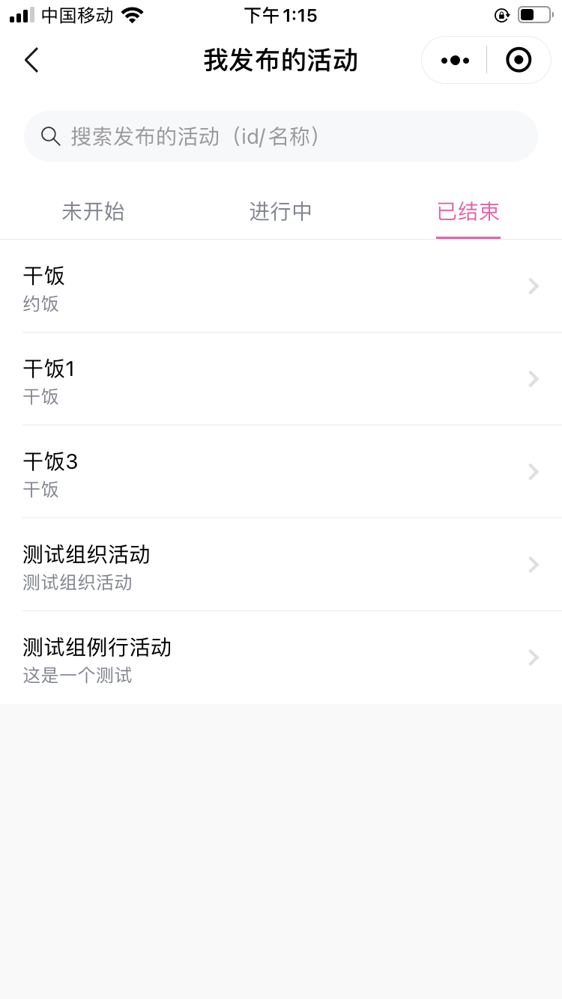

我发布的活动页面按照活动未开始、进行中、已结束分开展示用户发布的活动。上方搜索框为用户提供根据活动名称搜索用户发布的活动或根据id搜搜所有活动的功能。

##### 5.2.7.5 组织申请

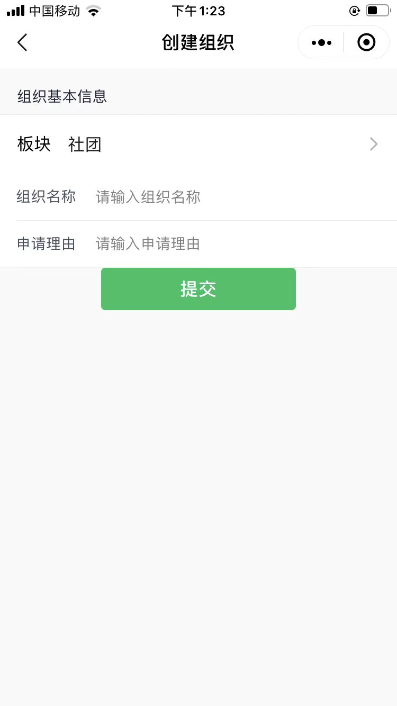

组织创建可选择社团、学生会、志愿版块。填入组织名称、申请理由点击提交，管理员将对组织进行审核，审核通过后可在我的组织或对应版块下找到被批准通过的组织。

##### 5.2.7.6 活动发布

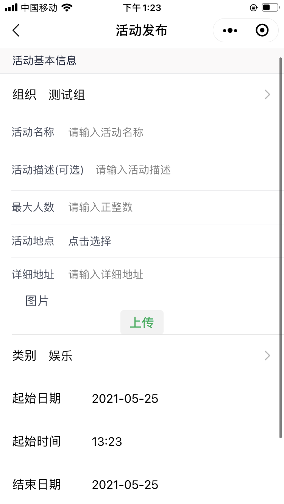

用户发布活动界面，组织选项可选择用户管理的组织或个人版块进行活动发布。填写活动名称、人数、地点、时间、活动类别等信息。活动地点填写首先在活动地点处点击选择，从地图中选择活动地点、还需再详细地址中填写活动详细地址如“新北区13公寓B1”，方便参与者找到活动地点。图片上传为可选项，用户可为活动上传一张图片，发布后的活动可以重新上传图片。

##### 5.2.7.7 用户反馈

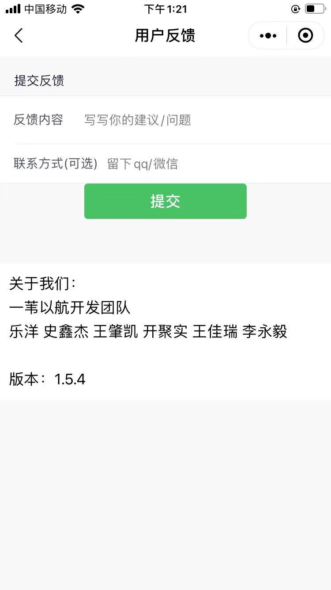

用户反馈界面方便用户针对使用小程序过程中发现的问题以及优化的建议提供反馈，用户提交反馈内容并自愿提供联系方式方便开发团队进一步联系沟通。

## 6 非常规过程

### 6.1 日志文件位置

nginx的访问日志：`/var/log/nginx/access.log`

nginx的报错日志：`/var/log/nginx/error.log`

uwsgi的日志：`~/ReedSailing-Backend/django_backend/buaa.log`

django的日志：`~/ReedSailing-Backend/django_backend/logs/all.log`

### 6.2 服务器重启后恢复服务的流程

```shell
#启动nginx
nginx
#启动uwsgi
uwsgi --ini ~/ReedSailing-Backend/django_backend/uwsgi.ini

#启动mysql
#建议在tmux中做，执行完后kill-session，不会导致mysql被关闭
#因为启动完会阻塞命令行而且按Ctrl+C不能退出
tmux new
mysqld --user=root
#按Ctrl+B,然后按X,之后输入y

#启动daphne
cd ~/ReedSailing-BackEnd/django_backend/
tmux new -s daphne
daphne -p 8001 backend.asgi:application
#按Ctrl+B，然后按D，脱离tmux会话（tmux会话会后台运行，不会被杀死）

#在tmux中启动博雅爬取脚本
tmux new -s boya
#启动博雅脚本，记得输入用户名和密码
python ~/ReedSailing-Backend/liberal_query/bykc.py
#按下Ctrl+B，然后按%（要按Shift+5）
#在新打开的空格中启动定时任务
python ~/ReedSailing-Backend/django_backend/manage.py crontab add
#跟踪输出的日志
tail -f /home/get_boya.log
#按下Ctrl+B，然后按D，脱离tmux会话
```

## 7 程序文件和数据文件一览表

### 7.1 小程序前端

| 目录/文件    | 描述                                             |
| ------------ | ------------------------------------------------ |
| components/  | 自定义组件目录                                   |
| icon/        | 图标文件目录                                     |
| lib/         | 使用的第三方UI库（iview、vant）目录              |
| pages/       | 页面源代码目录，每个页面包括wxml、js、wxss、json |
| utils/       | 工具脚本目录，包括登录、交互和一些常用工具       |
| app.js       | 全局数据和函数                                   |
| app.json     | 全局页面、组件配置                               |
| app.wxss     | 全局样式                                         |
| README.md    | 自述文件，包含页面详细说明                       |
| sitemap.json | 小程序索引配置                                   |
| theme.json   | 小程序全局主题样式                               |

### 7.2 后端

| 目录/文件        | 描述                 |
| ---------------- | -------------------- |
| liberal_query/   | 博雅爬虫脚本目录     |
| django_backend/  | django后端文件目录   |
| requirements.txt | python依赖包列表文件 |
| README.md        | 自述文件             |

